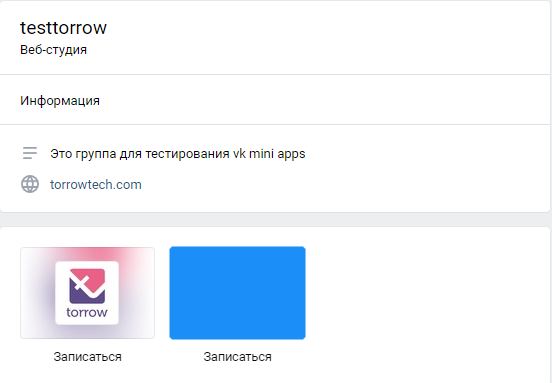

.. _promotion-label:

===========================
Где может записаться клиент?
===========================

.. note:: Правильное **продвижение** услуг может значительно увеличить приток клиентов и интерес к Вашему продукту. Вы можете выстроить свои каналы продаж в **социальных сетях**, использовать **смс-рассылки**, группы **Вконтакте**, **telegram-ботов**, рекламные носители с **qr-кодами**, **карты** или свой собственный **лендинг**. И мы готовы вам в этом помочь. Наши услуги можно разместить во всех возможных каналах сбыта буквально в **два клика**.

---------------
Запись на сайте
---------------

Ваш клиент в любой момент может записаться через наш :ref:`widget-label` прямо **на сайте**.
Вы можете, как :ref:`встроить виджет на сайт <widget-option-2-2-2>`, так и вызывать по нажатию на :ref:`стационарную <widget-option-1-4-4>` или :ref:`живую <widget-option-1-3-3>` (анимированную) кнопку.

.. figure:: media/images/viget2.png
    :scale: 53 %
    :alt: alternative text
    :align: center

--------------------------

-----------------------------
Запись через виджет Вконтакте
-----------------------------

Если для привлечения клиентов используется **сообщество Вконтакте**, то мы можем предложить удобный виджет для записи. Инструкцию по настройке можно найти в разделе: :ref:`vk-label`.

    
    Вид в меню сообщества

    
    Мини-приложение torrow в VK

-------------------------

-------------------------
Запись через Яндекс.карты
-------------------------

.. note:: Раздел находится в разработке.

При использовании нашего приложения вы сможете разместить кнопку онлайн-записи прямо в интерфейсе **яндекс-карт**. Инструкцию по настройке можно найти в разделе: :ref:`yandex-label`.

Кнопка действия доступна только при наличии рекламной подписки Яндекса. Вы можете самостоятельно определить наличие рекламной подписки по зеленой иконке в карточке организации. У организации с рекламной подпиской есть возможность добавить кнопку действия, которая будет отображаться в «Яндекс.Карты» и в карточке организации при поиске в Яндексе.

    
    Карточка компании в Яндекс.картах

------------------------

--------------------------
Запись через Telegram-бота
--------------------------

Ваши подписчики в **telegram-канале** смогут записаться на услуги аренды, консультации, купить товары и прочее с помощью нашего **telegram-бота**.

.. note:: Раздел находится в разработке.

--------------------------

-------------------
Запись через QR-код
-------------------

Вы можете разместить **QR-коды** ваших услуг или страниц компаний на рекламных носителях или любых других ресурсах, чтобы увеличить охват клиентов. Инструкцию по созданию **QR-кодов** можно найти в разделе: :ref:`QR-code`.

-------------------------

----------------
Запись по ссылке
----------------

Также Вы можете разместить **ссылку** на запись в своих **соцсетях**, использовать **смс-рассылку** или рассылку в **мессенджерах**. Как поделиться ссылкой на элемент можно найти в разделе: :ref:`share-label`

.. figure:: media/images/link.png
    :scale: 53 %
    :alt: alternative text
    :align: center

.. raw:: html
   
   <torrow-widget
      id="torrow-widget"
      url="https://web.torrow.net/app/tabs/tab-search/service;id=103edf7f8c4affcce3a659502c23a?closeButtonHidden=true&tabBarHidden=true"
      modal="right"
      modal-active="false"
      show-widget-button="true"
      button-text="Заявка эксперту"
      modal-width="550px"
      button-style = "rectangle"
      button-size = "60"
      button-y = "top"
   ></torrow-widget>
   

.. raw:: html

   