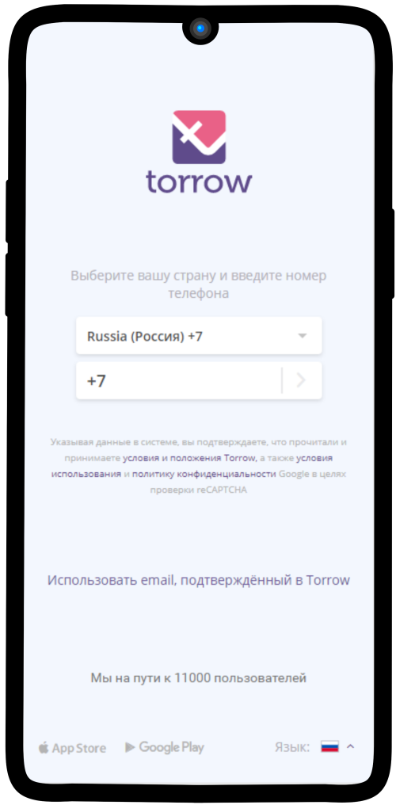
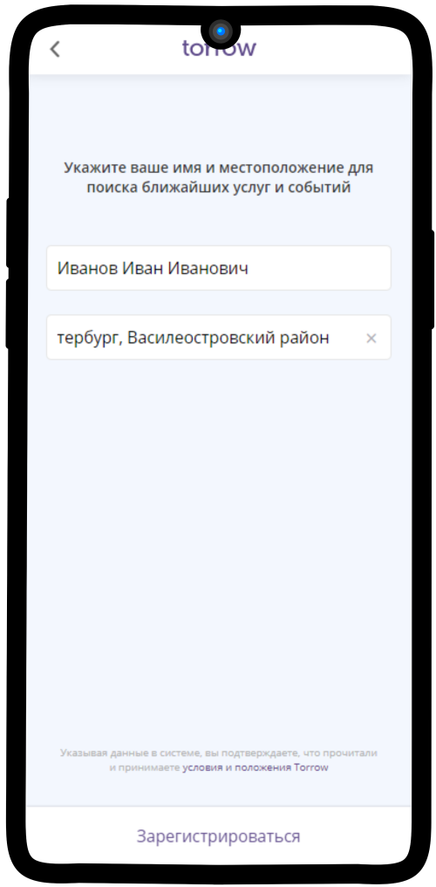
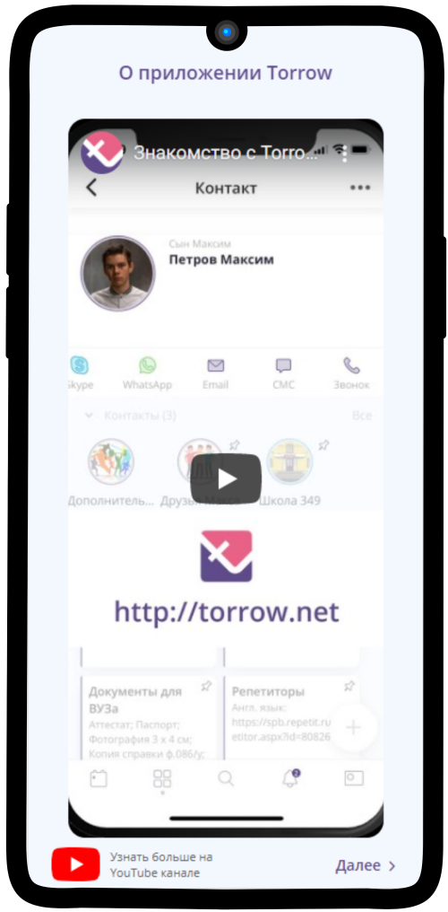
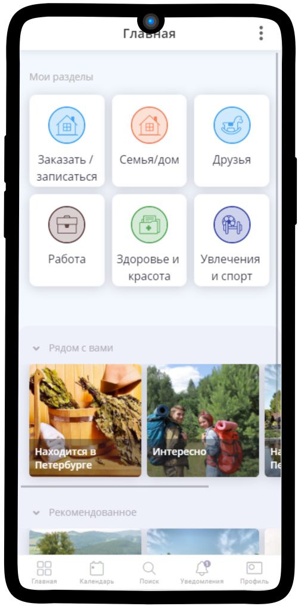

.. _registration-label:

========================
Регистрация в приложении
========================

Управляйте жизнью и бизнесом со смартфона
-----------------------------------------

.. rst-class:: centered
.. note:: **Torrow — приложение для создания комьюнити и ведения бизнеса, личных проектов, семейных планов.**

Вы можете воспользоваться `Веб-версией нашего приложения <https://torrow.net/>`_.

Или установить приложение на любой известный смартфон. Выберите подходящую платформу из списка:

.. figure:: media/googleplay.png
    :scale: 21 %
    :target: https://play.google.com/store/apps/details?id=net.torrow&hl=ru&gl=US
    :align: center

.. note:: **Примечание:** Если у Вас смартфон марки Xiaomi, необходимо настроить push-уведомления после прохождения регистрации в приложении Torrow. Подробная инструкция находится в разделе
    :ref:`faq-label`.

----------------

Пройдите короткую регистрацию
~~~~~~~~~~~~~~~~~~~~~~~~~~~~~

1. Введите **номер телефона**

2. Укажите **ФИО** и **местоположение**

3. Ознакомьтесь с коротким **роликом** и/или нажмите **ДАЛЕЕ**

4. **Готово!** Вы можете создать свою первую визитку и начать работу с приложением

5. **Настало время ознакомиться с** :ref:`elements-label`.

-----------------

Полезные ссылки
---------------

Более подробную информацию о нас вы можете получить на сайте: `info.torrow.net`_.
    .. _`info.torrow.net`: https://www.info.torrow.net/

Web-версия приложения Torrow_
    .. _Torrow: https://torrow.net/

.. raw:: html
   
   <torrow-widget
      id="torrow-widget"
      url="https://web.torrow.net/app/tabs/tab-search/service;id=103edf7f8c4affcce3a659502c23a?closeButtonHidden=true&tabBarHidden=true"
      modal="right"
      modal-active="false"
      show-widget-button="true"
      button-text="Заявка эксперту"
      modal-width="550px"
      button-style = "rectangle"
      button-size = "60"
      button-y = "top"
   ></torrow-widget>
   

.. raw:: html

   