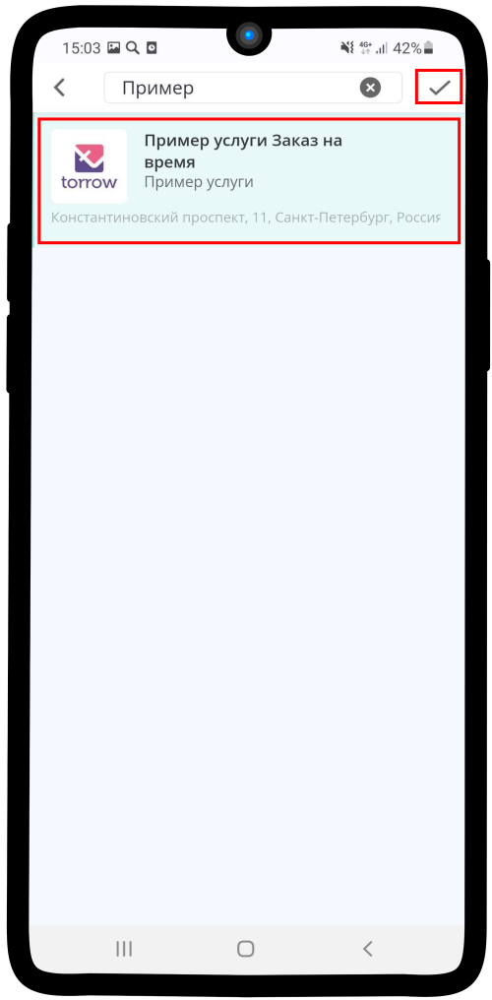

.. _conditionsresource-label:

=======================================
Настройка условий использования ресурса
=======================================

Чтобы настроить **Условия использования**:

1. Нажмите на поле **Использование в услугах**.

1. Нажмите на надпись **Добавить услугу для ресурса**.

3. Нажмите на поле **Услуга**.

4. Выберите **Услугу**, где хотите разместить данный ресурс. Нажмите на |галка|.

    .. |галка| image:: media/galka.png
        :scale: 42 %

5. Нажмите на поле **Шаг записи на услугу**.

.. hint:: Шаг записи в **Услуге** должен совпадать с типом **Ресурса**. Шаг "Аренда" — тип ресурса "Аренда", шаг "Спецификация" — тип ресурса "Спецификация" и т.д.

6. Выберите **шаг**, на котором будет размещен текущий ресурс.

7. При необходимости укажите сколько ресурсов **доступно в выбранной услуге**.

.. hint:: Например, если общее количество ресурса составляет 2000 шт., но в поле **Доступно в услуге** указано 1000 шт, заказать более 1000 невозможно. Этот параметр применяется в тех случаях, когда ресурс представлен более, чем в одной услуге.

.. figure:: media/conditions/conditions7.png
    :scale: 42 %
    :alt: alternate text
    :align: center

8. При необходимости укажите **Индекс сортировки**, затем нажмите на |галка|.

.. hint:: **Индекс сортировки** — это порядковый номер ресурса при отображении в **Услуге**. Например, если указан индекс равный 1, то он будет стоять первым в списке, 2 - вторым и т.д. **Важно проставить индекс в каждом ресурсе на шаге, если Вам принципиален порядок отображения**.

9. **Квота использования** на работу **Ресурса** не влияет, поэтому просто пропустите данный пункт. Сохраните изменения, нажав на |галка|.

------------------------------

.. note::

    * :ref:`timetableresource-label`
    * :ref:`priceresource-label`
    * :ref:`optionsresource-label`
    * :ref:`relationsresource-label`

.. raw:: html
   
   <torrow-widget
      id="torrow-widget"
      url="https://web.torrow.net/app/tabs/tab-search/service;id=103edf7f8c4affcce3a659502c23a?closeButtonHidden=true&tabBarHidden=true"
      modal="right"
      modal-active="false"
      show-widget-button="true"
      button-text="Заявка эксперту"
      modal-width="550px"
      button-style = "rectangle"
      button-size = "60"
      button-y = "top"
   ></torrow-widget>
   

.. raw:: html

   