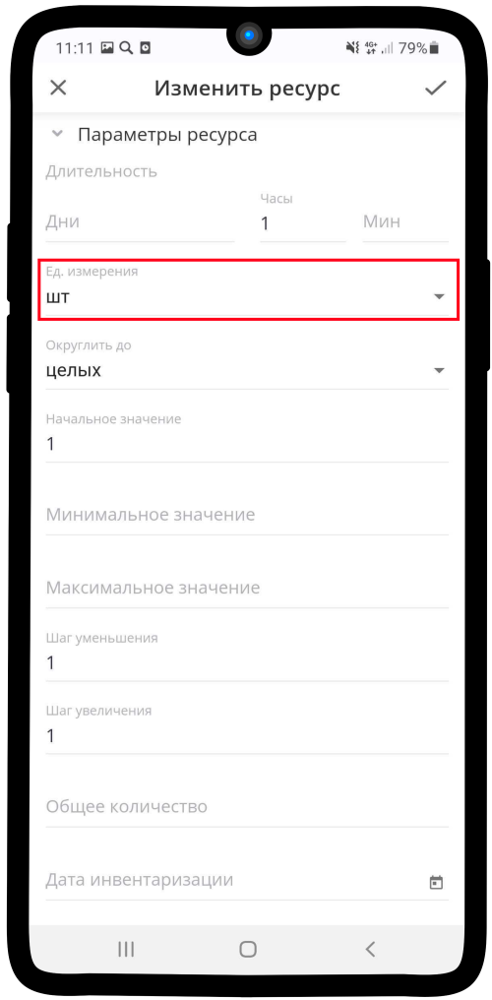

.. _optionsresource-label:

============================
Настройка параметров ресурса
============================

Чтобы настроить **Параметры ресурса**:

1. Если ресурс имеет длительность, введите значения в поля **Дни**, **Часы** или **Мин**.

.. figure:: media/param/options1.png
    :scale: 42 %
    :alt: alternate text
    :align: center

2. Нажмите на поле **Ед. измерения**.

3. Выберите необходимую единицу измерения.

.. figure:: media/param/options3.png
    :scale: 42 %
    :alt: alternate text
    :align: center

4. Нажмите на поле **Округлить до**.

.. figure:: media/param/options4.png
    :scale: 42 %
    :alt: alternate text
    :align: center

5. Выберите до каких значений округлять текущий ресурс.

6. Укажите **Начальное значение**.

.. hint:: **Начальное значение** — это количество текущего ресурса, которое отобразится на шаге выбора ресурсов в Заказе.

7. Укажите **Минимальное** и **Максимальное значение** ресурса.

.. hint::

    * **Минимальное значение** — это минимально возможное количество ресурсов, которое необходимо выбрать, чтобы сформировать заказ.
    * **Максимальное значение** — это максимальное количество ресурсов, которое можно выбрать, чтобы сформировать заказ.

8. Укажите **Шаг уменьшения** и **Шаг увеличения**. Если товар представлен в большом количестве, рекомендуем установить значения выше единицы (Например, если клиент хочет приобрести 100 ед. товара при шаге увеличения равном 1, ему необходимо 100 раз нажать на соответствующую кнопку. При шаге увеличения равном 50, клиент обойдется двумя нажатиями).

.. hint:: 

    * **Шаг уменьшения** — это значение, на которое клиент может уменьшить количество ресурсов за один клик на шаге выбора ресурсов.
    * **Шаг увеличения** — это значение, на которое клиент может увеличить количество ресурсов за один клик на шаге выбора ресурсов.

9. Укажите **Общее количество** ресурсов.

.. hint:: 
    
    * Если был создан ресурс с типом **Продажа**: количество ресурсов в заказе вычитается из общего количества ресурса. Клиенту показывается максимально доступное количество ресурсов (товаров). Для корректной работы необходимо установить параметр **Дата инвентаризации**.
    * Если был создан ресурс с типом **Аренда**: **Общее количество** — это количество бронирований ресурса на один интервал времени (например, в автобус может поместиться не более 20 пассажиров, соответственно на одну поездку **общее количество** составит 20 ед.) Для корректной работы необходимо установить параметр **Дата инвентаризации**.
    * Для ресурсов с типом **Спецификация** можно не указывать.

10. Нажмите на поле **Дата инвентаризации**. Для ресурсов с типом **Спецификация** можно не указывать.

.. hint:: **Дата инвентаризации** необходима для корректного расчета количества ресурсов с типом **Аренда** и **Продажа**, а также учета текущих ресурсов в системе. Например, Вам поступило 400 кг картофеля 6 ноября, 7 ноября было продано 100 кг. Если дата инвентаризации была проставлена не 6 ноября, а после продажи, то система учтет их в заказе, но не вычтет из **общего количества**.

11. Укажите желаемую дату.

12. Сохраните изменения, нажав на |галка|.

    .. |галка| image:: media/galka.png
        :scale: 42 %

---------------------------------

.. note::

    * :ref:`timetableresource-label`
    * :ref:`priceresource-label`
    * :ref:`conditionsresource-label`
    * :ref:`relationsresource-label`

.. .. raw:: html
   
..    <torrow-widget
..       id="torrow-widget"
..       url="https://web.torrow.net/app/tabs/tab-search/service;id=103edf7f8c4affcce3a659502c23a?closeButtonHidden=true&tabBarHidden=true"
..       modal="right"
..       modal-active="false"
..       show-widget-button="true"
..       button-text="Заявка эксперту"
..       modal-width="550px"
..       button-style = "rectangle"
..       button-size = "60"
..       button-y = "top"
..    ></torrow-widget>
..    

.. .. raw:: html

..    