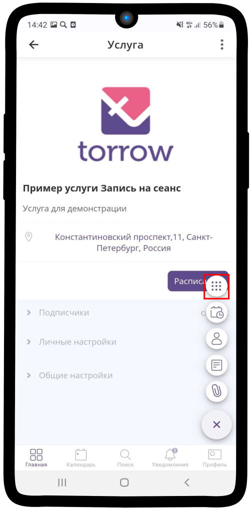
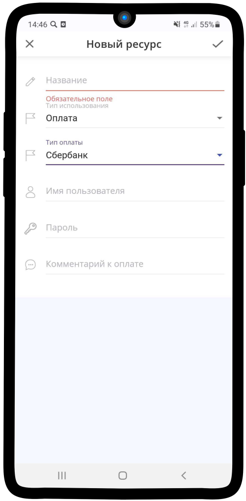

.. _paymentresource-label:

======
Оплата
======

Чтобы создать ресурс с типом **Оплата**:

1. Перейдите в элемент или раздел, где хотите создать ресурс. Нажмите на |плюс|.

    .. |плюс| image:: media/plus.png
        :scale: 42 %

2. Нажмите на кнопку |массив|.

    .. |массив| image:: media/reserved.png
        :scale: 42 %

3. Выбираем **Создать ресурс**.

4. Нажмите на поле **Тип использования** и выберите из списка **Оплата**.

5. Нажмите на поле **Тип оплаты**.

6. Выберите необходимый тип оплаты из списка. При необходимости введите **Комментарий к оплате**.

--------
Наличные
--------

----------------
Платежная ссылка
----------------

.. hint:: Платежная ссылка — уникальная ссылка, содержащая счет на оплату, по которой покупатель переходит на платежную систему. Ссылка генерируется в вашем интернет-эквайринге.

----
Qiwi
----

.. hint:: Для работы API потребуются публичный и секретный ключи. Ключи создаются в личном кабинете на `p2p.qiwi.com`_.

    .. _`p2p.qiwi.com`: https://p2p.qiwi.com/

--------
Сбербанк
--------

.. hint:: Имя пользователя и пароль предоставляется при подключении эквайринга Сбербанка.

------
ЮMoney
------

.. hint:: Номер счета ЮMoney, состоящий из 16 цифр, можно посмотреть в личном кабинете на `yoomoney.ru`_.
    
    .. _`yoomoney.ru`: https://yoomoney.ru/

------
ЮKassa
------

.. hint:: Идентификатор магазина и секретный ключ предоставляется при подключении в `yookassa.ru`_.

    .. _`yookassa.ru`: https://yookassa.ru/

.. .. raw:: html
   
..    <torrow-widget
..       id="torrow-widget"
..       url="https://web.torrow.net/app/tabs/tab-search/service;id=103edf7f8c4affcce3a659502c23a?closeButtonHidden=true&tabBarHidden=true"
..       modal="right"
..       modal-active="false"
..       show-widget-button="true"
..       button-text="Заявка эксперту"
..       modal-width="550px"
..       button-style = "rectangle"
..       button-size = "60"
..       button-y = "top"
..    ></torrow-widget>
..    

.. .. raw:: html

..    