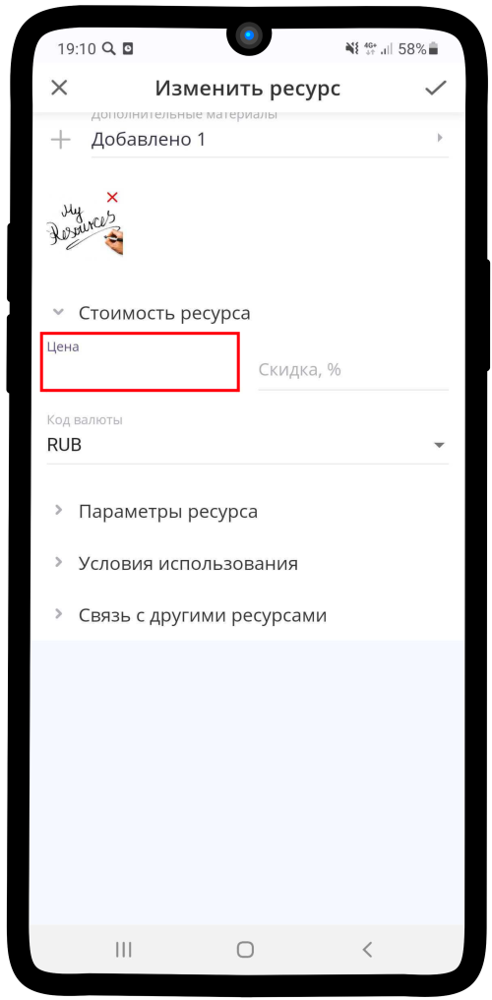
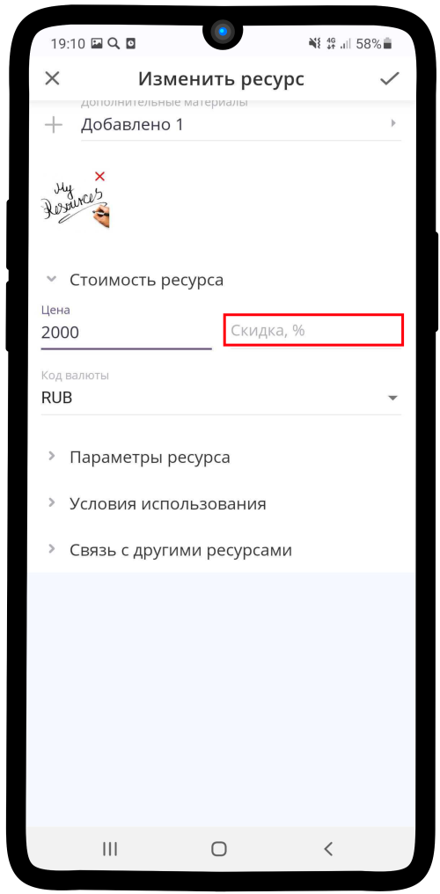
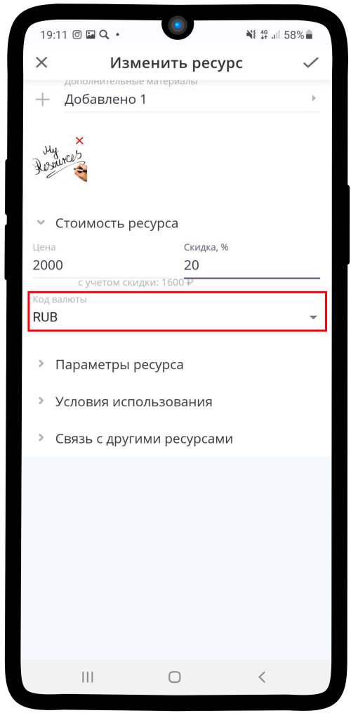
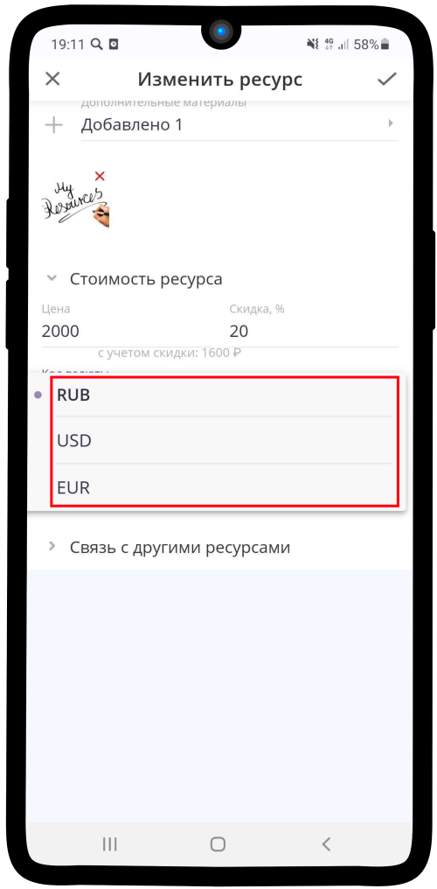
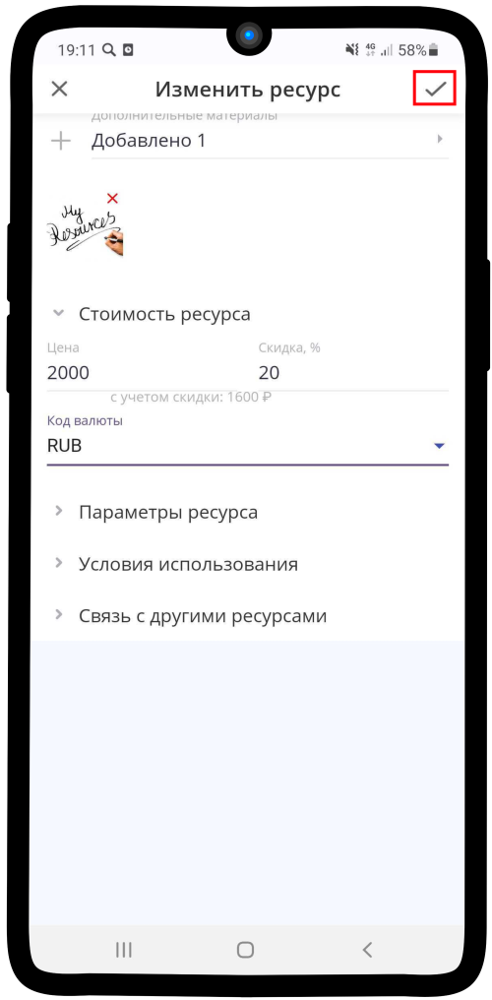

.. _priceresource-label:

===========================
Настройка стоимости ресурса
===========================

Чтобы настроить **Стоимость ресурса**:

1. Введите необходимую стоимость ресурса в поле **Цена**.

2. При необходимости укажите **Скидку** (она будет отображаться при выборе ресурса).

3. Нажмите на поле **Код валюты**.

4. Выберите желаемую **валюту**.

5. Сохраните изменения, нажав на |галка|.

    .. |галка| image:: media/galka.png
        :scale: 42 %

-----------------------------

.. note::

    * :ref:`materials-label`
    * :ref:`payment-label`
    * :ref:`timetable-label`
    * :ref:`restrictions-label`
    * :ref:`execution-label`
    * :ref:`required-label`

.. raw:: html
   
   <torrow-widget
      id="torrow-widget"
      url="https://web.torrow.net/app/tabs/tab-search/service;id=103edf7f8c4affcce3a659502c23a?closeButtonHidden=true&tabBarHidden=true"
      modal="right"
      modal-active="false"
      show-widget-button="true"
      button-text="Заявка эксперту"
      modal-width="550px"
      button-style = "rectangle"
      button-size = "60"
      button-y = "top"
   ></torrow-widget>
   

.. raw:: html

   <!--  -->