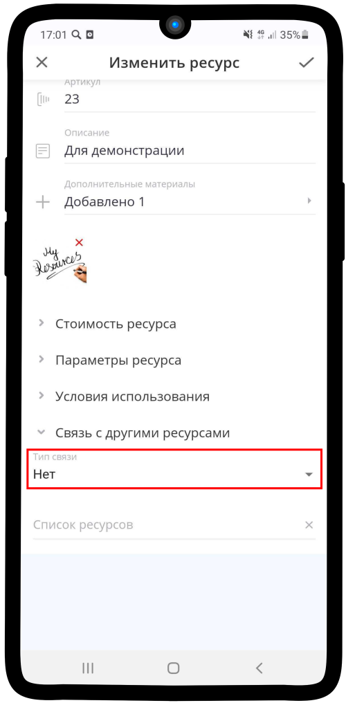
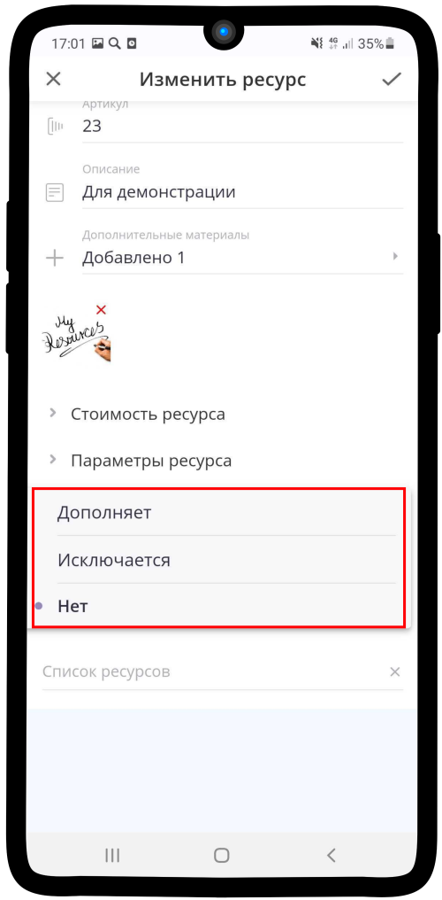
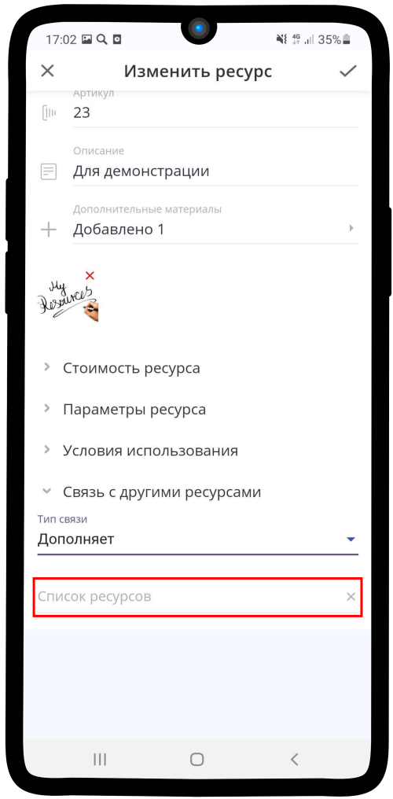
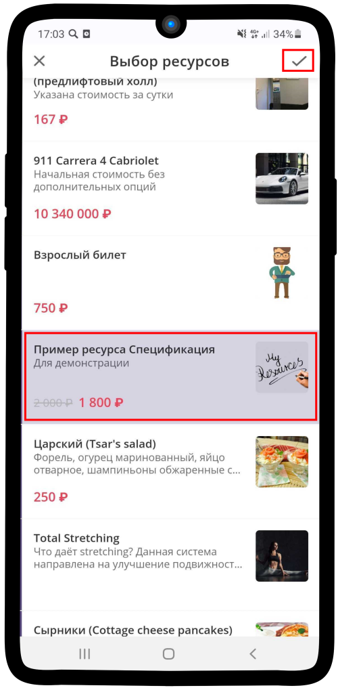
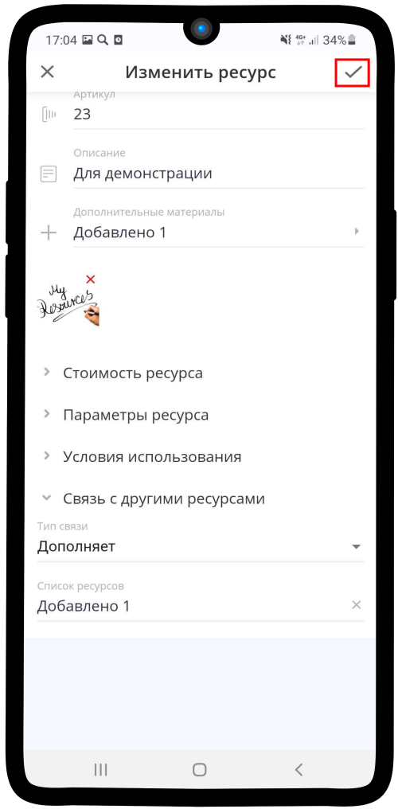

.. _relationsresource-label:

===================================
Настройка связи с другими ресурсами
===================================

Чтобы настроить **Связь с другими ресурсами**:

1. Нажмите на поле **Тип связи** (по умолчанию **Нет**).

2. Выберите необходимый параметр.

.. hint::

    * **Дополняет** — в таком случае, при выборе клиентом текущего настраиваемого ресурса на следующем шаге записи ему будет предложен ресурс (ресурсы), который будет выбран в **Список ресурсов**. Например, клиент находится в услуге **Заказ еды**, на шаге выбора блюда выбирает блины, следующим шагом ему предложат топинги - варенье, сметана (так как они дополняют ресурс - "блины"). При выборе блюда - мясо данных топингов уже не будет.
    * **Исключается** — в таком случае, при выборе клиентом текущего настраиваемого ресурса на следующем шаге записи ему будут предложены ресурсы, кроме тех, что выбраны в **Список ресурсов**. Например, клиент выбирает машины в среднем ценовом сегменте, тогда на шаге выбора самой машины для него будут исключены модели премиум и эконом сегмента.

1. Нажмите на поле **Список ресурсов**. 

4. Выберите необходимые ресурсы, которые хотите **исключить** или **дополнить**. Можно выбрать один и более ресурсов.

5. Сохраните изменения, нажав на |галка|.

    .. |галка| image:: media/galka.png
        :scale: 42 %

-----------------------------

.. note::

    * :ref:`timetableresource-label`
    * :ref:`priceresource-label`
    * :ref:`optionsresource-label`
    * :ref:`conditionsresource-label`

.. .. raw:: html
   
..    <torrow-widget
..       id="torrow-widget"
..       url="https://web.torrow.net/app/tabs/tab-search/service;id=103edf7f8c4affcce3a659502c23a?closeButtonHidden=true&tabBarHidden=true"
..       modal="right"
..       modal-active="false"
..       show-widget-button="true"
..       button-text="Заявка эксперту"
..       modal-width="550px"
..       button-style = "rectangle"
..       button-size = "60"
..       button-y = "top"
..    ></torrow-widget>
..    

.. .. raw:: html

..    