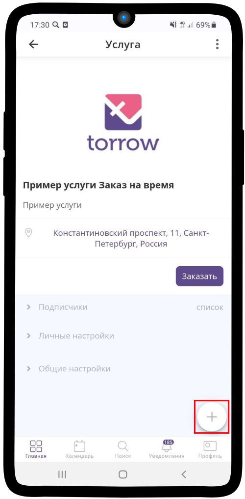
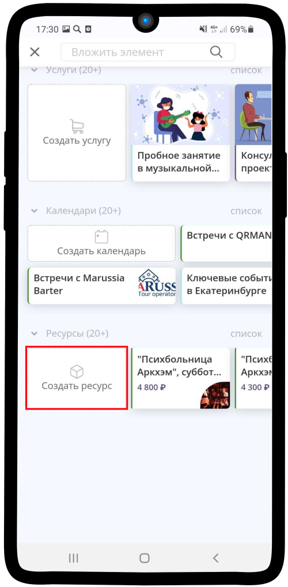

=======
Продажа
=======

----------------
Создание ресурса
----------------

1. Зайдите в элемент или раздел, где хотите создать **ресурс** и нажмите |плюс|.

    .. |плюс| image:: media/plus.png
        :scale: 42 %

2. Нажмите на кнопку |массив|.

    .. |массив| image:: media/reserved.png
        :scale: 42 %

3. Выбираем **Создать ресурс**.

4. Измените **тип**. Для этого нажмите на соответствующее поле (по умолчанию: **Спецификация**).

5. Выберите тип **Продажа**.

6. Заполните всю необходимую **информацию об услуге**: название, описание, артикул.

7. Добавьте **расписание** ресурса. Подробная инструкция: :ref:`timetableresource-label`.

8. Нажмите на поле **Контакт**.

9. Выберите необходимый контакт, который будет **связан с ресурсом** (если хотите закрепить за ним сотрудника). Нажмите на |галка|.

    .. |галка| image:: media/galka.png
        :scale: 42 %

.. hint:: Заказы ресурса будут отображаться в расписании указанного контакта (исполнителя).

10.  Добавьте **дополнительные материалы**, если они необходимы. **Если необходимости в них нет, пропустите данный пункт**.

.. hint:: Если добавить в ресурс дополнительные материалы, то Заказчик при совершении операции получит вложенный элемент (например: ссылку на курс, заметку с какой-либо информацией, туристический маршрут и др.). Чтобы узнать как настроить доп. материалы, перейдите по ссылке: :ref:`materials-label`.

11.  Разместите **фотографию** в Вашем **ресурсе**. Это привлечет больший интерес клиентов.

12. Вам необходимо заполнить поля: **Стоимость ресурса**, **Параметры ресурса**, **Условия использования** и **Связь с другими ресурсами**.

.. note::

    * :ref:`priceresource-label`
    * :ref:`optionsresource-label`
    * :ref:`conditionsresource-label`
    * :ref:`relationsresource-label`
    

13.  Ваша ресурс типа **Продажа** готов!

--------------------

-----------------
Настройка ресурса
-----------------

.. note::

    * :ref:`timetableresource-label`
    * :ref:`priceresource-label`
    * :ref:`optionsresource-label`
    * :ref:`conditionsresource-label`
    * :ref:`relationsresource-label`

.. .. raw:: html
   
..    <torrow-widget
..       id="torrow-widget"
..       url="https://web.torrow.net/app/tabs/tab-search/service;id=103edf7f8c4affcce3a659502c23a?closeButtonHidden=true&tabBarHidden=true"
..       modal="right"
..       modal-active="false"
..       show-widget-button="true"
..       button-text="Заявка эксперту"
..       modal-width="550px"
..       button-style = "rectangle"
..       button-size = "60"
..       button-y = "top"
..    ></torrow-widget>
..    

.. .. raw:: html

..    