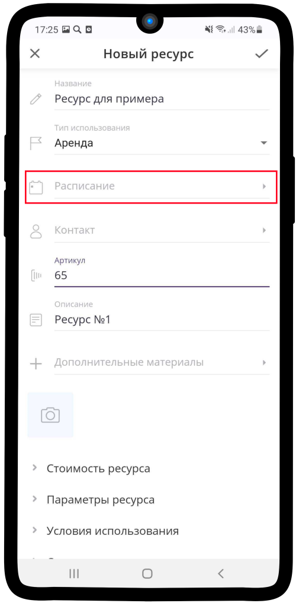
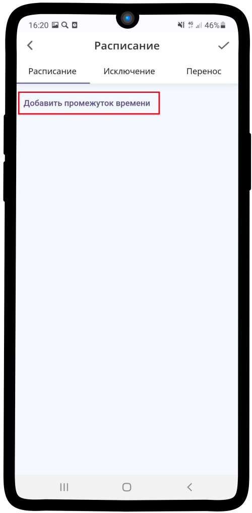
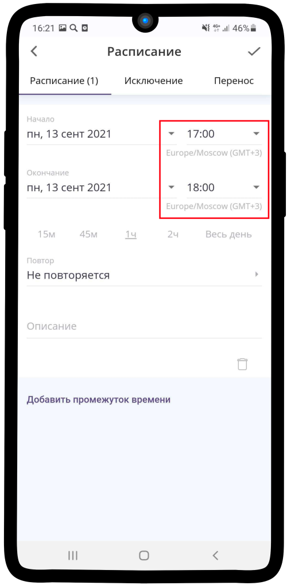
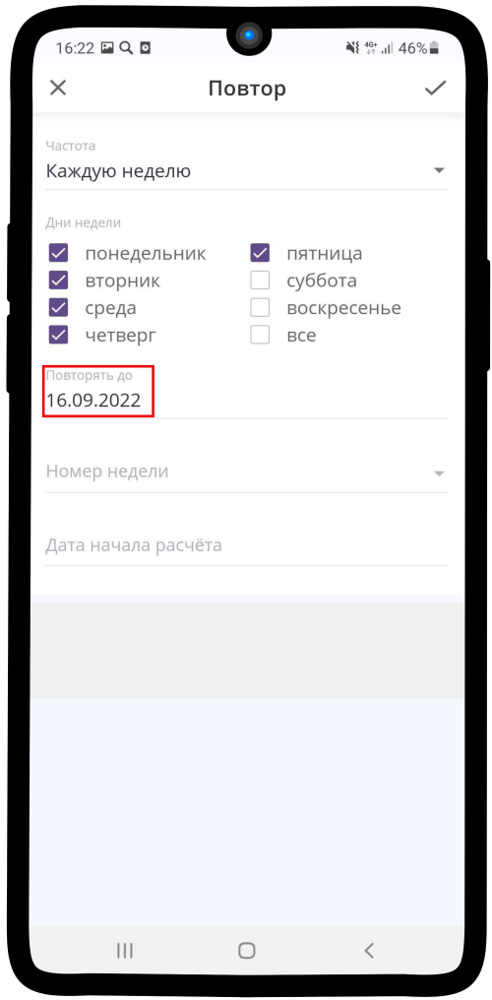
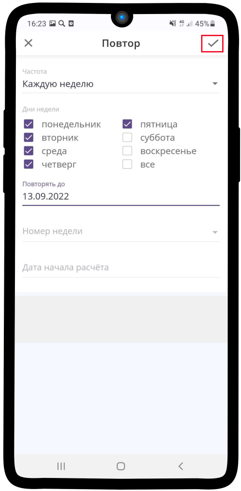

.. _timetableresource-label:

============================
Настройка расписания ресурса
============================

.. rst-class:: centered
.. raw:: html
    
    

        <iframe width="560" height="315" src="https://www.youtube.com/embed/yENUW0e9F8I" title="YouTube video player" frameborder="0" allow="accelerometer; autoplay; clipboard-write; encrypted-media; gyroscope; picture-in-picture" allowfullscreen></iframe>
    

Чтобы настроить **Расписание ресурса**:

1. Нажмите на поле **Расписание**.

2. Нажмите на текст **Добавить промежуток времени**.

3. Нажмите на **поле с датой**.

.. figure:: media/timetable/mimk22.png
    :scale: 42 %
    :alt: alternate text
    :align: center

4. Установите дату начала и окончания периода, затем нажмите **Установить**.

.. hint:: Вы можете установить любой интервал времени, но для настройки **расписания рабочего дня** необходимо **выбрать равные значения**.

.. figure:: media/timetable/mimk23.png
    :scale: 42 %
    :alt: alternate text
    :align: center

5. Нажмите на **поле со временем**.

6. Установите время начала и окончания рабочего дня, затем нажмите **Установить**.

.. figure:: media/timetable/mimk25.png
    :scale: 42 %
    :alt: alternate text
    :align: center

7. Нажмите на поле **Повтор**.

.. figure:: media/timetable/mimk26.png
    :scale: 42 %
    :alt: alternate text
    :align: center

8. Нажмите на поле **Частота**. По умолчанию **Не повторяется**.

.. hint:: По умолчанию **Не повторяется**.

.. figure:: media/timetable/mimk27.png
    :scale: 42 %
    :alt: alternate text
    :align: center

9. Выберите подходящий вариант из списка.

.. hint:: Если Вы работаете не каждый день, то выберите значение **Каждую неделю**.

.. figure:: media/timetable/mimk28.png
    :scale: 42 %
    :alt: alternate text
    :align: center

10. В появившемся окне выберите те дни, когда Вы работаете.

.. figure:: media/timetable/mimk29.png
    :scale: 42 %
    :alt: alternate text
    :align: center

11. Нажмите на поле **Повторять до**. Выберите период времени, до которого необходимо повторять данное расписание.

12. Установите **год, месяц и дату** окончания периода.

.. figure:: media/timetable/mimk31.png
    :scale: 42 %
    :alt: alternate text
    :align: center

13. Нажмите |галка|, чтобы сохранить изменения.

    .. |галка| image:: media/galka.png
        :scale: 42 %

14. При необходимости введите **описание** и нажмите |галка|. Ваше расписание **сохранено**, теперь Вы можете продолжить редактирование **Ресурса**.

-------------------------

.. note::

    * :ref:`priceresource-label`
    * :ref:`optionsresource-label`
    * :ref:`conditionsresource-label`
    * :ref:`relationsresource-label`

.. raw:: html
   
   <torrow-widget
      id="torrow-widget"
      url="https://web.torrow.net/app/tabs/tab-search/service;id=103edf7f8c4affcce3a659502c23a?closeButtonHidden=true&tabBarHidden=true"
      modal="right"
      modal-active="false"
      show-widget-button="true"
      button-text="Заявка эксперту"
      modal-width="550px"
      button-style = "rectangle"
      button-size = "60"
      button-y = "top"
   ></torrow-widget>
   

.. raw:: html

   <!--  -->