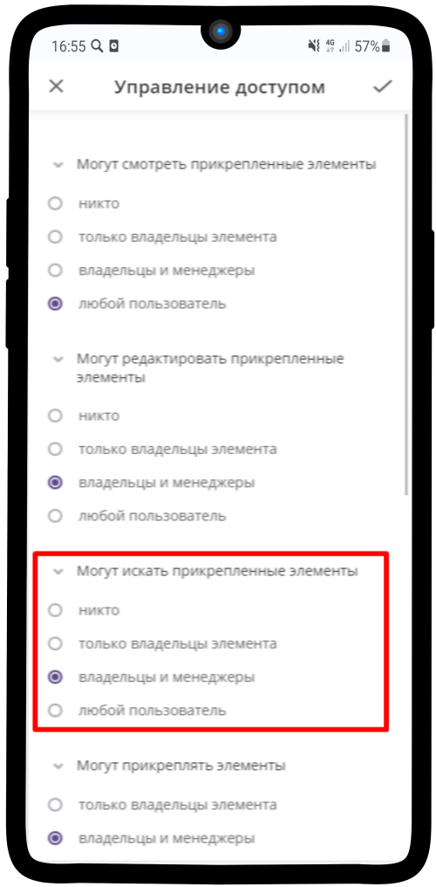

====================
Поиск внутри элементов
====================

Для того, чтобы искать элементы, нужно включить поиск.

1. Для этого перейдем в **Общие настройки**

.. figure:: media/base17.png
    :scale: 53 %
    :alt: alternative text
    :align: center   

-----------------

2. Далее пункт **Управление доступом**

.. figure:: media/base18.png
    :scale: 53 %
    :alt: alternative text
    :align: center   

-----------------

3. В поле **Могут искать прикрепленные элементы** отмечаем **владельцы и менеджеры**

.. hint:: Если элемент не прикреплен, то в поиске он виден не будет

-----------------

4. Поиск включен

-----------------