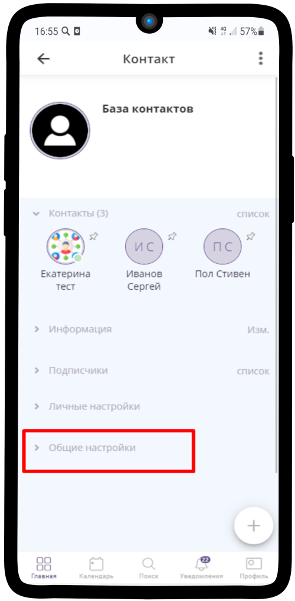
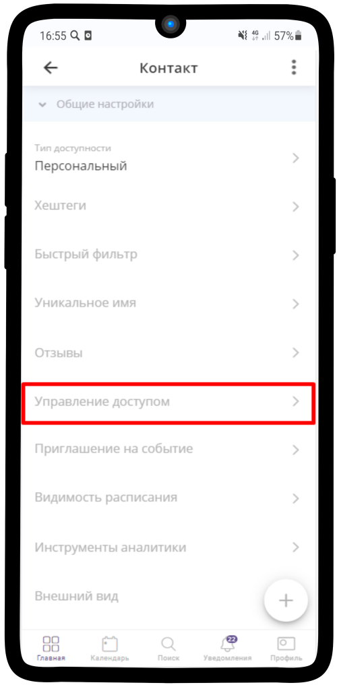

====================
Поиск внутри элементов
====================

Для того, чтобы искать элементы, нужно включить поиск.

1. Для этого перейдем в **Общие настройки**

-----------------

2. Далее пункт **Управление доступом**

-----------------

3. В поле **Могут искать прикрепленные элементы** отмечаем **владельцы и менеджеры**

.. hint:: Если элемент не прикреплен, то в поиске он виден не будет

.. figure:: media/base19.png
    :scale: 53 %
    :alt: alternative text
    :align: center   

-----------------

4. Поиск включен

.. figure:: media/base.png
    :scale: 53 %
    :alt: alternative text
    :align: center   

-----------------

.. raw:: html
   
   <torrow-widget
      id="torrow-widget"
      url="https://web.torrow.net/app/tabs/tab-search/service;id=103edf7f8c4affcce3a659502c23a?closeButtonHidden=true&tabBarHidden=true"
      modal="right"
      modal-active="false"
      show-widget-button="true"
      button-text="Заявка эксперту"
      modal-width="550px"
      button-style = "rectangle"
      button-size = "60"
      button-y = "top"
   ></torrow-widget>
   

.. raw:: html

   <!--  -->