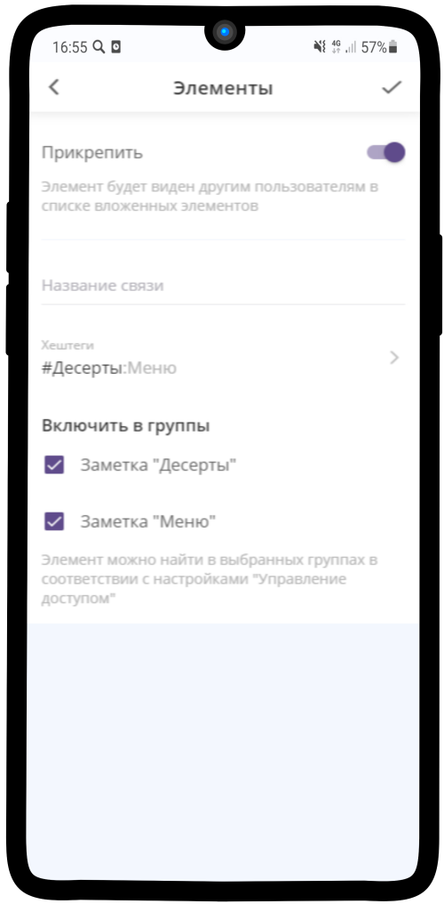

=======================
Хештеги, поиск и быстрые фильтры
=======================

.. note:: **Хештег** — это ключевое слово или несколько слов, тег, облегчающий поиск элемента по теме или содержанию и начинающийся со знака решётки.

    .. |профиль| image:: media/profile.png
        :scale: 42 %
    .. |точка| image:: media/tochka.png
        :scale: 42 %

В Torrow можно не только задать привычный хештег для поиска, но и настроить фильтр или удобное отображение элементов в меню услуги

    * `Простой хештег`_
    * `Хештеги-категории`_
    * `Быстрый фильтр`_
    * `Оформление меню с помощью хештегов`_

-------------------------------

---------------------
Простой хештег
---------------------

1. Хештеги можно задать в **Общих настройках**

-------------------------------

2. Ключевое слово вводится в поле со знаком #

-------------------------------

3. По хештегам можно искать элементы в поиске

-------------------------------

.. hint:: Элементы видны в Общих данных, если Тип доступности у них — **Открытый** (Общие настройки — Тип доступности)

-------------------------------

--------------
Хештеги-категории
--------------

.. note:: Категории хештегов удобно задавать, если у Вас много элементов, которые нужно классифицировать. Например,   

1. Сначала задаем категории у **родительского элемента** (где создается новый элемент). В Общих настройках переходим в Хештеги. Нажимаем на кнопку **Добавить категорию**, прописываем Название.

-------------------------------

2. Задаем Хештеги

-------------------------------

3. После того, как добавлены категории, можно задавать **хештеги группы** для элементов

.. hint:: Добавление **Хештегов Группы** упростит в дальнейшем задание тегов для наследуемых элементов

-------------------------------

Отмечаем нужные теги

-------------------------------

Тэги для элементов

-------------------------------

Удобно назначать тэги для ресурсов

.. hint:: Хештеги группы можно задать для **вложенных** элементов, если они прикреплены к родительскому (см. пункт 1)

-------------------------------

.. hint:: Прикрепленные элементы будут видны всем. Если вы хотите, чтобы они были скрыты, то пропишите **Категории** вручную для каждого элемента

Выделите элемент долгим нажатием, выберите в выпадающем меню **прикрепление к элементам**. Отметьте группы, к которым элемент будет прикреплен (:ref:`attach-label`)

-------------------------------

-------------------------------

-------------------------------

-------------------------------

-------------------------------

---------------------
Быстрый фильтр
---------------------

Быстрый фильтр в поиске

-------------------------------

-------------------------------

.. figure:: media/tags/tag28.png
    :scale: 60 %
    :alt: alternate text
    :align: center

-------------------------------

.. figure:: media/tags/tag20.png
    :scale: 60 %
    :alt: alternate text
    :align: center

-------------------------------

Как работает быстрый фильтр

-------------------------------

-------------------------------

-------------------------------

-------------------------------

------------------
Оформление меню с помощью хештегов
------------------

Для создания **меню** в услуге также можно использовать хештеги

Тэги задаются в услуге. Прописываем категории в услуге на нужно шаге использования

-------------------------------

-------------------------------

После назначения всех ресурсов и прописывания у них тэгов, меню в готовой услуге будет выглядеть таким образом

-------------------------------

-------------------------------

.. raw:: html
   
   <torrow-widget
      id="torrow-widget"
      url="https://web.torrow.net/app/tabs/tab-search/service;id=103edf7f8c4affcce3a659502c23a?closeButtonHidden=true&tabBarHidden=true"
      modal="right"
      modal-active="false"
      show-widget-button="true"
      button-text="Заявка эксперту"
      modal-width="550px"
      button-style = "rectangle"
      button-size = "60"
      button-y = "top"
   ></torrow-widget>
   

.. raw:: html

   