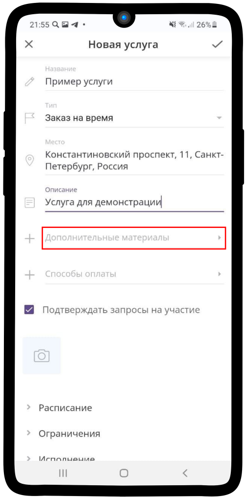

.. _materials-label:

===================================
Настройка дополнительных материалов
===================================

.. note:: Если добавить в услугу дополнительные материалы, то Заказчик при совершении операций получит вложенный элемент (например: ссылку на курс, заметку с какой-либо информацией, туристический маршрут и др.).

1. Нажмите на поле **Дополнительные материалы**.

2. Нажмите на надпись **Добавить материалы**.

3. Нажмите на поле **Элемент**.

4. **Перейдите к элементу**, который хотите добавить в услугу.

5. Выберите **необходимый элемент**.

6. Нажмите на кнопку **Выбрать** |галка|.

    .. |галка| image:: media/galka.png
        :scale: 42 %

7. Нажмите на поле **Время доступности**.

8. Выберите из списка необходимое время доступности **дополнительного материала**.

.. hint::

    * **Не ограничено** — вложенный элемент будет доступен неограниченное количество времени.
    * **Относительно дат события** — вложенный элемент будет доступен относительно установленных значений начальной и конечной дат события (заказа).
    * **Относительно начала события** — вложенный элемент будет доступен относительно начальной или конечной даты события (заказа).
    * **Период** — вложенный элемент будет доступен в установленный интервал времени.

9. Если Вы выбрали время доступности **Относительно дат события**, то можно установить задержку **До начала события** (например, преждевременно куплен билет на концерт, но получен будет за 3 часа до начала), **После начала события** (например, Вы приобрели курс, ссылку на курс, но получить сможете через несколько часов после пярмой трансляции), аналогично **До конца события** и **После начала события**.

10. Если Вы выбрали время доступности **Относительно начала события**, то **настройка аналогична пункту 9**.

11.  Если Вы выбрали **Период**, нажмите на поле **Дата открытия** и **Дата закрытия**.

12. Выберите **даты начала и окончания** доступности вложенного элемента. Нажмите на кнопку **Установить**.

13.  Выберите **время начала и окончания** доступности вложенного элемента. Нажмите на кнопку **Установить**.

.. figure:: media/Additional_materials/material13.png
    :scale: 42 %
    :alt: alternate text
    :align: center

14. Когда заполните все поля, нажмите |галка|.

15. **Готово!** Дополнительные материалы вложены в Вашу услугу.

-----------------------------

.. note::

    * :ref:`payment-label`
    * :ref:`timetable-label`
    * :ref:`restrictions-label`
    * :ref:`execution-label`
    * :ref:`required-label`

.. raw:: html
   
   <torrow-widget
      id="torrow-widget"
      url="https://web.torrow.net/app/tabs/tab-search/service;id=103edf7f8c4affcce3a659502c23a?closeButtonHidden=true&tabBarHidden=true"
      modal="right"
      modal-active="false"
      show-widget-button="true"
      button-text="Заявка эксперту"
      modal-width="550px"
      button-style = "rectangle"
      button-size = "60"
      button-y = "top"
   ></torrow-widget>
   

.. raw:: html

   