.. _execution-label:

====================
Настройка исполнения
====================

Назначение исполнителя
----------------------

1. Укажите исполнителя услуги (**ответственное лицо**). Для этого нажмите на поле **Исполнители**.

2. В **поисковой строке** введите необходимый контакт. Затем выберите его и нажмите кнопку **Добавить**.
    
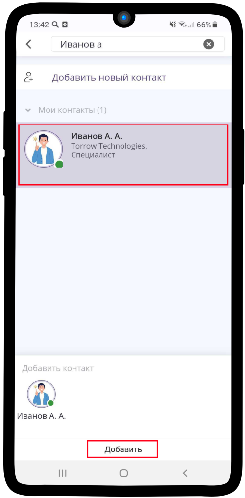

----------------------

Настройка шагов записи
----------------------

.. hint:: Для услуги типа **Запись на сеанс** не указываются **Шаги записи**.

1. Нажмите на поле **Шаги записи**.

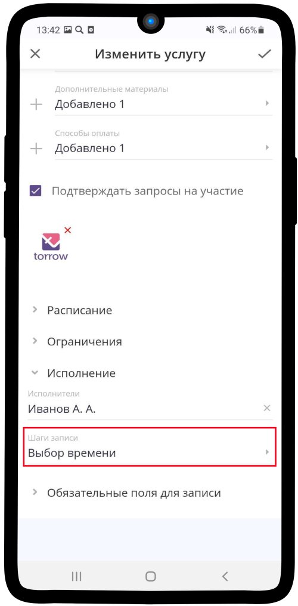

2. Нажмите на поле **Добавить еще шаг записи на услугу**. Вид как на изображении ниже присутствует только у услуги типа **Заявка** (отсутствует Шаг — **Выбор времени**). В случае настройки других услуг пропустите пункт **2** и перейдите к **3**.

.. hint:: Вы можете добавить до 50 шагов записи.

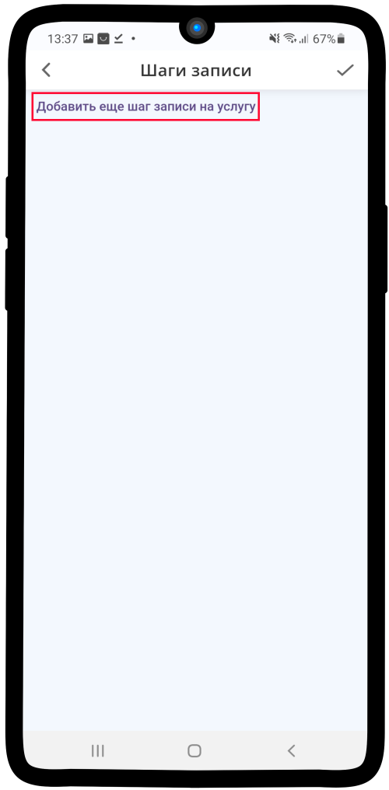

3. Нажмите на поле **Формат выбора времени**. Данный шаг отсутсвует для услуги типа **Заявка** (если Вы настраиваете заявку, перейдите к **пункту 7**).

4. Выберите необходимый вариант.

.. hint:: 

    * **Дата** — при использовании услуги клиент сможет выбрать необходимую дату выполнения заказа (1 шаг записи).
    * **Дата и время** — при использовании услуги клиент сможет выбрать необходимую дату и время выполнения заказа (2 шага записи).

5. Укажите **Длительность по умолчанию** (например, длительность онлайн-урока или тренировки 1 час).

6. Если необходимо, укажите **минимальную и максимальную длительность** (например, для заявки с типом **Аренда**: мин. время аренды 7 дней, максимальное 30 дней. В таком случае клиент не сможет арендовать товар менее, чем на 7 дней и более, чем на 30 дней). Теперь нажмите на надпись **Добавить еще шаг записи на услугу**.

7. Впишите **название шага записи** в указанное поле. Затем нажмите на **Тип использования**.

.. hint:: При использовании услуги данное название будет отображено в верхней части экрана во время выбора **ресурса** (:ref:`resources-label`).

8. Выберите необходимый вариант в зависимости от предполагаемой **услуги** и нажмите |галка|.

    .. |галка| image:: media/galka.png
        :scale: 42 %

.. hint::
    
    * **Продажа** — выбирать в случае, если товар количественно ограничен. Например: игрушки, кулинарные блюда, виды одежды и т.д.
    * **Спецификация** — выбирать в случае, если товар количественно не ограничен. Например: стрижка, услуги тренера, занятие в музыкальной школе и т.д.
    * **Аренда** — выбирать в случае, если товар сдается в аренду на какой-то интервал времени. Например: аренда квартиры, аренда антиквариата, аренда рабочей силы и т.д.
    * **Очередь** — выбирать данный тип использования, если к услуге подключено несколько исполнителей в виде ресурсов, которые самостоятельно разбирают заказы. Например: заявка на пробное занятие в спортивную школу, заявку получит тот тренер, который раньше примет заказ и т.д.

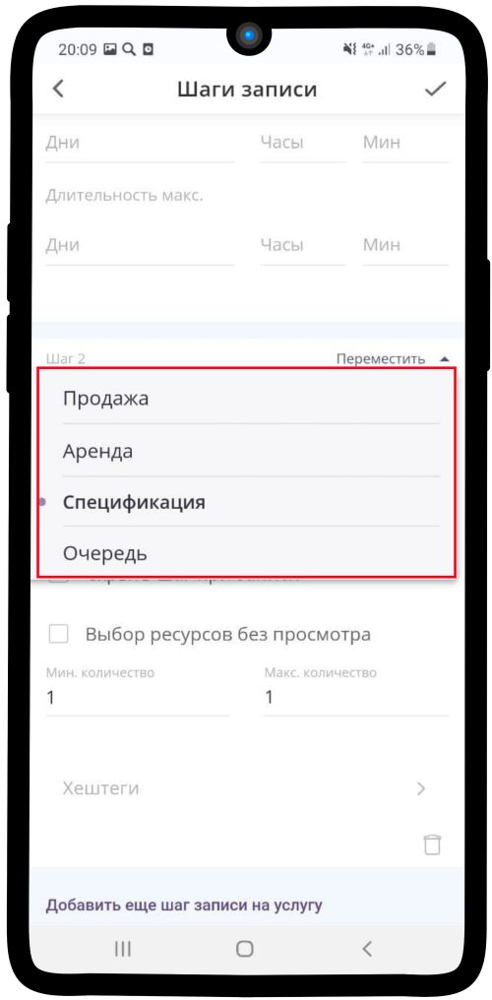

9. Типы использования **Спецификация**, **Аренда** и **Продажа** имеют одинаковую настройку шага. Поставьте |галка| **Скрыть шаг при записи**, если хотите, чтобы он не отображался при записи клиентом. **Выбор ресурсов без просмотра** необходим для записи с типом **Очередь**, поэтому оставьте данное поле **пустым**.

10. Определите какое **минимальное и максимальное** количество ресурсов можно выбрать на данном шаге.

11. Задайте хештеги, которые будут отображаться в шаге записи на услугу в виде вкладок с ресурсами.

.. hint:: Распределение по вкладкам на шаге записи будет зависеть от хештегов, которые Вы зададите при создании ресурса.

12. Тип использования **Очередь** имеет более сложную структуру и функциональность. Установите значение **Овербукинг ресурсов**.

.. hint:: 

    * Если значение **Овербукинг ресурсов** больше **1**, то клиенты смогут записаться на услугу даже в том случае, если ресурс закончился (например, такой подход используется при продаже авиабилетов, так как есть вероятность, что билеты будут сданы перед вылетом).
    * Если задать значение равное **0** ограничений по данному числу ресурсов не будет.

13. Перейдите к **Фильтрации заказов для очереди**.

.. hint:: 

    * **Начало периода** — время начала проверки заказа до его начала (если оставить пустым, ограничений по дате начала проверки не будет).
    * **Окончание периода** — время окончания проверки заказа до его начала (например, если установить значение 24 часа, то проверка Заказа закончится за 24 часа до записи).

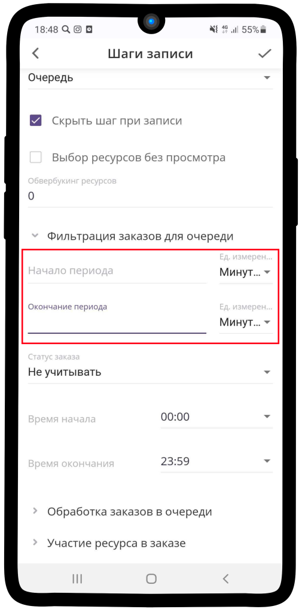

14. Нажмите на поле **Статус заказа**.

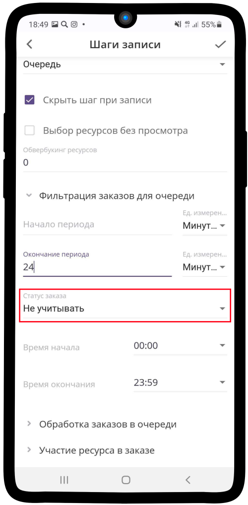

15. Выберите какой **статус заказа** будет на момент прохождения данного шага записи.

.. hint:: 

    * **Не учитывается** — статус не изменится.
    * **Согласуется** — заказ находится на проверке.
    * **Запланирован** — заказ ожидает выполнения.
    * **В работе** — заказ находится в работе.
    * **Выполнен** — заказ выполнен (завершен).

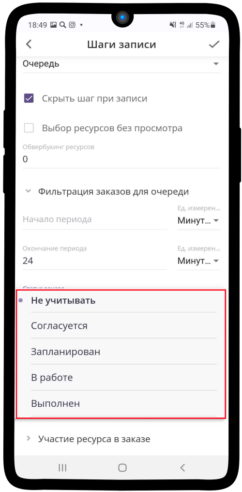

16. Укажите **время начала** и **время окончания** фильтрации.

.. hint:: **Время начала** и **время окончания** — это интервал времени Заказчика, когда с ним можно связаться. Например, у Заказчика 20:00, а у Менеджера, который хочет принять Заказ 14:00. Если время окончания меньше 20:00, то Менеджеру в очереди не поступит Заказ, чтобы не беспокоить Заказчика в позднее время. Будут передаваться лишь Заказы, которые попадают в текущий интервал времени. 

.. figure:: media/step-customization/step10.1.png
    :scale: 42 %
    :alt: alternate text
    :align: center

17. Перейдите к **Обработке заказов в очереди**. Нажмите на поле **Выполнить операцию с заказом**.

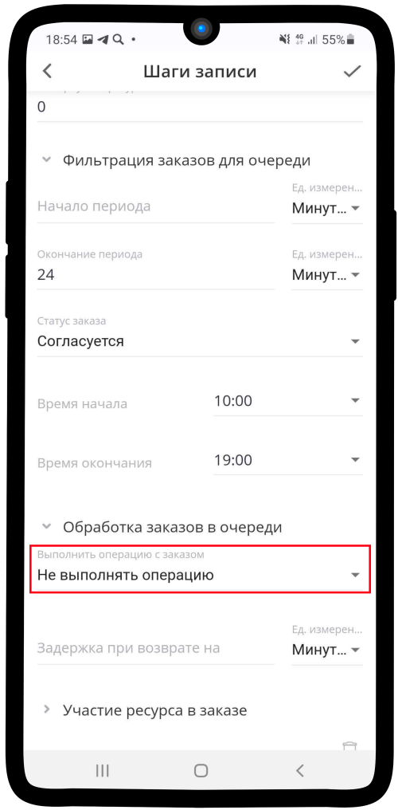

18. Выберите необходимый пункт.

.. hint:: 

    * **Не выполнять операцию** — заказ не будет **Запланирован**.
    * **Запланировать** — статус заказа изменится на **Запланирован**.

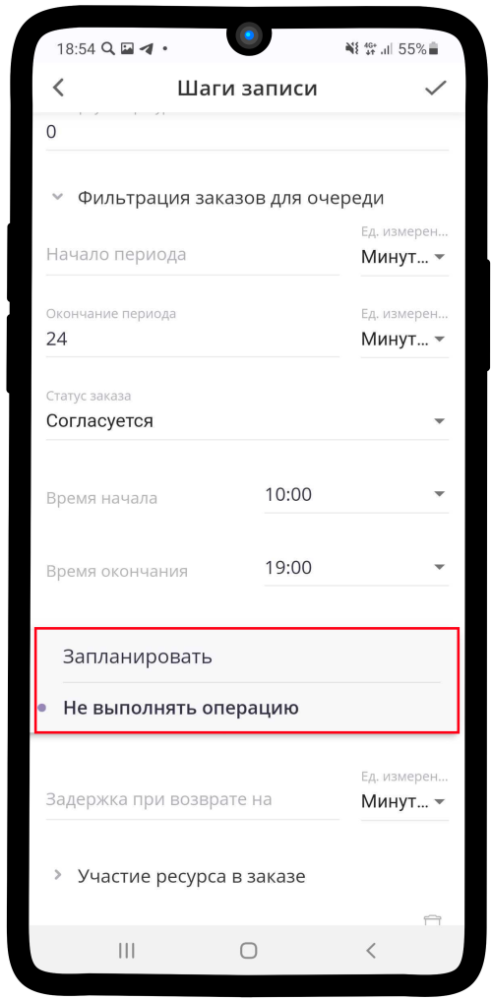

19. Установите значение **Задержки при возврате**. Это время, на которое будет отложен заказ при освобождении ресурса.

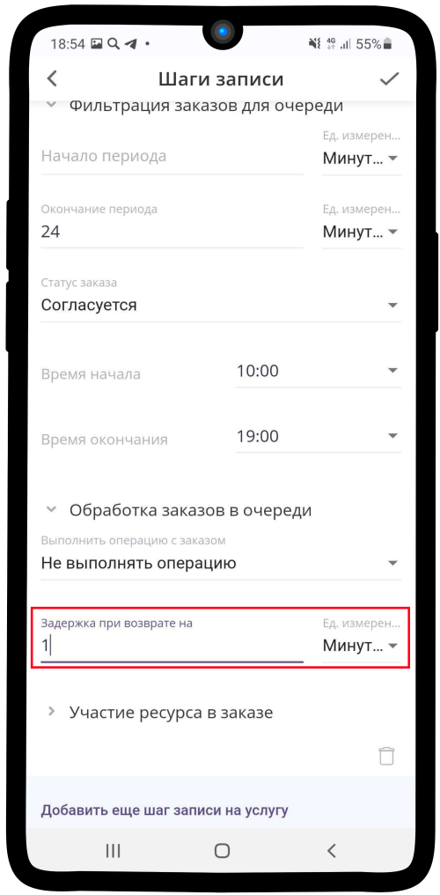

20. Перейдите к **Участие ресурса в заказе**. Нажмите на поле **Изменить участие на**.

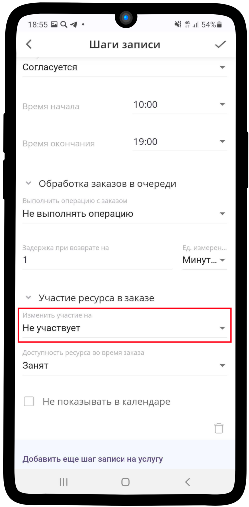

21. Выберите необходмый тип участия ресурса.

.. hint::

    * **Не участвует** — данный ресурс не будет назначаться исполнителем заказа.
    * **Заказчик** — данный ресурс не будет назначаться исполнителем заказа.
    * **Сопровождающий** — данный ресурс будет назначен сопровождающим заказа.
    * **Исполнитель** — данный ресурс будет назначен исполнителем заказа.

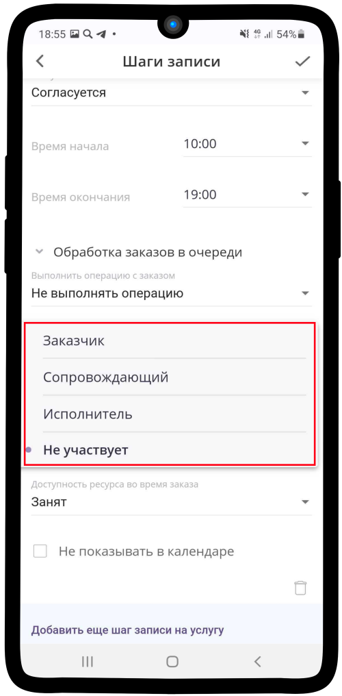

22. Нажмите на поле **Доступность ресурса во время заказа**

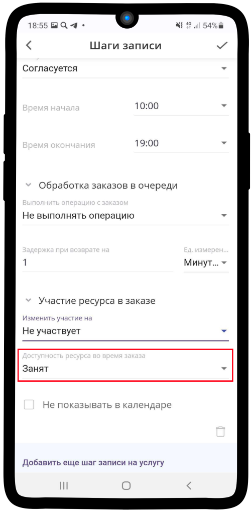

23. Выберите **тип доступности** ресурса во время заказа.
    
.. hint::

    * **Занят** — в расписании исполнителя будет отмечено занятое время.
    * **Свободен** — в расписании исполнителя не будет изменений.

24.  Поставьте |галка| в **Не показывать в календаре**, чтобы в расписании исполнителя отображался заказ. **Оставьте поле пустым**, если этого не нужно.

    .. |галка| image:: media/galka.png
        :scale: 42 %

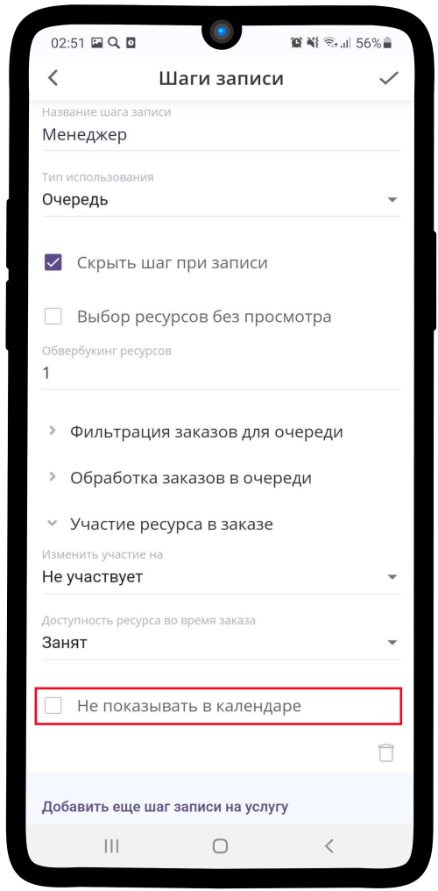

25. Если Вы хотите переместить шаг выше, то нажмите на кнопку **Переместить**. В таком случае клиент увидит этот шаг раньше других.

26. Сохраните изменения, для этого нажмите на |галка|. Если Вы хотите **добавить другие шаги**, нажмите на надпись повторите действия, **начиная с пункта 2**.

27. **Готово!** Вы настроили **Исполнение** услуги.

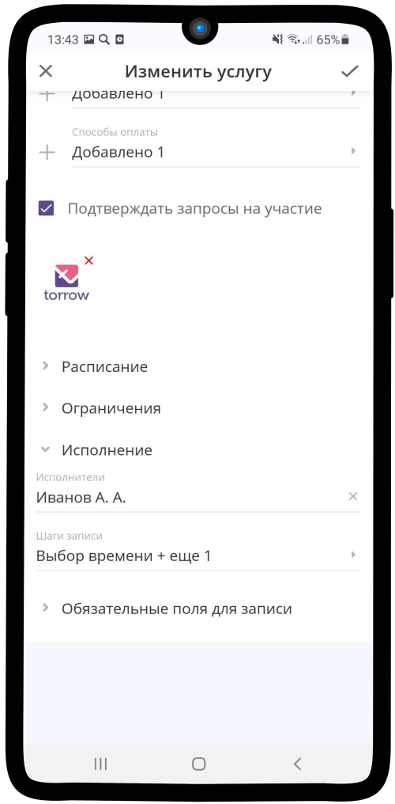

---------------------------------

.. note::

    * :ref:`materials-label`
    * :ref:`payment-label`
    * :ref:`timetable-label`
    * :ref:`restrictions-label`
    * :ref:`required-label`

.. raw:: html
   
   <torrow-widget
      id="torrow-widget"
      url="https://web.torrow.net/app/tabs/tab-search/service;id=103edf7f8c4affcce3a659502c23a?closeButtonHidden=true&tabBarHidden=true"
      modal="right"
      modal-active="false"
      show-widget-button="true"
      button-text="Заявка эксперту"
      modal-width="550px"
      button-style = "rectangle"
      button-size = "60"
      button-y = "top"
   ></torrow-widget>
   

.. raw:: html

   