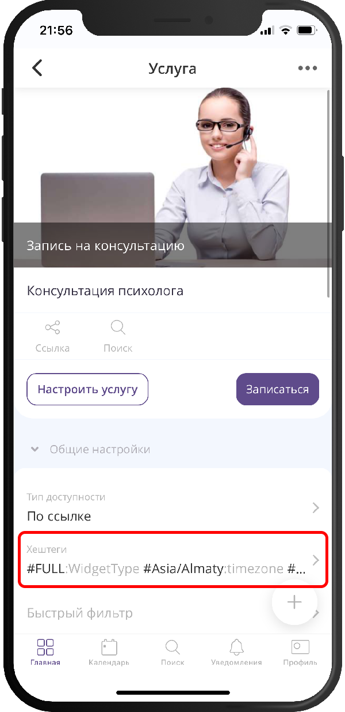
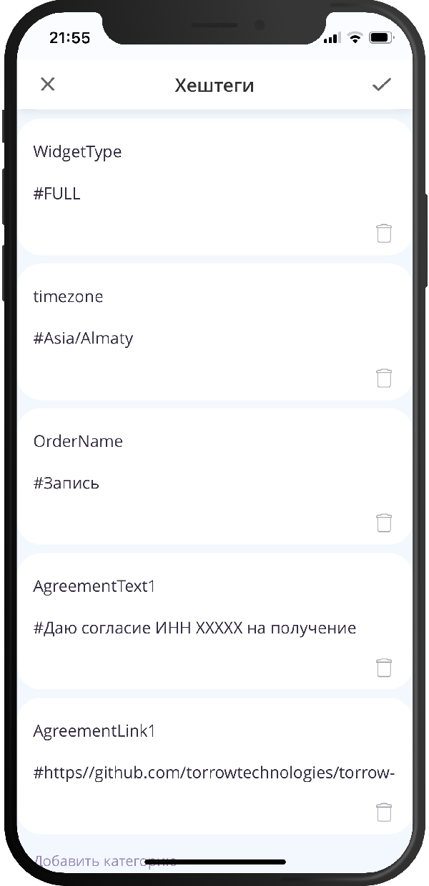

.. _service-hashtags-label:

======================================
Дополнительные настройки (хеш-теги)
======================================

Помимо стандартных полей в карточке услуги, часть поведения можно задать **хеш-тегами** — специальными метками в формате ``значение:ключ`` или ``текст:ключ``. Ниже перечислены поддерживаемые теги, их назначение и примеры.

-----------------------------
Где задаются хеш-теги услуги
-----------------------------

Хеш-теги настраиваются в разделе **"Общие настройки"** услуги. Добавьте туда одну или несколько меток в нужном формате и сохраните услугу.

-----------------
Справочник тегов
-----------------

Оплата и срок действия ссылки
=============================

``<секунды>:payment_redirect_timeout_sec``
    **Назначение:** ограничить время жизни **ссылки на оплату** для услуги с оплатой. Задаётся **в самой услуге**, а не в ресурсе оплаты.

    **Пример:** ``1800:payment_redirect_timeout_sec`` — ссылка действительна 30 минут (1800 секунд).

Ограничения действий заказчика
==============================

``<минуты>:DisableUpdateOrderTime``
    **Назначение:** за сколько минут **до начала заказа** заказчик **не может перенести** время заказа.

    **Пример:** ``300:DisableUpdateOrderTime`` — перенос недоступен, если до начала осталось не больше 300 минут (5 часов). Для суток: ``1440:DisableUpdateOrderTime``.

``<минуты>:DisableCancelMyParticipation``
    **Назначение:** за сколько минут **до начала заказа** заказчик **не может отменить своё участие**.

    **Пример:** ``300:DisableCancelMyParticipation`` — отмена участия закрывается за 5 часов до начала. Для суток: ``1440:DisableCancelMyParticipation``.

Часовой пояс услуги
===================

``<timezone>:timezone``
    **Назначение:** задать **часовой пояс услуги**. Важно для **офлайн-услуг**: влияет на календарь записи и на время в шагах записи с типом «дата». Список зон: `timezonedb.com/time-zones <https://timezonedb.com/time-zones>`_.

    **Примеры:** ``Asia/Almaty:timezone``, ``Europe/Moscow:timezone``, ``Asia/Yekaterinburg:timezone``.

Тексты в интерфейсе записи
===========================

``<текст>:OrderName``
    **Назначение:** задать **наименование заказа** в заголовке или на кнопке смены времени (вместо стандартной подписи).

    **Пример:** ``Запись:OrderName``.

``<текст>:UnavailableBookingMessage``
    **Назначение:** сообщение, которое показывается клиенту, когда **нет доступных слотов** для записи на услугу.

    **Пример:** ``Запись в кафе откроется в конце месяца.:UnavailableBookingMessage``.

Первый ресурс в списках (звёздочка в названии шага)
===================================================

Если **название шага записи** начинается со звёздочки (``*``), ресурс, выбранный на этом шаге, считается **первым** и отображается **во всех списках** как основной.

**Пример названия шага:** ``*Кабинет`` — номер кабинета будет вести себя как первый ресурс в списковом виде.

.. hint::

   Добавление ``*`` к уже существующей услуге учитывается **только для новых заказов**; в старых заказах остаётся название шага **без** звёздочки.

Клиентская скидка (система лояльности)
======================================

``<имя поля>:DiscountPercentage``
    **Назначение:** указать **название поля в системе лояльности**, в котором хранится **процент скидки** клиента.

    **Пример:** ``Скидка:DiscountPercentage`` — в системе лояльности должно быть поле «Скидка» со значением в процентах (например, ``20``).

Пользовательские соглашения
===========================

Пары тегов для текста и ссылки (можно использовать несколько блоков):

* ``<текст>:AgreementText1`` и ``<ссылка>:AgreementLink1``
* ``<текст>:AgreementText2`` и ``<ссылка>:AgreementLink2``

**Назначение:** оформить **текст согласия** с кликабельной **ссылкой**: в тексте согласия фрагмент, который должен стать ссылкой, обрамите **двойным подчёркиванием** ``__``.

**Примеры фраз в тексте согласия:**

* ``Даю согласие ИНН ХХХХХ __на обработку персональных данных__``
* ``Даю согласие ИНН ХХХХХ на получение сообщений и информационно-рекламной рассылки``

.. warning::

   В значении тега ссылки **нельзя использовать символ** ``:``. Обходной приём: в URL записывать ``http//`` и ``https//`` вместо ``http://`` и ``https://`` — система выполнит нужную подстановку.

**Пример хештегов:**
``Даю согласие ИНН ХХХХХ __на обработку персональных данных__:AgreementText1``
``https//info.torrow.net/useragreement:AgreementLink1``

Telegram-бот уведомлений
========================

``060:AutoStartTelegramNotificationBot``
    **Назначение:** **автоматически запускать** бота уведомлений в Telegram **в течение 60 секунд** после открытия заказа.

    **Пример:** ``060:AutoStartTelegramNotificationBot``.

``HideTelegramNotificationBot``
    **Назначение:** **скрыть кнопку** Telegram-бота уведомлений в интерфейсе.

    **Пример:** ``HideTelegramNotificationBot`` (без числового префикса).

Тег в ресурсе услуги (не в карточке услуги)
===========================================

``<секунды>:MarginTime`` *(задаётся в **ресурсе** услуги, в его хеш-тегах)*

    **Назначение:** **минимальный интервал в секундах** между событиями этого ресурса (отступ после занятого слота).

    **Пример:** ``3600:MarginTime`` — час между событиями.
