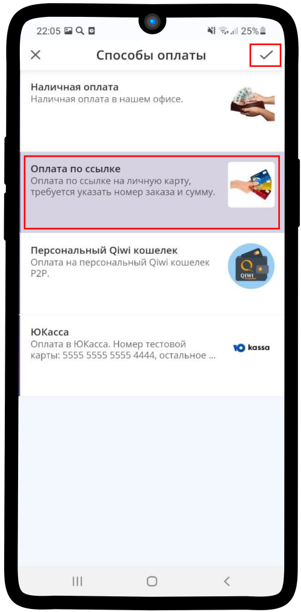
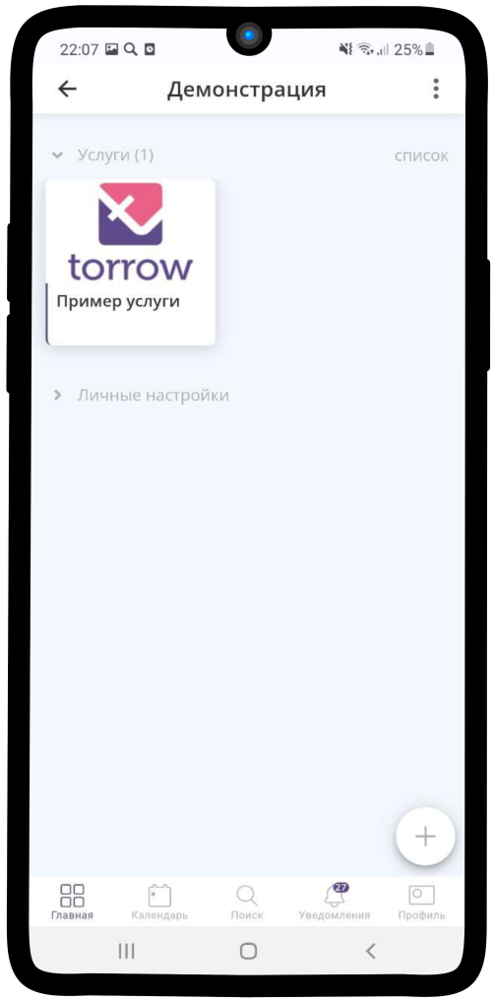

.. _orderontime-label:

==============
Заказ на время
==============

1. Зайдите в элемент или раздел, где хотите создать **услугу** и нажмите |плюс|.

    .. |плюс| image:: media/plus.png
        :scale: 42 %

2. Нажмите на кнопку |массив|.

    .. |массив| image:: media/reserved.png
        :scale: 42 %

3. Выбираем **Создать услугу** |корзина|.

    .. |корзина| image:: media/shopping-cart.png
        :scale: 42 %

4. Измените **тип**. Для этого нажмите на соответствующее поле (по умолчанию: **Запись на сеанс**).

5. Выберите тип **Заказ на время**.

6. Заполните всю необходимую **информацию об услуге**: название, описание, место.

7. Добавьте **дополнительные материалы**, если они необходимы. **Если необходимости в них нет, пропустите данный пункт**.

.. hint:: Если добавить в услугу дополнительные материалы, то Заказчик при совершении операций получит вложенный элемент (например: ссылку на курс, заметку с какой-либо информацией, туристический маршрут и др.). Чтобы узнать как настроить доп. материалы, перейдите по ссылке: :ref:`materials-label`.

.. figure:: media/order_on_time/order7.png
    :scale: 42 %
    :alt: alternate text
    :align: center

8. Добавьте **способ оплаты**, если необходимо. **Если необходимости в них нет, пропустите пункты 8-9**.

.. hint:: Вы можете подключить любой возможный способ оплаты: наличные, перевод, банковской картой, qiwi и др. Чтобы узнать как настроить оплату, перейдите по ссылке: :ref:`payment-label`.

9. Выберите необходимый способ оплаты и нажмите |галка|.

10. Если хотите, чтобы при создании клиентом заявки Вам **приходило уведомление**, то поставьте |галка| в указанное поле.

    .. |галка| image:: media/galka.png
        :scale: 42 %

11. Разместите **фотографию** в Вашей **услуге**. Это привлечет больший интерес клиентов.

12. Вам необходимо заполнить поля: **Расписание**, **Ограничения**, **Исполнение** и **Обязательные поля для записи**.

.. note::

    * :ref:`timetable-label`
    * :ref:`restrictions-label`
    * :ref:`execution-label`
    * :ref:`required-label`
    

13. Ваша услуга типа **Заказ на время** готова! Осталось добавить **ресурсы** (:ref:`resources-label`).

-----------------------------

.. toctree::
    :maxdepth: 1
    :caption: Настройка услуги

    add-materials-customization
    payment-customization
    timetable-customization
    restrictions-customization
    execution-customization
    required-fields-customization