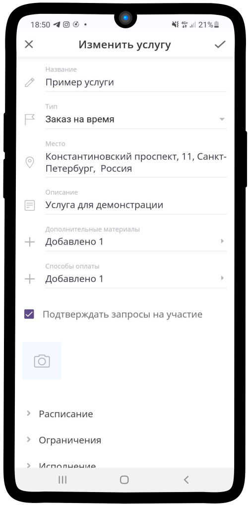

.. _payment-label:

================
Настройка оплаты
================

Чтобы добавить возможность оплаты заказа клиентом:

1. Нажмите на поле **Способы оплаты**.

.. figure:: media/order_on_time/order8.png
    :scale: 42 %
    :alt: alternate text
    :align: center

2. Выберите необходимый способ оплаты и нажмите |галка|, чтобы сохранить изменения.

    .. |галка| image:: media/galka.png
        :scale: 42 %

.. hint:: Если Вы ранее не создавали ресурсов с типом **Оплата**, то данное окно будет пустым. Чтобы создать ресурс с необходимым типом оплаты воспользуйтесь инструкцией: :ref:`paymentresource-label`.

.. figure:: media/order_on_time/order9.png
    :scale: 42 %
    :alt: alternate text
    :align: center

3. Способ оплаты **добавлен**.

-----------------------------

.. note::

    * :ref:`materials-label`
    * :ref:`timetable-label`
    * :ref:`restrictions-label`
    * :ref:`execution-label`
    * :ref:`required-label`

.. raw:: html
   
   <torrow-widget
      id="torrow-widget"
      url="https://web.torrow.net/app/tabs/tab-search/service;id=103edf7f8c4affcce3a659502c23a?closeButtonHidden=true&tabBarHidden=true"
      modal="right"
      modal-active="false"
      show-widget-button="true"
      button-text="Заявка эксперту"
      modal-width="550px"
      button-style = "rectangle"
      button-size = "60"
      button-y = "top"
   ></torrow-widget>
   

.. raw:: html

   <!--  -->