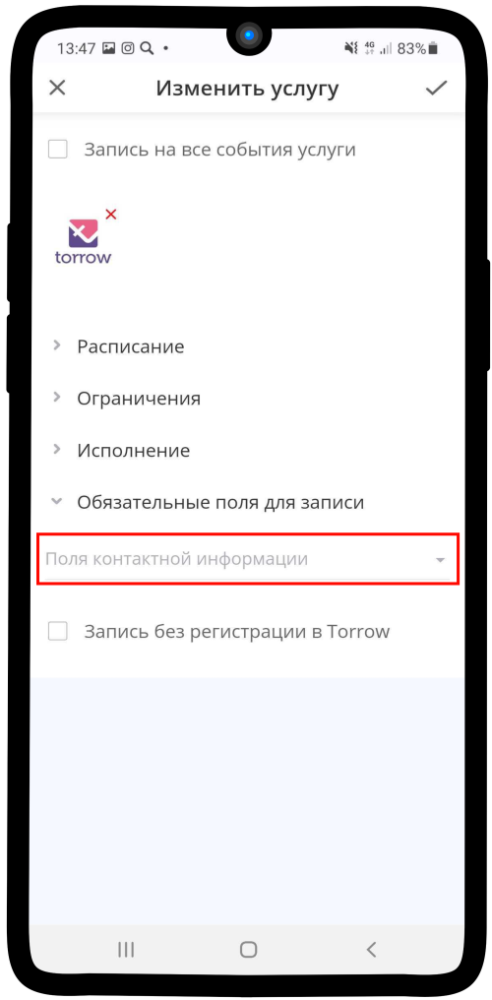
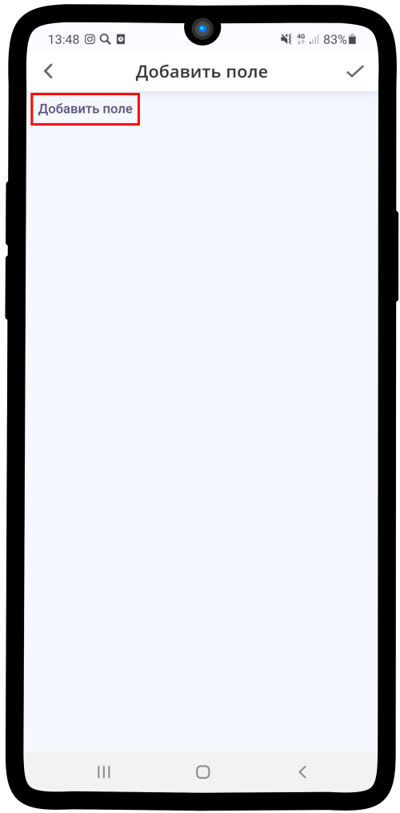
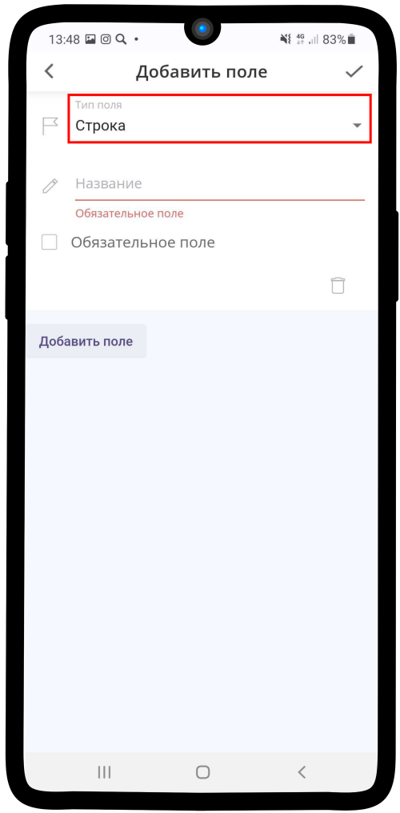
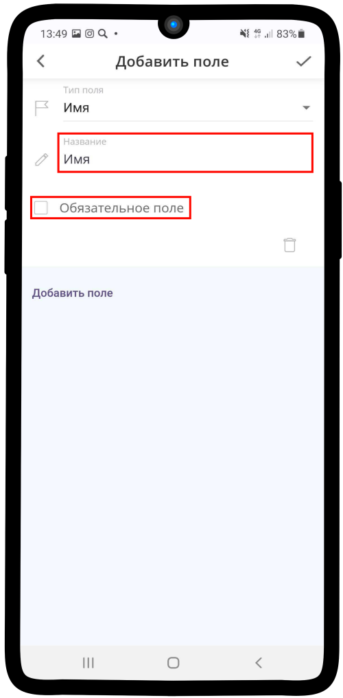
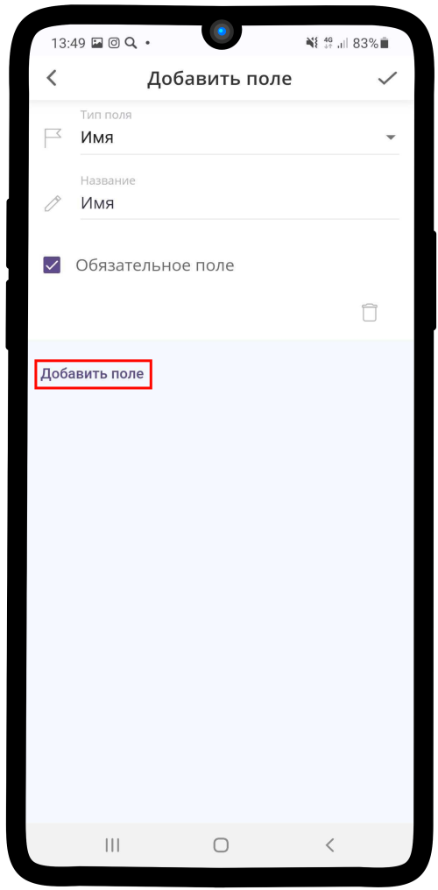
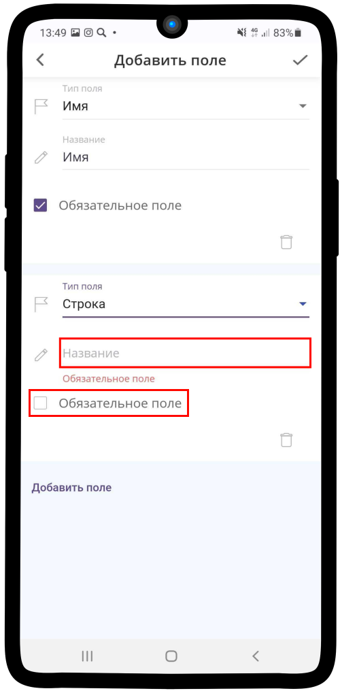
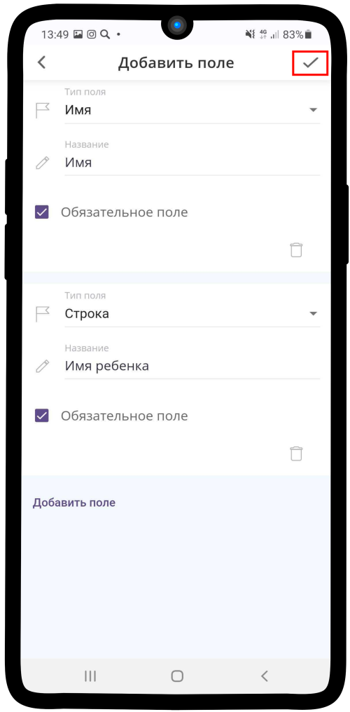
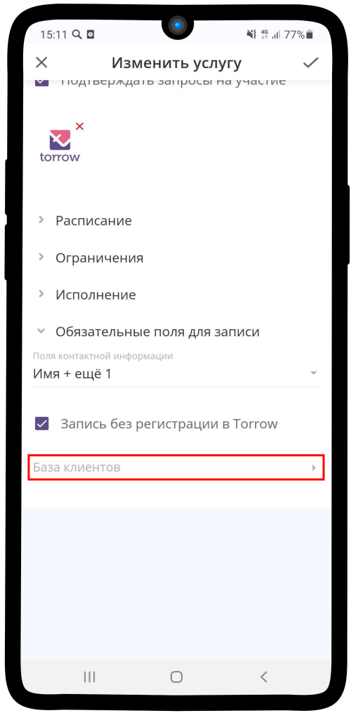
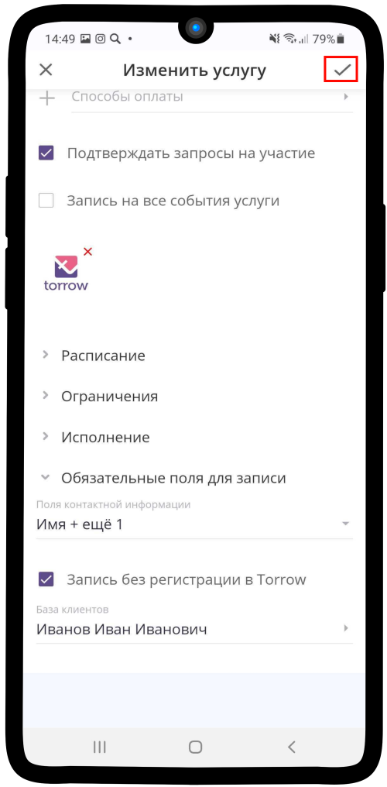

.. _required-label:

=======================================
Настройка обязательных полей для записи
=======================================

Чтобы настроить обязательные поля в услуге:

1. Раскройте вкладку **Обязательные поля для записи** и нажмите на поле **Поля контактной информации**.

2. Нажмите на надпись **Добавить поле**.

3. Нажмите на **Тип поля** (по умолчанию **Строка**).

4. Выберите один из предложенных вариантов.

.. hint:: По умолчанию уже представлены типы: Имя, ФИО, Организация, Должность, Адрес, Телефон, Email. Также есть типы **Строка** и **Число**, в них Вы можете указать любую информацию, которую хотите получить от клиента.

.. figure:: media/required-fields/required4.png
    :scale: 42 %
    :alt: alternate text
    :align: center

5. Название применяется к типу поля, которое Вы выбрали, но при необходимости его можно изменить. Поставьте **галку** в поле **Обязательное поле**, чтобы клиент не мог сформировать заказ без указания данной информации.

6. Чтобы указать дополнительное поле, нажмите на надпись **Добавить поле**

7. Выберите тип **Строка**, если хотите указать собственное поле. Введите **Название** поля, которое увидит клиент при заполнении контактной информации и поставьте отметку **Оьязательное поле**.

.. hint::

    * Тип поля **Строка** - если Вы выбрали данный тип поля, то клиент может вводить в неё только буквенные символы.
    * Тип поля **Число** - если Вы выбрали данный тип поля, то клиент может вводить в неё только числовые значения.

8. Сохраните изменения, нажав на |галка|.

    .. |галка| image:: media/galka.png
        :scale: 42 %

9. Чтобы Ваши клиенты имели возможность сделать заказ в услуге без прохождения процедуры регистрации в приложении, нажмите на поле **Запись без регистрации в Torrow**.

.. figure:: media/required-fields/required9.png
    :scale: 42 %
    :alt: alternate text
    :align: center

10. Нажмите на появившееся поле **База клиентов**.

.. hint:: **База клиентов** - это контакт, куда будет попадать контактная информация о клиентах, которые сделали заказ, но **не прошли процедуру регистрации**.

11. Выберите контакт, который будете использовать в качестве клиентской базы и нажмите |галка|.

.. hint:: Если контакт еще не создан, просто сохраните услугу с текущими настройками, создайте контакт и вернитесь к данному пункту инструкции.

12. Вы заполнили **Обязательные поля для записи**, теперь сохраните изменения, нажав на |галка|.

--------------------------------

.. note::

    * :ref:`materials-label`
    * :ref:`payment-label`
    * :ref:`timetable-label`
    * :ref:`restrictions-label`
    * :ref:`execution-label`