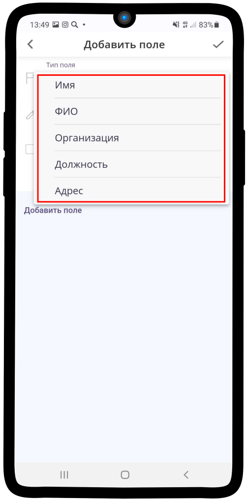
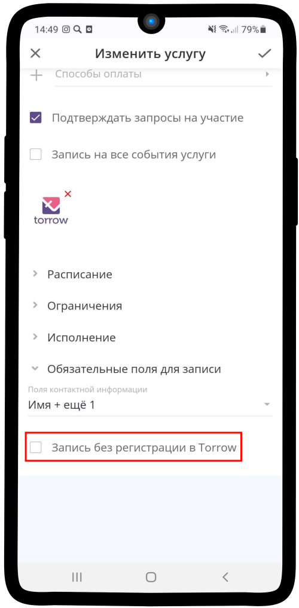
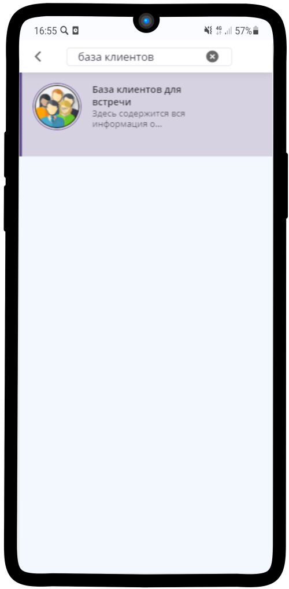

.. _required-label:

=======================================
Настройка обязательных полей для записи
=======================================

----------------------------
Обязательные поля для записи
----------------------------

Чтобы настроить обязательные поля в услуге:

1. Раскройте вкладку **Обязательные поля для записи** и нажмите на поле **Поля контактной информации**.

2. Нажмите на надпись **Добавить поле**.

.. figure:: media/required-fields/required2.png
    :scale: 42 %
    :alt: alternate text
    :align: center

3. Нажмите на **Тип поля** (по умолчанию **Строка**).

4. Выберите один из предложенных вариантов.

.. hint:: По умолчанию уже представлены типы: Имя, ФИО, Организация, Должность, Адрес, Телефон, Email. Также есть типы **Строка** и **Число**, в них Вы можете указать любую информацию, которую хотите получить от клиента.

5. Название применяется к типу поля, которое Вы выбрали, но при необходимости его можно изменить. Поставьте **галку** в поле **Обязательное поле**, чтобы клиент не мог сформировать заказ без указания данной информации.

6. Чтобы указать дополнительное поле, нажмите на надпись **Добавить поле**

7. Выберите тип **Строка**, если хотите указать собственное поле. Введите **Название** поля, которое увидит клиент при заполнении контактной информации и поставьте отметку **Обязательное поле**.

.. hint::

    * Тип поля **Строка** — если Вы выбрали данный тип поля, то клиент может вводить в неё только буквенные символы.
    * Тип поля **Число** — если Вы выбрали данный тип поля, то клиент может вводить в неё только числовые значения.

.. figure:: media/required-fields/required7.png
    :scale: 42 %
    :alt: alternate text
    :align: center

8. Сохраните изменения, нажав на |галка|.

    .. |галка| image:: media/galka.png
        :scale: 42 %

----------------------------

-------------------------------
Запись без регистрации в Torrow
-------------------------------

1. Чтобы Ваши клиенты имели возможность сделать заказ в услуге без прохождения процедуры регистрации в приложении, нажмите на поле **Запись без регистрации в Torrow**.

.. hint:: Чтобы клиенты могли записаться на услугу без регистрации, необходимо в `Обязательные поля для записи`_ добавить поле **Телефон** или **Email**.

2. Нажмите на появившееся поле **База клиентов**.

.. hint:: **База клиентов** - это контакт, куда будет попадать контактная информация о клиентах, которые сделали заказ, но **не прошли процедуру регистрации**.

3. Выберите контакт, который будете использовать в качестве **клиентской базы**  и нажмите |галка| (При регистрации автоматически создается **База клиентов**)

.. hint:: Если Вы хотите использовать другую Базу клиентов, просто сохраните услугу с текущими настройками, создайте контакт и вернитесь к данному пункту инструкции (:ref:`contact_base-label`).

4. Вы заполнили **Обязательные поля для записи**, теперь сохраните изменения, нажав на |галка|.

--------------------------------

.. note::

    * :ref:`materials-label`
    * :ref:`payment-label`
    * :ref:`timetable-label`
    * :ref:`restrictions-label`
    * :ref:`execution-label`

.. raw:: html
   
   <torrow-widget
      id="torrow-widget"
      url="https://web.torrow.net/app/tabs/tab-search/service;id=103edf7f8c4affcce3a659502c23a?closeButtonHidden=true&tabBarHidden=true"
      modal="right"
      modal-active="false"
      show-widget-button="true"
      button-text="Заявка эксперту"
      modal-width="550px"
      button-style = "rectangle"
      button-size = "60"
      button-y = "top"
   ></torrow-widget>
   

.. raw:: html

   <!--  -->