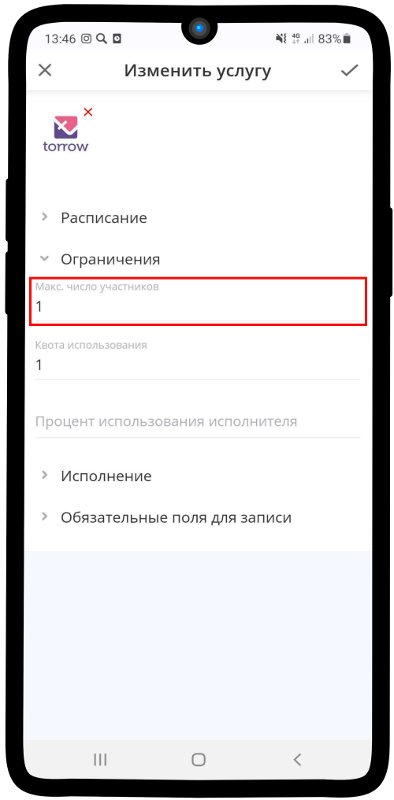
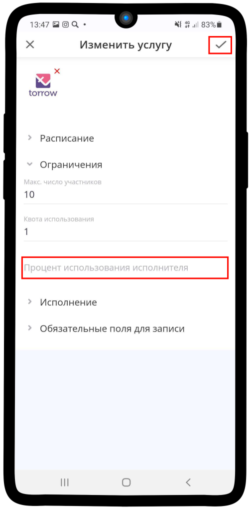

.. _restrictions-label:

=====================
Настройка ограничений
=====================

Чтобы настроить ограничения в услуге:

1. Раскройте вкладку **Ограничения** и введите **Максимальное число участников** (при необходимости).

.. hint:: Поле **Максимальное число участников** - это максимально возможное число участников в заказе. Если заказ индивидуальный просто оставьте поле нетронутым или впишите **1**. Используется преимущественно в услугах с типом **Запись на сеанс**. Например, при формировании групповой консультации можно указать 10 участников., в таком случае на сеанс сможет записаться не более 10 человек.

2. Укажите **Квоту использования**.

.. hint:: **Квота использования** - количество использований услуги на один интервал времени. Если оставить поле пустым, то ограничений на использование услуги не будет.

3. Если необходимо, можете указать **Процент использования исполнителя** (по умолчанию не установлен). Теперь можете сохранить изменения, нажав на |галка|.

    .. |галка| image:: media/galka.png
        :scale: 42 %

.. hint:: **Процент использования исполнителя** - это количество рабочего времени исполнителя, которое отведено для данной услуги.

----------------------------------

.. note::

    * :ref:`materials-label`
    * :ref:`payment-label`
    * :ref:`timetable-label`
    * :ref:`execution-label`
    * :ref:`required-label`