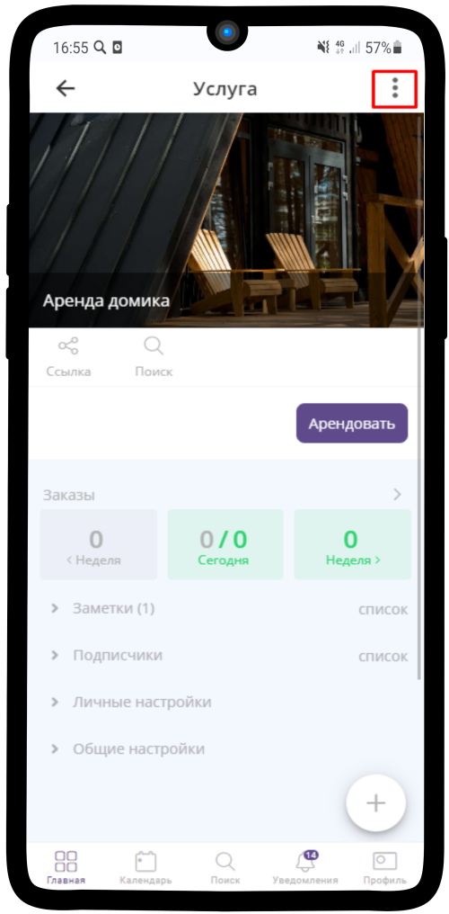
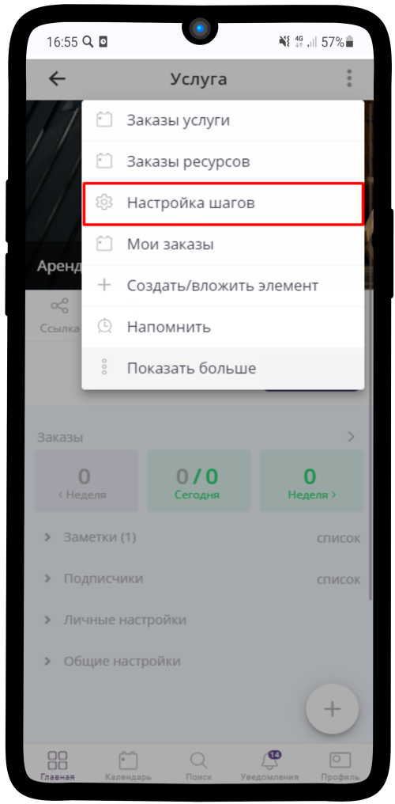
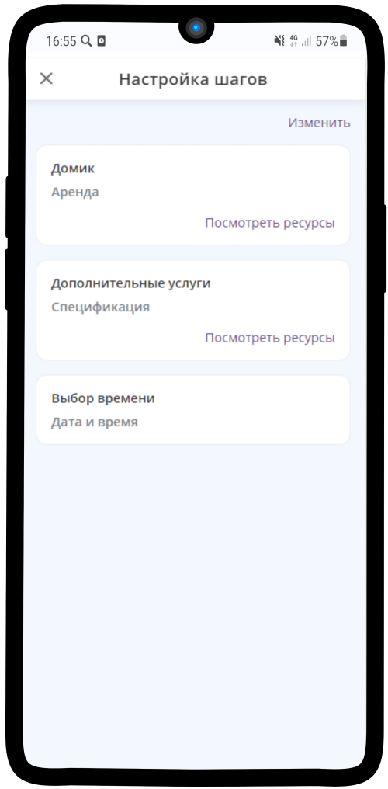
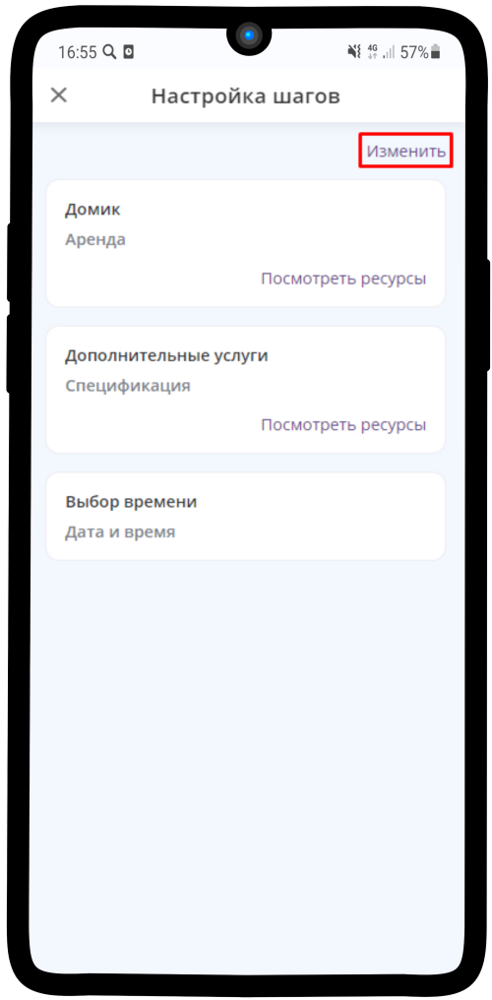
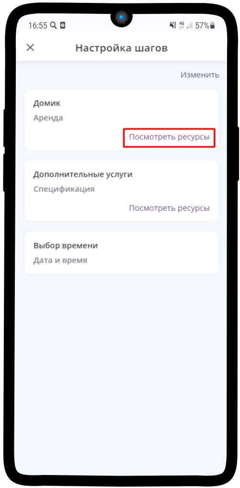
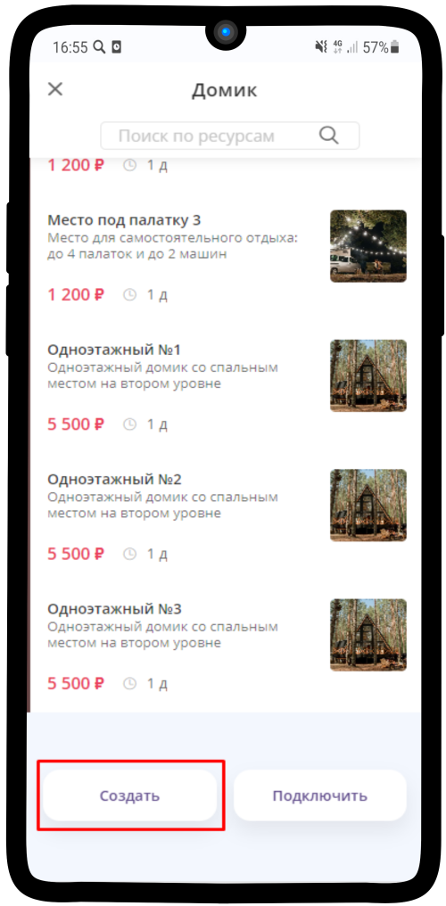
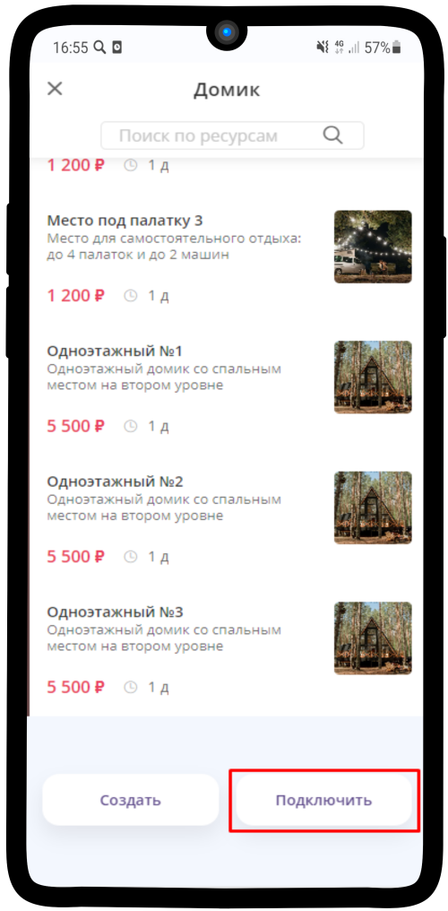

.. _stepscustom-label:

====================
Настройка шагов записи
====================

1. Нажмите на |точка| в правом верхнем углу.

    .. |точка| image:: media/tochka.png
        :scale: 42 %

-----------------------------

2. Выберите пункт **Настройка шагов**

-----------------------------

3. В услугах с типом **Запись на время**, **Аренда** и **Заказ на время** на странице будет показан шаг **Выбор времени**. Для услуги с типом **Запись на сеанс** шаги записи **не указываются**. Если ранее Вы настраивали шаги в услуге, то они будут показаны на этой странице.

-----------------------------

4. Вы можете изменить имеющиеся шаги или добавить новые (подробная инструкция по настройке шагов :ref:`execution-label`)

-----------------------------

5. Нажав на шаг, Вы можете посмотреть подключенные ресурсы, отредактировать их

-----------------------------

6. По кнопке **Создать** — создается новый ресурс с типом, указанным на данном шаге

-----------------------------

7. По кнопке **Подключить** — можно подключить уже созданный ранее ресурс с подходящим типом

-----------------------------
