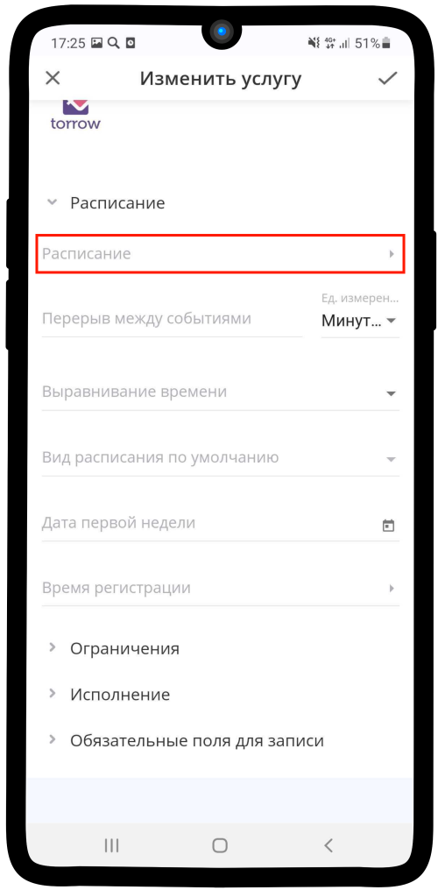
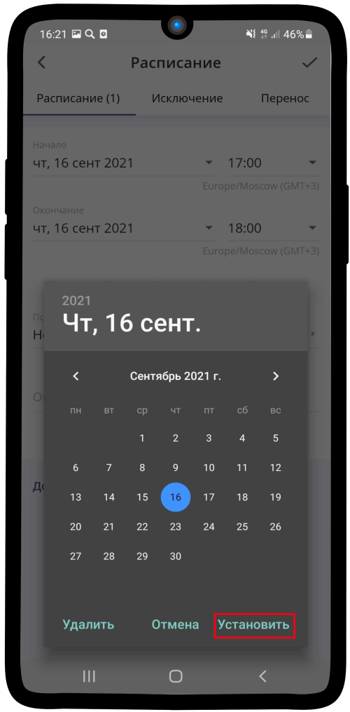
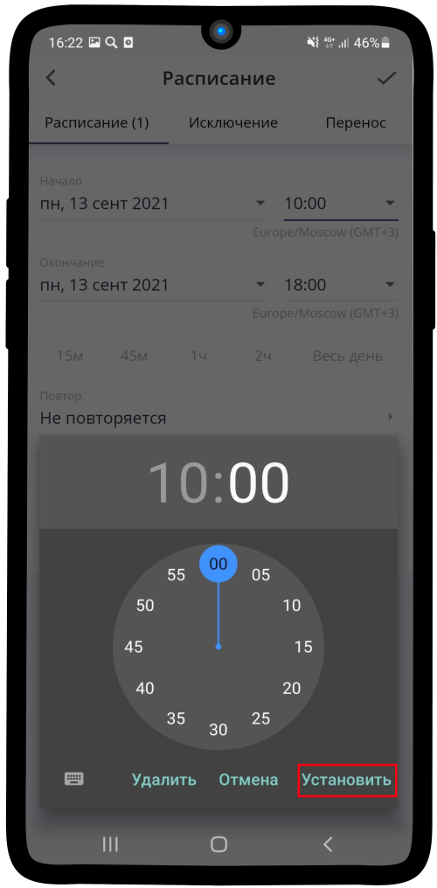
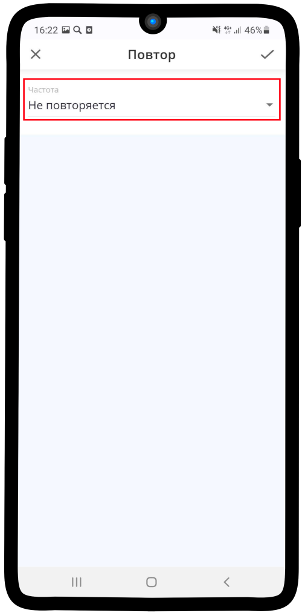
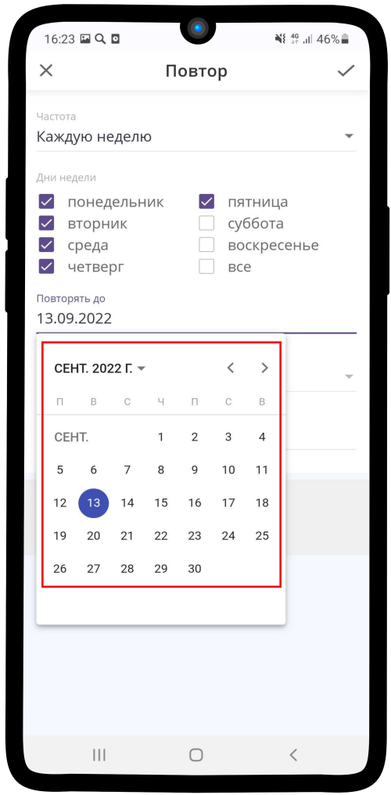
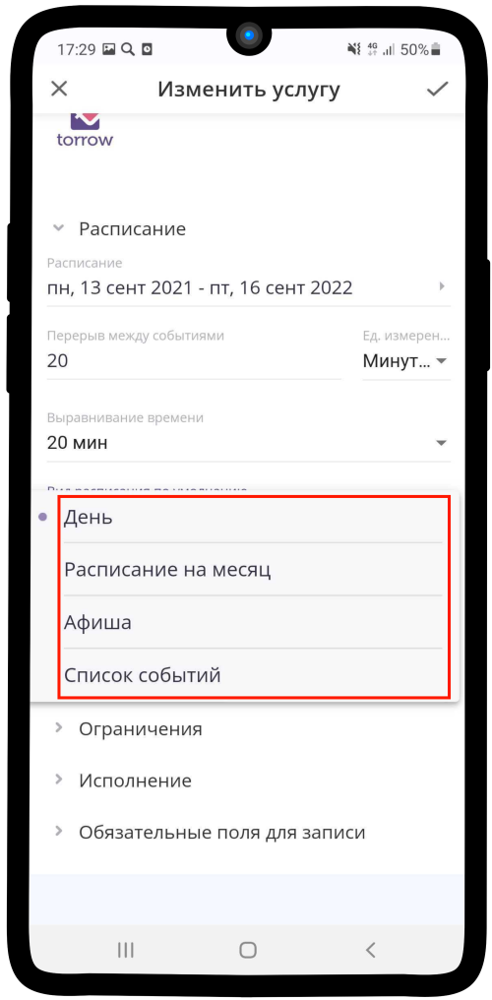

.. _timetable-label:

====================
Настройка расписания
====================

Чтобы настроить **расписание услуги**:

1. Нажмите на поле **Расписание**.

.. hint:: Данный параметр не используется в услуге типа **Запись на сеанс**.

2. Нажмите на текст **Добавить промежуток времени**.

.. figure:: media/time_service/timetable1.2.png
    :scale: 42 %
    :alt: alternate text
    :align: center

3. Нажмите на **поле с датой**.

4. Установите дату начала и окончания периода, затем нажмите **Установить**.

.. hint:: Вы можете установить любой интервал времени, но для настройки **расписания рабочего дня** необходимо **выбрать равные значения**.

5. Нажмите на **поле со временем**.

.. figure:: media/time_service/timetable4.png
    :scale: 42 %
    :alt: alternate text
    :align: center

6. Установите время начала и окончания рабочего дня, затем нажмите **Установить**.

7. Нажмите на поле **Повтор**.

.. figure:: media/time_service/timetable6.png
    :scale: 42 %
    :alt: alternate text
    :align: center

8. Нажмите на поле **Частота**. По умолчанию **Не повторяется**.

.. hint:: По умолчанию **Не повторяется**.

9. Выберите подходящий вариант из списка.

.. hint:: Если Вы работаете не каждый день, то выберите значение **Каждую неделю**.

10. В появившемся окне выберите те дни, когда Вы работаете.

11. Нажмите на поле **Повторять до**. Выберите период времени, до которого необходимо повторять данное расписание.

.. figure:: media/time_service/timetable10.png
    :scale: 42 %
    :alt: alternate text
    :align: center

12. Установите **год, месяц и дату** окончания периода.

13. Нажмите |галка|, чтобы сохранить изменения.

    .. |галка| image:: media/galka.png
        :scale: 42 %

.. figure:: media/time_service/timetable12.png
    :scale: 42 %
    :alt: alternate text
    :align: center

14. При необходимости введите **описание** и нажмите |галка|. Ваше расписание **сохранено**, теперь Вы можете продолжить редактирование **Услуги**.

.. figure:: media/time_service/timetable13.png
    :scale: 42 %
    :alt: alternate text
    :align: center

15.  Если необходимо, установите **перерыв между событиями**.

.. note:: Например, если к Вам записался клиент и после обслуживания необходимо провести уборку помещения или время на подготовку.

.. hint:: В Услугах типа **Заявка** и **Запись на сеанс** данный параметр не используется.

16. Установите **выравнивание времени**.

.. hint:: Выравнивание времени — это шкала, которую увидит клиент на шаге выбора времени заказа. Возможно установить дробление от 5 минут до 1 часа.

17. Нажмите на поле **Вид расписания по умолчанию**

18. Выберите необходимый вид. Предлагаем выбрать **Список событий**, он наиболее удобен для просмотра заказов во время работы.

19. При необходимости можете установить параметр **Дата первой недели**.

.. hint:: Дата первой недели — необходима в случае, если расписание услуги меняется в зависимости от номера недели первой или второй. Обычно используется в образовательных учреждениях.

20. Нажмите на поле **Время регистрации**.

21. Установите **время открытия и закрытия регистрации** на Вашу услугу и сохраните, нажав на |галка|.

.. hint:: например, открытие за 14 дней до начала и закрытие за 3 часа до начала. Т.е время регистрации составит 13 дней и 21 час. Если Вы не хотите, чтобы было подобное ограничение, просто оставьте поле пустым.

22.  Блок **Расписание** заполнен, теперь можете сохранить изменения, нажав на |галка| или продолжить редактирование других блоков.

----------------------------

.. note::

    * :ref:`materials-label`
    * :ref:`payment-label`
    * :ref:`restrictions-label`
    * :ref:`execution-label`
    * :ref:`required-label`

.. raw:: html
   
   <torrow-widget
      id="torrow-widget"
      url="https://web.torrow.net/app/tabs/tab-search/service;id=103edf7f8c4affcce3a659502c23a?closeButtonHidden=true&tabBarHidden=true"
      modal="right"
      modal-active="false"
      show-widget-button="true"
      button-text="Заявка эксперту"
      modal-width="550px"
      button-style = "rectangle"
      button-size = "60"
      button-y = "top"
   ></torrow-widget>
   

.. raw:: html

   