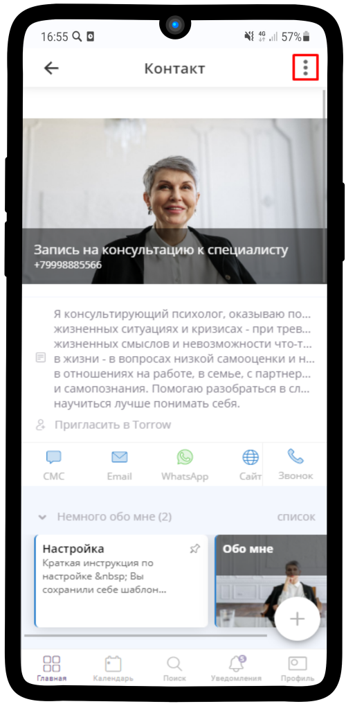
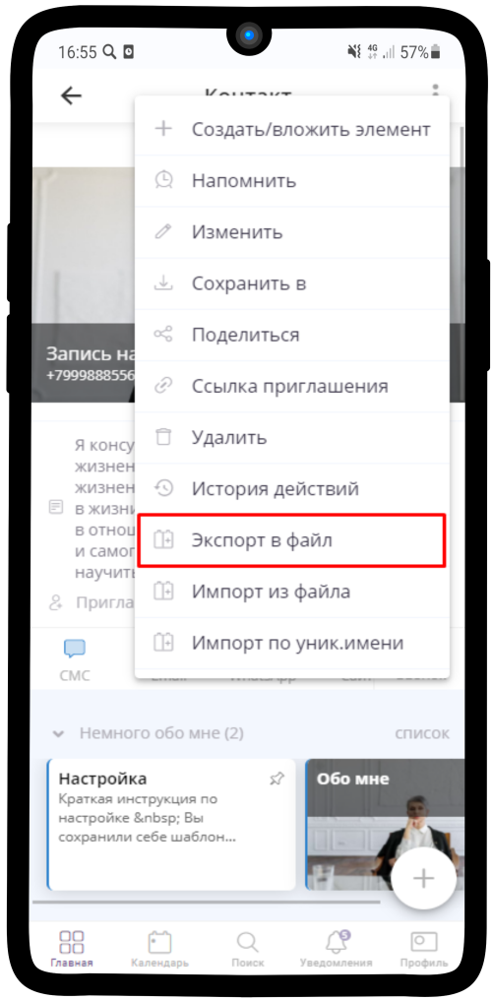
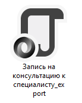
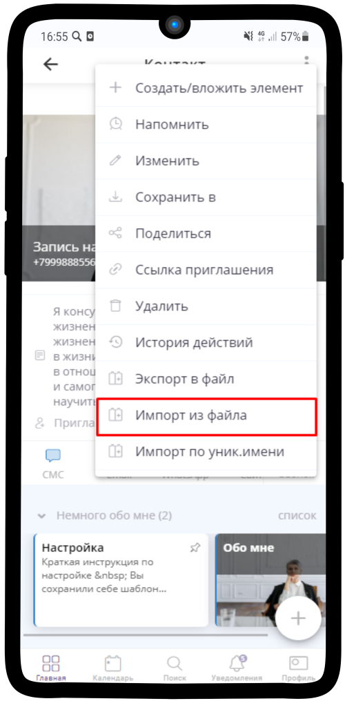
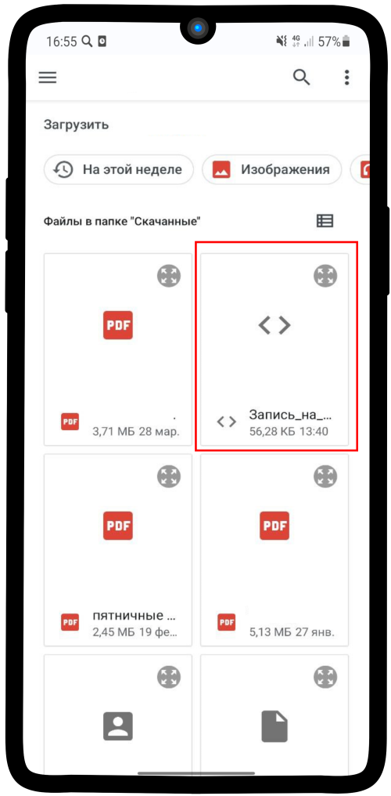

Экспорт / импорт шаблонов
=============================

Экспорт/Импорт элементов в файл удобен для создания точных копий и/или создания разных версий Вашего продукта. 

.. note::
    
    * `Экспорт элементов в файл`_
    * `Импорт файла`_

.. hint:: Для того, чтобы экспорт/импорт работал корректно, все нужные элементы должны быть **прикреплены** и **Тип доступности: По ссылке / Открытый**

    .. |точка| image:: media/tochka.png
        :scale: 42 %

Экспорт элементов в файл
--------------------------

1. Зайдите в нужный Вам элемент, нажмите на |точка| в правом верхнем углу

----------------------------------------

2. Выберите в выпадающем меню **Экспорт в файл**
   

-----------------------------------------

3. Файл формата json загружен на Ваше устройство

------------------------------------------

Импорт файла
-------------

1. Чтобы загрузить экспортированный файл, выберите область, куда сохраните нужный элемент. Нажмите на |точка| в правом верхнем углу
   
.. figure:: media/template12.png
    :scale: 53 %
    :alt: alternate text
    :align: center

------------------------------------------

2. Нажмите на **Импорт из файла**

------------------------------------------

3. Выберите ранее сохраненный файл

------------------------------------------

4. Элемент экспортирован — отображается выбранный Вами элемент

.. figure:: media/template14.png
    :scale: 53 %
    :alt: alternate text
    :align: center

