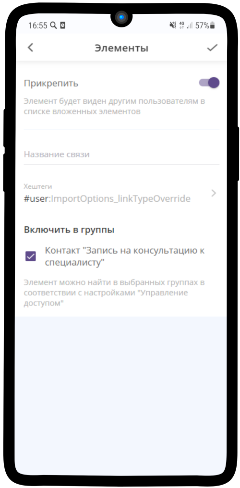
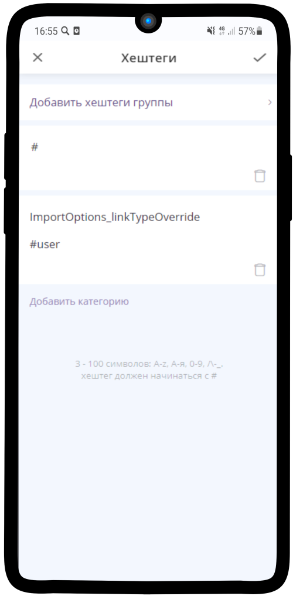
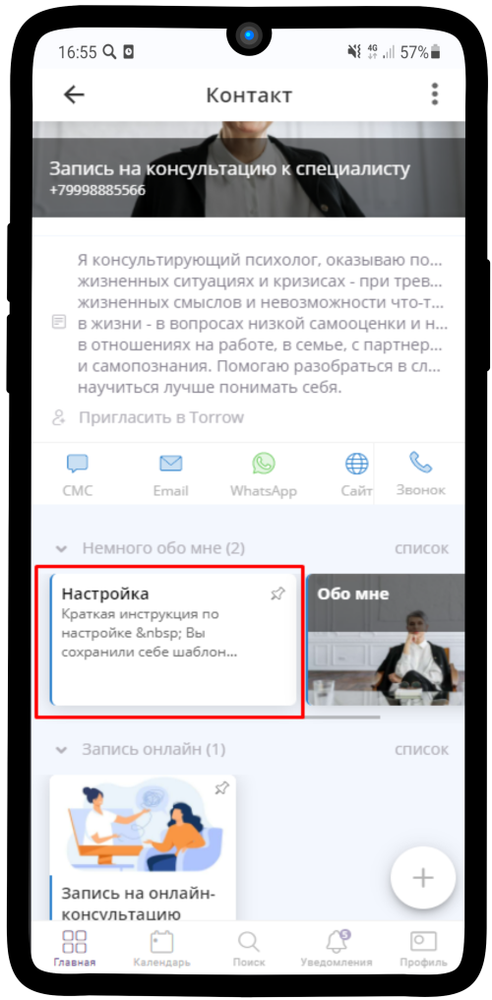
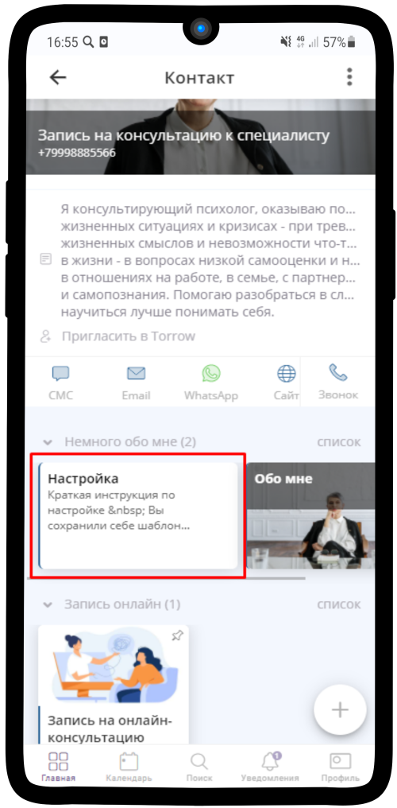

Дополнительные настройки
=========================

При импорте сохраняются все настройки элементов, кроме уникального имени. 

Настройки для импорта/экспорта, которые могут переопределить стандартный алгоритм (стандартный – это сделать точную копию изначальной структуры элементов).

Дополнительные настройки:

* ignore:ExportOptions_export —  не экспортировать данную связь/элемент
  
* link:ImportOptions_importType — при импорте не делать дубликат элемента, а ссылаться на чужой элемент из экспорта

* user:ImportOptions_linkTypeOverride — при импорте данной связи делать её неприкрепленной(пользовательской)

Настройки прописываются в виде хештегов у связей
  

------------------------------------------
   

------------------------------------------

* user:ImportOptions_linkTypeOverride — при импорте данной связи делать её неприкрепленной (пользовательской). Элементы с указанным тегом видны только для владельца. Настройка наследуется — вложенные и прикрепленные элементы также не видны пользователям.

Шаблон с прописанной связью-тегом и прикрепленным элементом

------------------------------------------

Копия с неприкрепленным элементом
   

------------------------------------------

* ignore:ExportOptions_export —  не экспортировать данную связь/элемент

Например, связь/элемент созданные для пояснения или служебного пользования

* link:ImportOptions_importType — при импорте не делать дубликат элемента, а ссылаться на чужой элемент из экспорта

Операция аналогичная **Сохранить в**: у Владельца импортируемого элемента создаются читательские права. Он имеет доступ к элементам с Типом доступности: Открытый/По ссылке, не может редактировать элементы.

.. .. raw:: html
   
..    <torrow-widget
..       id="torrow-widget"
..       url="https://web.torrow.net/app/tabs/tab-search/service;id=103edf7f8c4affcce3a659502c23a?closeButtonHidden=true&tabBarHidden=true"
..       modal="right"
..       modal-active="false"
..       show-widget-button="true"
..       button-text="Заявка эксперту"
..       modal-width="550px"
..       button-style = "rectangle"
..       button-size = "60"
..       button-y = "top"
..    ></torrow-widget>
..    

.. .. raw:: html

..    