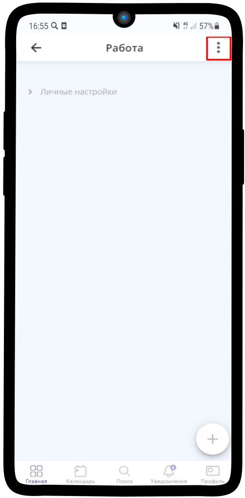
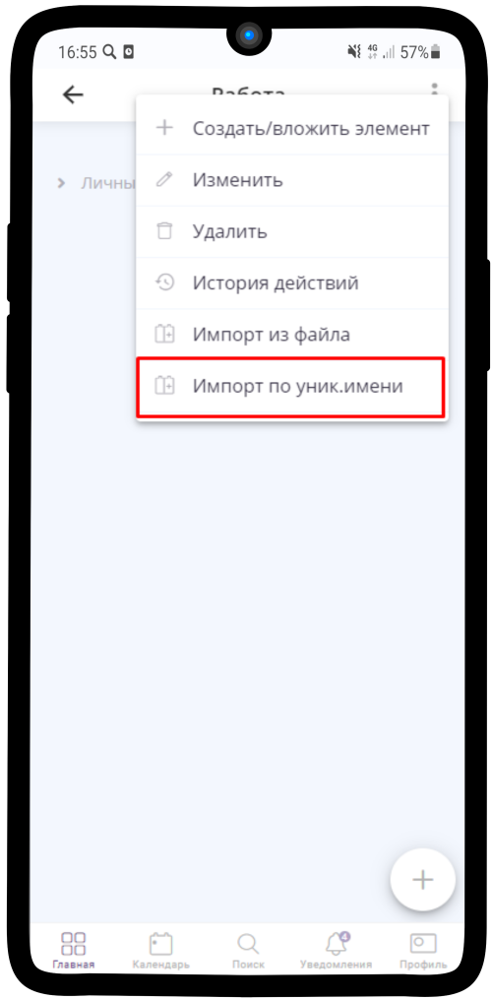
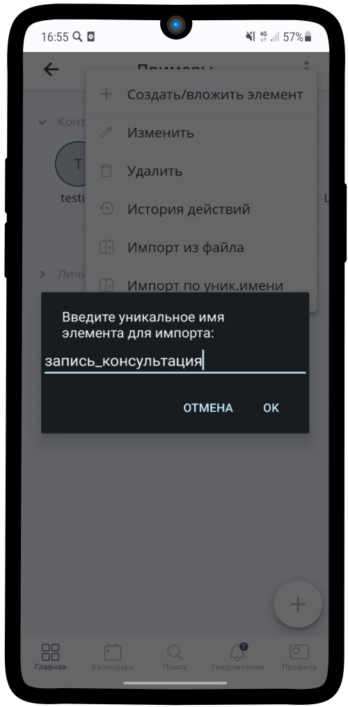
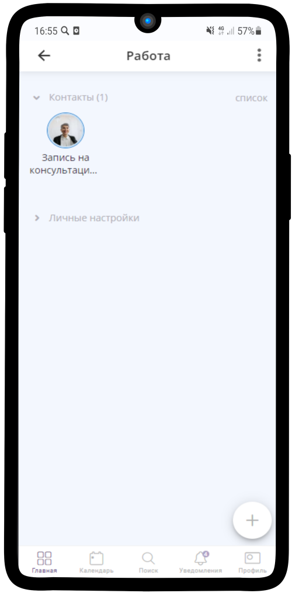

Импорт по уникальному имени
===========================

    .. |точка| image:: media/tochka.png
        :scale: 42 %

1. Чтобы загрузить нужный шаблон, выберите область, куда сохраните нужный элемент. Нажмите на |точка| в правом верхнем углу
   

------------------------------------------

2. Нажмите на **Импорт по уник.имени**

------------------------------------------

3. Введите **Уникальное имя** элемента.

.. hint:: Вы можете использовать один из наших шаблонов. Подобным образом можно импортировать и другие элементы.
    
    Примеры шаблонов:
    
    * посуточная_аренда
    * почасовая_аренда
    * запись_консультация

    `Больше шаблонов Вы можете найти здесь <https://info.torrow.net/templates>`_

------------------------------------------

4. Нажмите **ОК**

------------------------------------------

5. Элемент сохранен

.. raw:: html
   
   <torrow-widget
      id="torrow-widget"
      url="https://web.torrow.net/app/tabs/tab-search/service;id=103edf7f8c4affcce3a659502c23a?closeButtonHidden=true&tabBarHidden=true"
      modal="right"
      modal-active="false"
      show-widget-button="true"
      button-text="Заявка эксперту"
      modal-width="550px"
   ></torrow-widget>
   