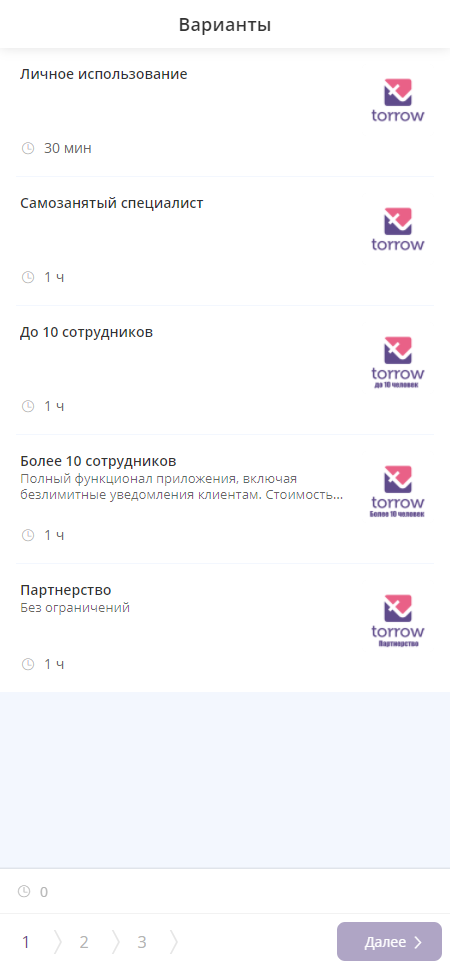
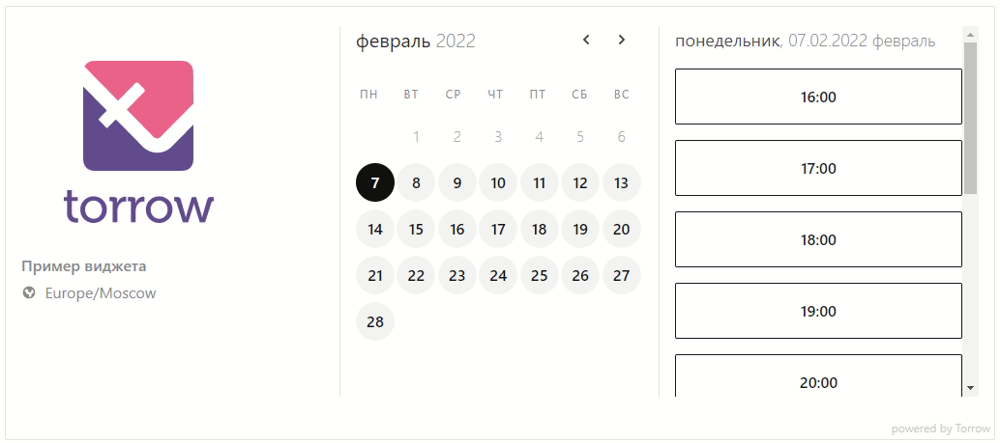

.. _widget-label:

Виджет приложения
=================

.. toctree::
      :maxdepth: 2

      widget-FF
      widget-EF

О виджете
~~~~~~~~~

.. note:: **Виджет** — это универсальная форма онлайн-записи клиентов, которая размещается на вашем сайте. Формат виджета Torrow целиком и полностью зависит от предпочтений клиента и имеет гибкую структуру.

**Для клиентов важен не только внешний вид вашего сайта, но и форма записи на услуги, которые предоставляет ваша компания. Чтобы соответствовать всем требованиям Заказчика, мы даем возможность гибко настроить форму виджета Torrow:**

* **Персонализация формы записи** — логотипы, изображения, описание услуг, описание компании, размещение ссылок и пр.
* **Адаптивный интерфейс** — меняется в зависимости от устройства, с которого производится запись.
* **Неограниченное размещение услуг** в форме записи.
* **Гибкая настройка услуг** — количество, стоимость, длительность.
* **Подключение сотрудников** — при формировании заказа в виджете исполнитель услуги получит уведомление о записи с детальным отображением заказа.
* **Сбор контактной информации о Заказчике**, возможность указания дополнительных кастомизированных полей.
* **Подтверждение записи** клиентом или владельцем услуги.
* **Возможность оплаты** клиентом услуг прямо на вашем сайте с помощью виджета.
* **Автоматический учет клиентов** и добавление в базу клиентов.

В нашем приложении Вы можете выбрать несколько вариантов виджета, а также подобрать удобный для Вас вариант его использования!

.. note:: **Полная версия виджета** - обладает всеми функциями записи и оплаты. :ref:`Подробнее!<widgetdifiform2>`

Возможности: 
Ограничения: 
Примеры использования:  

- :ref:`Виджет открывается по ссылке на отдельной странице<widget-ef-exmpl-1>`
- :ref:`Виджет встроен на страницу сайта<widget-ef-exmpl-2>`
- :ref:`Виджет открывается по кнопке <widget-ef-exmpl-3>`
--------------------------------------------------------------------

.. note:: **Упрощенная версия виджета** - обладает ограниченными функциями (только выбор времени и контактная информация). Недоступен для услуг с ресрусами. :ref:`Подробнее!<widgeteasyform2>`  

Возможности:
Ограничения:
Примеры использования:

- :ref:`Виджет открывается по ссылке на отдельной странице<widget-ff-exmpl-1>`
- :ref:`Виджет встроен на страницу сайта<widget-ff-exmpl-2>`
- :ref:`Виджет открывается по кнопке <widget-ff-exmpl-3>`
