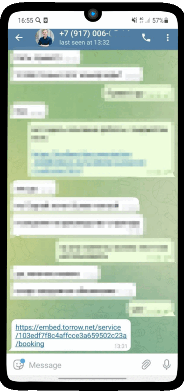
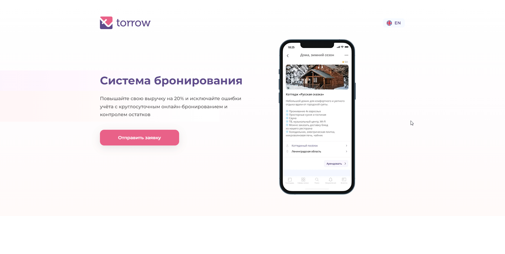

.. _widget-label:

Виджет приложения
=================

.. contents:: Оглавление

~~~~~~~~~
О виджете
~~~~~~~~~

.. note:: **Виджет** — это универсальная форма онлайн-записи клиентов, которая размещается на вашем сайте. Формат виджета Torrow целиком и полностью зависит от предпочтений клиента и имеет гибкую структуру.

**Для клиентов важен не только внешний вид вашего сайта, но и форма записи на услуги, которые предоставляет ваша компания. Чтобы соответствовать всем требованиям Заказчика, мы даем возможность гибко настроить форму виджета Torrow:**

* **Персонализация формы записи** — логотипы, изображения, описание услуг, описание компании, размещение ссылок и пр.
* **Адаптивный интерфейс** — меняется в зависимости от устройства, с которого производится запись.
* **Неограниченное размещение услуг** в форме записи.
* **Гибкая настройка услуг** — количество, стоимость, длительность.
* **Подключение сотрудников** — при формировании заказа в виджете исполнитель услуги получит уведомление о записи с детальным отображением заказа.
* **Сбор контактной информации о Заказчике**, возможность указания дополнительных кастомизированных полей.
* **Подтверждение записи** клиентом или владельцем услуги.
* **Возможность оплаты** клиентом услуг прямо на вашем сайте с помощью виджета.
* **Автоматический учет клиентов** и добавление в базу клиентов.

В нашем приложении Вы можете выбрать несколько вариантов виджета, а также подобрать удобный для Вас вариант его использования!

~~~~~~~~~~~~~~~~
Полный виджет
~~~~~~~~~~~~~~~~

.. note:: **Полная версия виджета** - обладает всеми функциями записи и оплаты.

.. figure:: media/WidgetFullV.png
      :scale: 50 %
      :align: center
      :alt: Альтернативный текст

      Пример полного виджета

      Окошко приложения может открываться прямо у Вас на сайте! :ref:`Настроить!<widgetdifiform>`

**Примеры установок**

1) Виджет открывается по ссылке на отдельной странице

Пользователь получает ссылку на полный виджет и переходит по ней.

.. figure:: media/gif/widgetFullLink.gif
      :scale: 60%
      :align: center
      :alt: Альтернативный текст

      :ref:`Подробнее<widget-option-1-1>`

2) Виджет встроен на страницу сайта

Пользователь прямо на сайте пользуется виджетом!

.. raw:: html

    <iframe src="https://web.torrow.net/app/tabs/tab-announcement/service;id=1b5903ed42bf48b428fb31ee7af27866" height="400px" width="50%"></iframe> 

:ref:`Подробнее<widget-option-1-2>`

3) Виджет открывается по кнопке 
   
Пользователь прямо на сайте может вызвать окно с полным виджетом!

.. figure:: media/gif/widgetFullButton2.gif
      :height: 500
      :align: center
      :alt: Альтернативный текст

      :ref:`Подробнее<widget-option-1-3>`

Вы также можете использовать свою кнопку на сайте! :ref:`Подробнее<widget-option-1-4>`

-----------------------------

~~~~~~~~~~~~~~~~~~~~
Упрощенный виджет
~~~~~~~~~~~~~~~~~~~~

.. note:: **Упрощенная версия виджета** - обладает ограниченными функциями (только выбор времени и контактная информация).

.. figure:: media/widgetV.png
      :scale: 50 %
      :align: center
      :alt: Альтернативный текст

      Пример упрощенного виджета. :ref:`Настроить!<widgeteasyform>`  

**Примеры установок:**

1) *Виджет открывается по ссылке на отдельной странице*

Пользователь получает ссылку и переходит по ней.

      :ref:`Подробнее<widgetoption-2-1>`

2) *Виджет встроен на страницу сайта*

Пользователь использует Ваш сайт и там находит виджет.

.. raw:: html

    <iframe src="https://embed.torrow.net/service/103edf7f8c4affcce3a659502c23a/booking" height="490px" width="150%"></iframe> 

:ref:`Подробнее<widget-option-2-2>`

3) Виджет открывается по кнопке 

Пользователь использует Ваш сайт и вызывает окно с упрощенным виджетом прямо на сайте!
Используйте науш стандартную "живую" кнопку!

      :ref:`Подробнее<widget-option-2-3>`

Или Вы также можете использовать свою кнопку на сайте!

      :ref:`Подробнее<widget-option-2-4>`

-------------------------------------------------

~~~~~~~~~~~~~
Дополнительно
~~~~~~~~~~~~~

.. toctree::
     :maxdepth: 2

     widget-options
     widget-setup