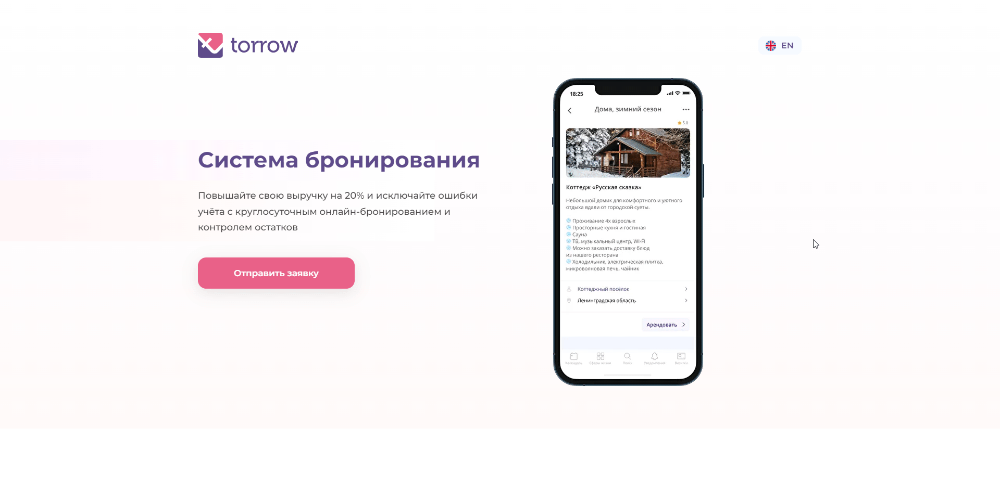

.. _widgeteasyform2:

Упрощенный виджет онлайн-записи
~~~~~~~~~~~~~~~~~~~~~~~~~~~~~~~

.. note:: **Упрощенная версия виджета онлайн-записи** - обладает ограниченными функциями (только выбор времени и контактная информация).

.. toctree:: 
      :maxdepth: 1

      widget-EF-inst
      widget-EF-setUp

Примеры установок
`````````````````

.. _widget-ef-exmpl-1:
Виджет открывается по ссылке на отдельной странице
''''''''''''''''''''''''''''''''''''''''''''''''''

Пользователь получает ссылку и переходит по ней.

.. figure:: media/gif/widgetEasyLink.gif
      :scale: 60 %
      :align: center
      :alt: Альтернативный текст

_____________________________________________________________________

.. _widget-ef-exmpl-2:
Виджет встроен на страницу сайта
''''''''''''''''''''''''''''''''

Пользователь использует Ваш сайт и там находит виджет.

.. raw:: html

    <iframe src="https://embed.torrow.net/service/103edf7f8c4affcce3a659502c23a/booking" height="490px" width="150%"></iframe> 


_____________________________________________________________________

.. _widget-ef-exmpl-3:
Виджет открывается по кнопке 
''''''''''''''''''''''''''''

Пользователь прямо на сайте может вызвать окно с полным виджетом! 

.. figure:: media/gif/widgetEasyButton2.gif
      :scale: 50 %
      :align: center
      :alt: Альтернативный текст


.. _widget-ff-exmpl-4:
Виджет открывается при нажатии по существующей кнопке на сайте
''''''''''''''''''''''''''''''''''''''''''''''''''''''''''''''


