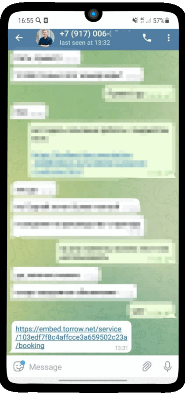
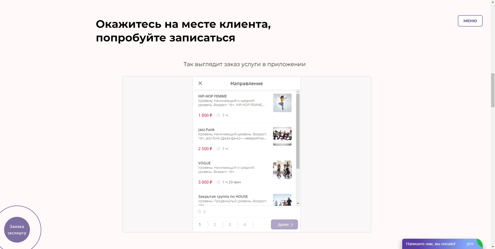
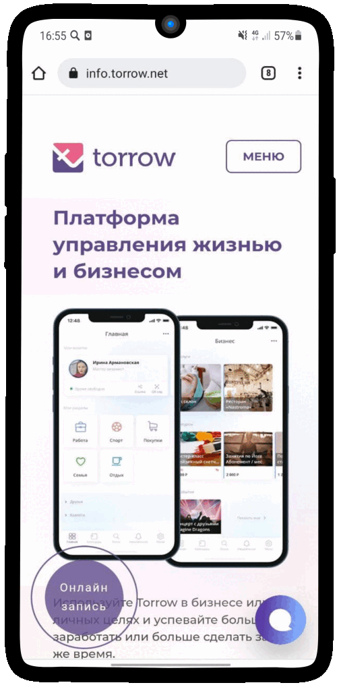

----------------------------------------------------
Варианты использования полного виджета онлайн-записи
----------------------------------------------------

.. |точка| image:: media/tochka.png
     :width: 21
     :alt: alternative text

.. contents:: Перечень вариантов
     :depth: 2

.. hint:: Для получения ссылки на услугу, для для различных вариантов использования виджета, произведите следующие операции:
1. Откройте услугу, нажмите на контекстное меню |точка|
2. Выберите "Поедлиться"
3. Нажмите повторно "Поделиться" в нижей части экрана 
4. Выберите пункт "Виджет онлайн-записи" упрощенного виджета или "Ссылка" для полного виджета

.. note:: **Полная версия виджета** - обладает всеми функциями записи и оплаты.
  
.. _widgetoption-1-0-0:

**Ссылка с визиткой компании и её услугами**
~~~~~~~~~~~~~~~~~~~~~~~~~~~~~~~~~~~~~~~~~~~~~~~~~~~~~~~~~~~~~

1. Скопируйте ссылку на Вашу визитку
2. Отправьте её своему клиенту любым удобным Вам способом

-------------------------------------------------------------------

.. _widgetoption-1-1-1:

**Ссылка с виджетом онлайн-записи**
~~~~~~~~~~~~~~~~~~~~~~~~~~~~~~~~~~~~~~~~~~~~~~~~~~~~~~~~

1. Скопируйте ссылку на Вашу услгу
2. Отправьте её своему клиенту любым удобным Вам способом

.. figure:: media/gif/widgetFullLink.gif
      :scale: 50%
      :align: center
      :alt: Альтернативный текст
-------------------------------------------------------------------

.. _widget-option-1-2-2:

**Виджет онлайн-записи встроен в сайт**
~~~~~~~~~~~~~~~~~~~~~~~~~~~~~~~~~~~~~~~~~~~~~~~~~~~~~~~~~~~~~~~~~~~~~~

1. Пользователь просматривает веб-сайт
2. Пользователь видит виджет встроенный в сайт

-------------------------------------------

.. _widget-option-1-3-3:

**Полный виджет онлайн-записи вызывается при нажатии на кнопку**
~~~~~~~~~~~~~~~~~~~~~~~~~~~~~~~~~~~~~~~~~~~~~~~~~~~~~~~~~~~~~~~~~~~~~~~~~~~~~~~~~~~~~~~~~~~~~~~~~~~

1) Клиент открывает сайт компании, нажимает на кнопку **Онлайн-запись**
2) Выбирает подходящую ему услугу
3) Нажимает на подходящую **дату** для проведения **консультации**
4) Выбирает удобное ему **время**
5) Проверяет детали заказа
6) Заполняет свои контактные данные, а также по желанию оставляет **Примечание**. Нажимает на кнопку **Записаться**.
7) Готово! Данные переданы менеджеру, после подтверждения заказа клиенту поступит информация о проведении консультации на указанный почтовый ящик или телефон.

-----------------------------------------

.. _widget-option-1-4-4:

**Полный виджет онлайн-записи вызывается при нажатии Вашей кнопки**
~~~~~~~~~~~~~~~~~~~~~~~~~~~~~~~~~~~~~~~~~~~~~~~~~~~~~~~~~~~~~~~~~~~~~~~~~~~~~~~~~~~~~~~~~~~~~~~~~~~~~~~~
1. Клиент открывает Ваш веб-сайт
2. Нажимает кнопку "Записаться"

.. figure:: media/gif/ff-in-web-by-cstm-btn.gif
     :scale: 50%
     :align: center
     :alt: Aльтернативный текст

