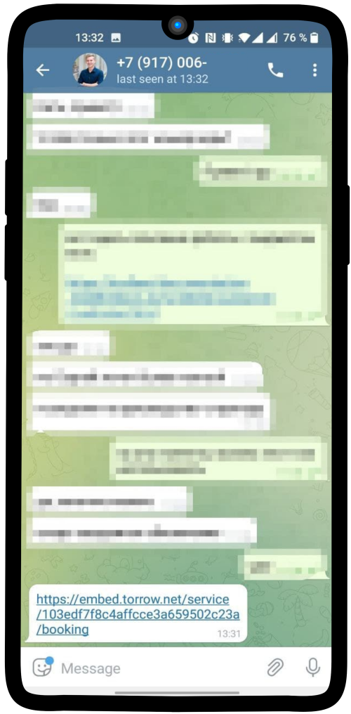
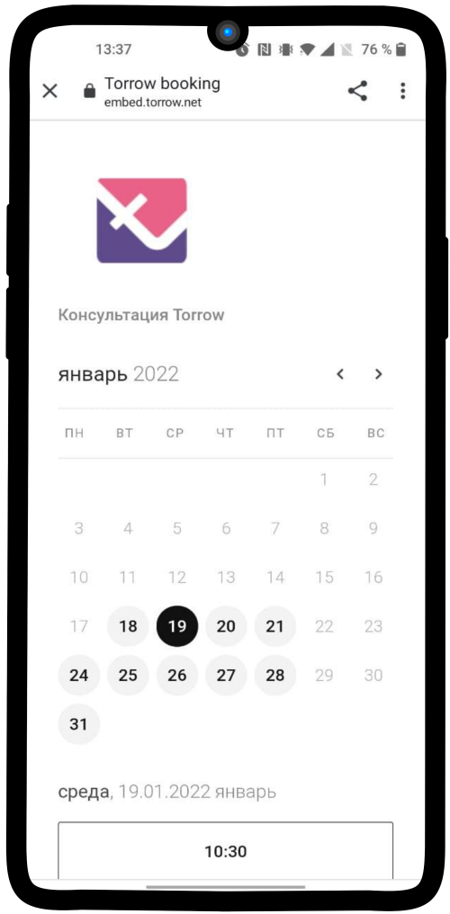
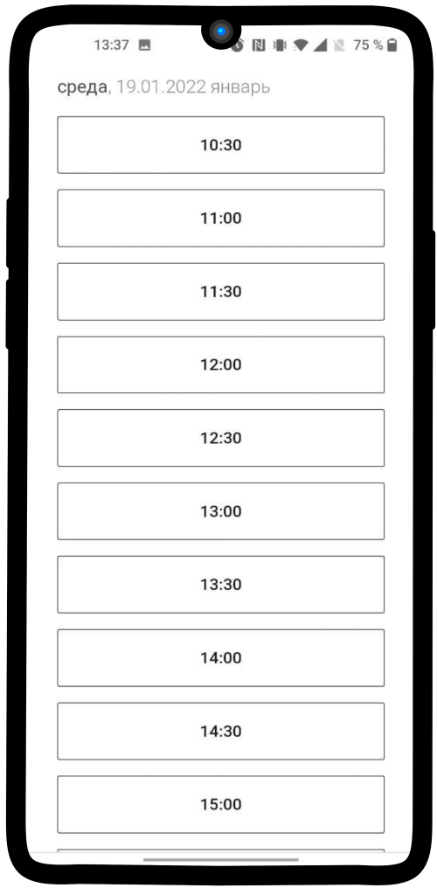
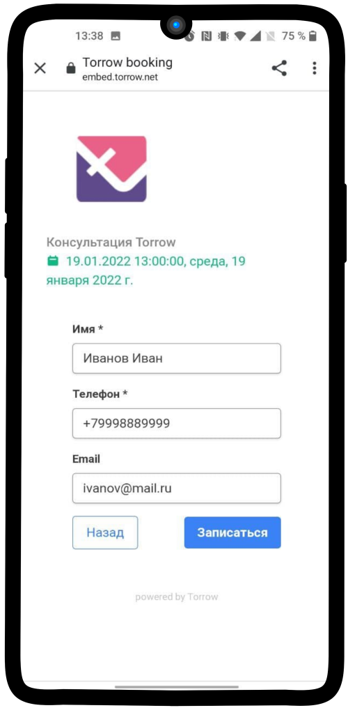
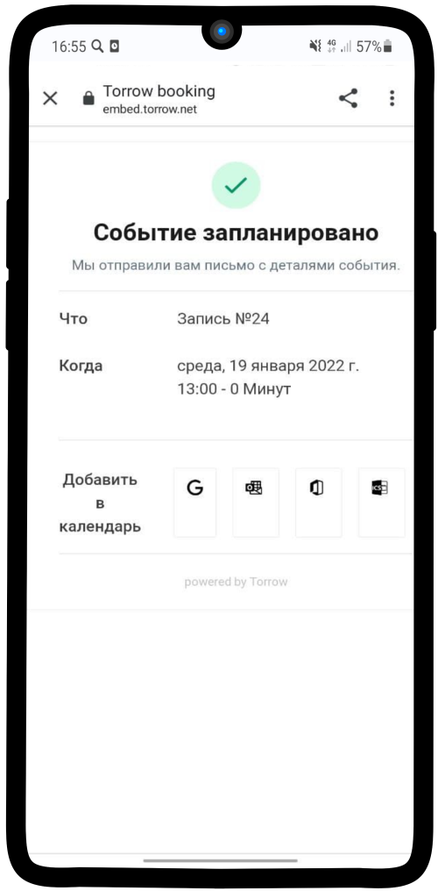
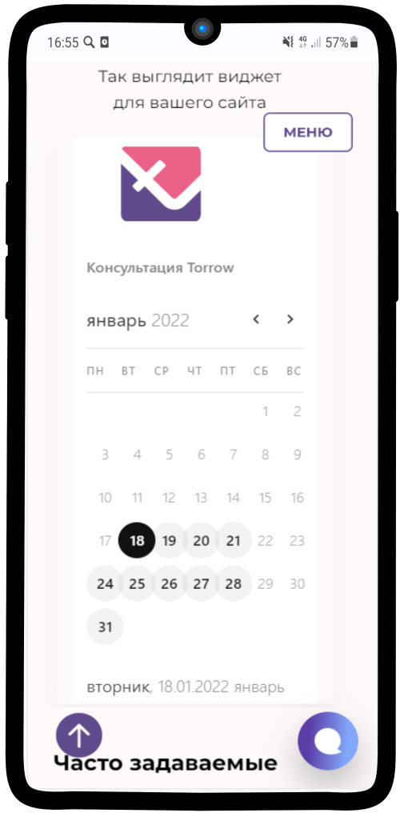
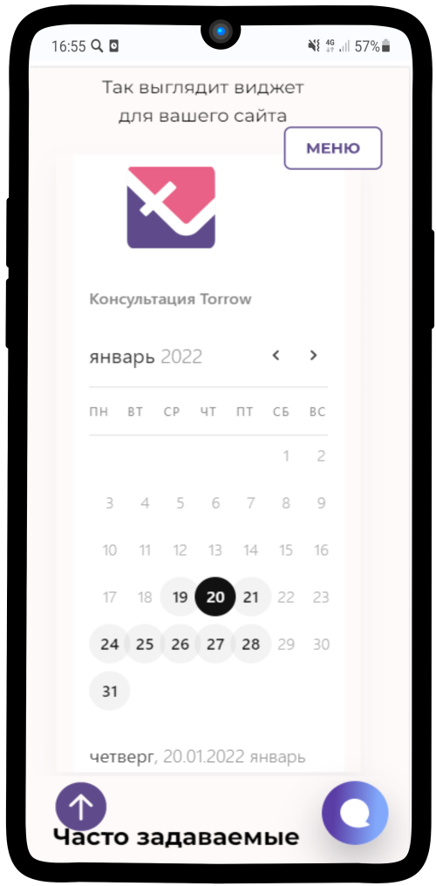
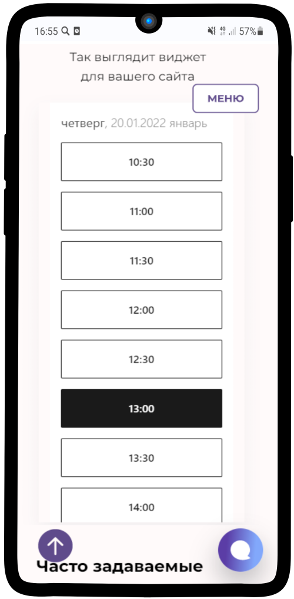
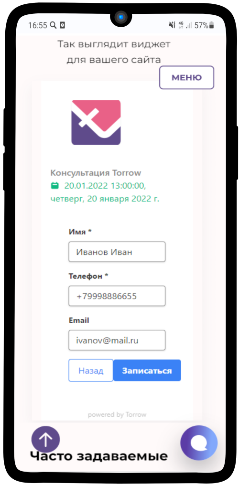
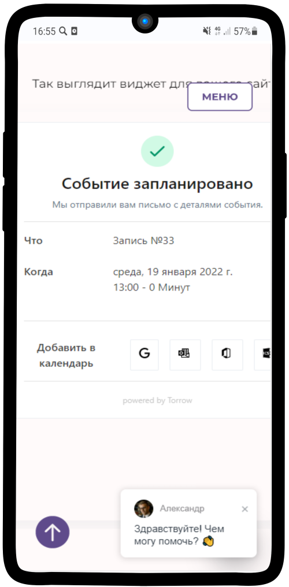

-------------------------
Упрощенная версия виджета
-------------------------

.. note:: **Упрощенная версия виджета** - обладает ограниченными функциями (только выбор времени и контактная информация).

--------------------------

**Варианты взаимодействия клиента с виджетом онлайн-записи**

1. **Клиенту направляется ссылка с виджетом онлайн-записи**

1) Клиент открывает полученную ссылку с виджетом

--------------------------

2) Выбирает подходящую **дату** для проведения **консультации**

--------------------------

3) Выбирает удобное ему **время**

--------------------------

4) Заполняет свои контактные данные, а также по желанию оставляет **Примечание**. Нажимает на кнопку **Записаться**.

--------------------------

5) Готово! Данные клиента переданы менеджеру, после подтверждения заказа клиенту поступит информация о проведении консультации на указанный почтовый ящик или телефон.

--------------------------

2. **Клиент переходит на сайт компании. Виджет онлайн-записи встроен в сайт**

1) Клиент открывает сайт компании

--------------------------

2) Выбирает подходящую **дату** для проведения **консультации**

--------------------------

3) Выбирает удобное ему **время**

--------------------------

4) Заполняет свои контактные данные, а также по желанию оставляет **Примечание**. Нажимает на кнопку **Записаться**.

--------------------------

5) Готово! Данные клиента переданы менеджеру, после подтверждения заказа клиенту поступит информация о проведении консультации на указанный почтовый ящик или телефон.

--------------------------

3. **Клиент переходит на сайт компании. Виджет онлайн-записи вызывается при нажатии на кнопку**