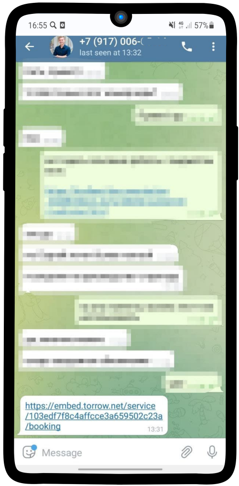
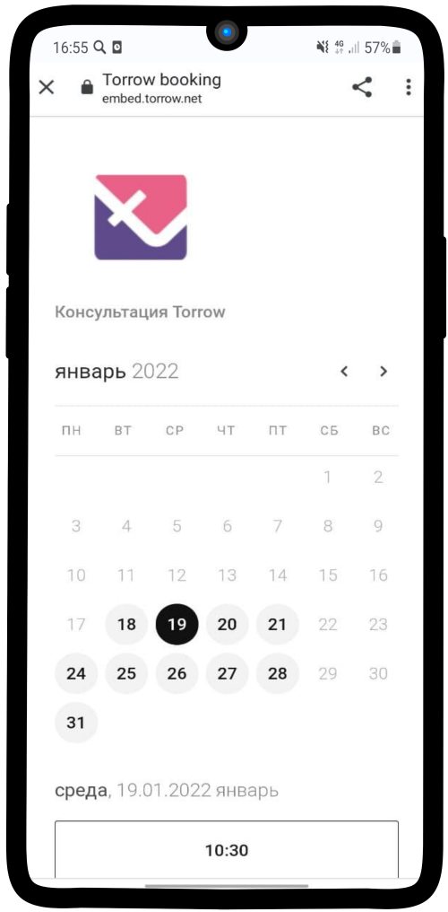
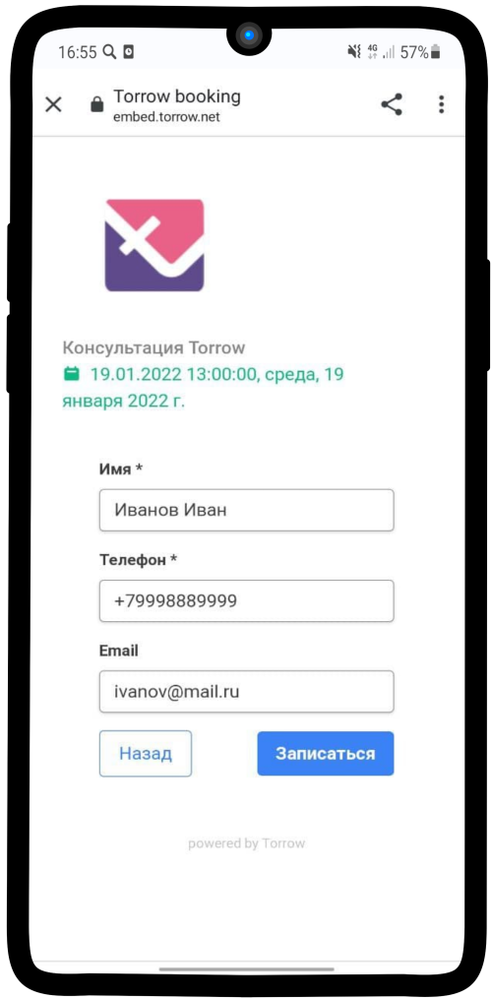
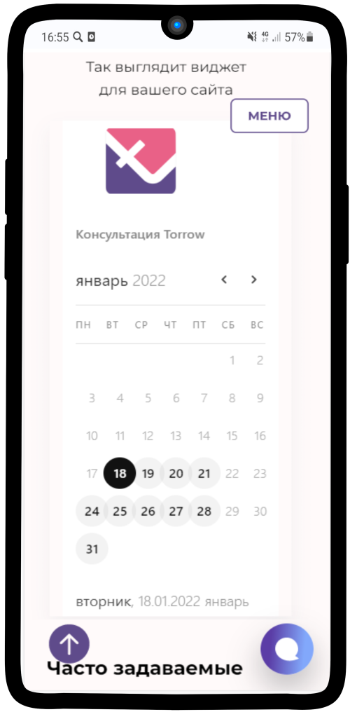
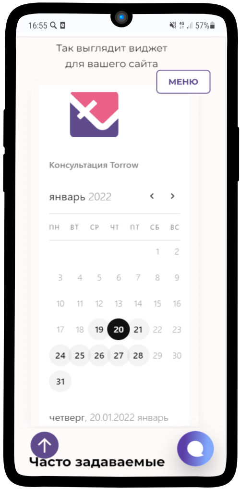
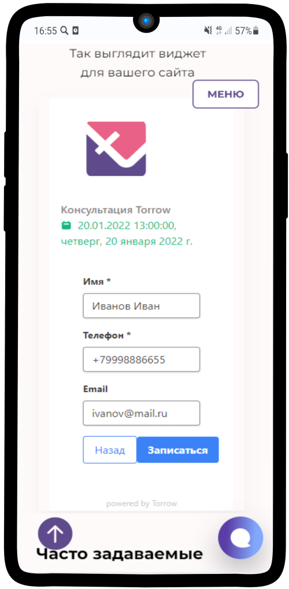

Варианты установки
==================

.. contents:: Перечень вариантов
     :depth: 2

.. hint:: Для получения ссылки на услугу, для для различных вариантов использования виджета, произведите следующие операции:
1. Откройте услугу, нажмите на контекстное меню |точка|
2. Выберите "Поедлиться"
3. Нажмите повторно "Поделиться" в нижей части экрана 
4. Выберите пункт "Виджет онлайн-записи" упрощенного виджета или "Ссылка" для полного виджета

-------------
Полный виджет
-------------

.. note:: **Полная версия виджета** - обладает всеми функциями записи и оплаты.

- :ref:`Клиенту отправляют ссылку и открывается визитка онлайн школы с услугами записи <widgetoption-1-0>`
- :ref:`Клиенту отправляют ссылку и открывается запись на услугу <widgetoption-1-1>`
- :ref:`Клиент заходит на сайт компании и виджет записи встроен в сайт компании <widgetoption-1-2>`
- :ref:`Клиент заходит на сайт компании и на сайте кнопка записи, по которой открывается окно записи <widgetoption-1-3>`
- :ref:`Клиент заходит на сайт компании и на сайте "живая" кнопка записи, по которой открывается окно записи <widgetoption-1-4>`
  
.. |точка| image:: media/tochka.png
     :width: 21
     :alt: alternative text

-----------------
Упрощенный виджет
-----------------

.. note:: **Упрощенная версия виджета** - обладает ограниченными функциями (только выбор времени и контактная информация).

- :ref:`Клиенту отправляют ссылку и открывается визитка онлайн школы с услугами записи <widgetoption-2-1>`
- :ref:`Клиенту отправляют ссылку и открывается запись на услугу <widgetoption-2-2>`
- :ref:`Клиент заходит на сайт компании и виджет записи встроен в сайт компании <widgetoption-2-3>`
- :ref:`Клиент заходит на сайт компании и на сайте кнопка записи, по которой открывается окно записи <widgetoption-2-4>`
- :ref:`Клиент заходит на сайт компании и на сайте "живая" кнопка записи, по которой открывается окно записи <widgetoption-2-5>`

.. _widgetoption-1-0:

**Клиенту направляется ссылка с визиткой компании и её услугами**
~~~~~~~~~~~~~~~~~~~~~~~~~~~~~~~~~~~~~~~~~~~~~~~~~~~~~~~~~~~~~

1. Скопируйте ссылку на Вашу визитку
2. Отправьте её своему клиенту любым удобным Вам способом

-------------------------------------------------------------------

.. _widgetoption-1-1:

**Клиенту направляется ссылка с виджетом онлайн-записи**
~~~~~~~~~~~~~~~~~~~~~~~~~~~~~~~~~~~~~~~~~~~~~~~~~~~~~~~~

.. figure:: media/gif/widgetFullLink.gif
      :scale: 50%
      :align: left
      :alt: Альтернативный текст

1. Скопируйте ссылку на Вашу услгу
2. Отправьте её своему клиенту любым удобным Вам способом

-------------------------------------------------------------------

.. _widget-option-1-2:

**Клиент переходит на сайт компании. Виджет онлайн-записи встроен в сайт**
~~~~~~~~~~~~~~~~~~~~~~~~~~~~~~~~~~~~~~~~~~~~~~~~~~~~~~~~~~~~~~~~~~~~~~

Альтернтивный текст

-------------------------------------------

.. _widget-option-1-3:

**Клиент переходит на сайт компании. Полный виджет онлайн-записи вызывается при нажатии на кнопку**
~~~~~~~~~~~~~~~~~~~~~~~~~~~~~~~~~~~~~~~~~~~~~~~~~~~~~~~~~~~~~~~~~~~~~~~~~~~~~~~~~~~~~~~~~~~~~~~~~~~

.. figure:: media/gif/1-3.gif
    :scale: 45 %
    :alt: alternative text
    :align: right

1) Клиент открывает сайт компании, нажимает на кнопку **Онлайн-запись**
2) Выбирает подходящую ему услугу
3) Нажимает на подходящую **дату** для проведения **консультации**
4) Выбирает удобное ему **время**
5) Проверяет детали заказа
6) Заполняет свои контактные данные, а также по желанию оставляет **Примечание**. Нажимает на кнопку **Записаться**.
7) Готово! Данные переданы менеджеру, после подтверждения заказа клиенту поступит информация о проведении консультации на указанный почтовый ящик или телефон.

-----------------------------------------

.. _widget-option-1-4:

**Клиент переходит на сайт компании. Полный виджет онлайн-записи вызывается при нажатии Вашей кнопки**
~~~~~~~~~~~~~~~~~~~~~~~~~~~~~~~~~~~~~~~~~~~~~~~~~~~~~~~~~~~~~~~~~~~~~~~~~~~~~~~~~~~~~~~~~~~~~~~~~~~~~~~~

  
.. _widget-option-2-1:

**Клиенту направляется ссылка с упрощенным виджетом онлайн-записи**
~~~~~~~~~~~~~~~~~~~~~~~~~~~~~~~~~~~~~~~~~~~~~~~~~~~~~~~~~~~~~~~~~~~

1) Клиент открывает полученную ссылку с виджетом

--------------------------

2) Выбирает подходящую **дату** для проведения **консультации**

--------------------------

3) Выбирает удобное ему **время**

.. figure:: media/images/1.3.png
    :scale: 53 %
    :alt: alternative text
    :align: center

--------------------------

4) Заполняет свои контактные данные, а также по желанию оставляет **Примечание**. Нажимает на кнопку **Записаться**.

--------------------------

5) Готово! Данные клиента переданы менеджеру, после подтверждения заказа клиенту поступит информация о проведении консультации на указанный почтовый ящик или телефон.

.. figure:: media/images/1.5.png
    :scale: 53 %
    :alt: alternative text
    :align: center

--------------------------

.. _widget-option-2-2:

**Клиент переходит на сайт компании. Виджет онлайн-записи встроен в сайт**
~~~~~~~~~~~~~~~~~~~~~~~~~~~~~~~~~~~~~~~~~~~~~~~~~~~~~~~~~~~~~~~~~~~~~~~~~~

1) Клиент открывает сайт компании

--------------------------

2) Выбирает подходящую **дату** для проведения **консультации**

--------------------------

3) Выбирает удобное ему **время**

.. figure:: media/images/viget32.png
    :scale: 53 %
    :alt: alternative text
    :align: center

--------------------------

4) Заполняет свои контактные данные, а также по желанию оставляет **Примечание**. Нажимает на кнопку **Записаться**.

--------------------------

5) Готово! Данные клиента переданы менеджеру, после подтверждения заказа клиенту поступит информация о проведении консультации на указанный почтовый ящик или телефон.

.. figure:: media/images/viget52.png
    :scale: 53 %
    :alt: alternative text
    :align: center

--------------------------

.. _widget-option-2-3:

**Клиент переходит на сайт компании. Упрощенный виджет онлайн-записи вызывается при нажатии на кнопку**
~~~~~~~~~~~~~~~~~~~~~~~~~~~~~~~~~~~~~~~~~~~~~~~~~~~~~~~~~~~~~~~~~~~~~~~~~~~~~~~~~~~~~~~~~~~~~~~~~~~~~~~

.. _widget-option-2-4:

**Клиент переходит на сайт компании. Упрощенный виджет онлайн-записи вызывается при нажатии Вашей кнопки**
~~~~~~~~~~~~~~~~~~~~~~~~~~~~~~~~~~~~~~~~~~~~~~~~~~~~~~~~~~~~~~~~~~~~~~~~~~~~~~~~~~~~~~~~~~~~~~~~~~~~~~~~~~