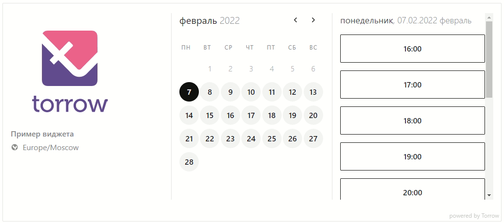

=========================
Настройка виджетов приложения Torrow
=========================

.. contents:: Содержание

.. note:: **Данная страница руководства нацелена на помощь в самостоятельной настройке виджетов.**

.. _widgeteasyform:

Упрощенный виджет
--------------------
.. hint:: Упрощенный виджет — это iframe виджет. Используя этот вид виджета, клиент может вбырать удобное ему время записи и/или оставить свою контактную информацию.

       Упрощенный виджет
~~~~~~~~~~~~~~~~~~~~
Как добавить виджет?
~~~~~~~~~~~~~~~~~~~~

 .. |точка| image:: media/tochka.png
      :width: 21
      :alt: alternative text

Чтобы добавить виджет необходимо:
    1. Открыть страничку Вашей услуги
    2. Открыть контекстное меню |точка|
    3. Нажать "Поделиться"
    4. Нажать "Поделиться" в нижней части экрана
    5. Из появившегося списке выбрать "Виджет онлайн записи"

~~~~~~~~~~~~~~~~~~~~~
Как настроить виджет?
~~~~~~~~~~~~~~~~~~~~~
*На данный момент, мы работаем над улучшением кастомизации "Формы обратной связи".*

Сейчас у Вас есть возможность редактировать **время отображаемое в ячейках**, **поля контактной информации**, **изображение услуги**.
     * Для настройки ячеек времени — перейдите в настройки услуги и установите подходящее для Вас выравнивание времени.
     * Для настроек полей контактной информации — перейдите в настройки услуги и задайте необходимые поля контактной информации.
     * Для настроек изображения услуги — перейдите в настройки услуги и задайте картинку услуги.
     *Также у виджета есть возможность отображать количество свободных мест рядом с ячейками времени, для этого просто задайте этот параметр в настройках услуги*

.. _widgetdifiform:

Полный виджет
-------------

.. hint:: Полный виджет — модальное окно приложения открывающее Вашу услугу прямо на сайте. Скрипт привязыввается к стандартной кнопке или может быть привязан к уже существующей кнопке на Вашем сайте (см. следующий пункт). 

     Полный виджет

~~~~~~~~~~~~~~~~~~~~
Как добавить виджет?
~~~~~~~~~~~~~~~~~~~~

.. hint:: Для добавления виджета, скопируйте скрипт указанный ниже.

*Скрипт виджета выглядит следующим образом:*

.. code-block::

     <torrow-widget
         id="torrow-widget"
         url="https://torrow.net/app/tabs/tab-search/service;id=aae6803edb08c6832f4e02a7f26929b58?closeButtonHidden=true&tabBarHidden=true"
         modal="right"
         modal-active="true"
         show-widget-button="true"
     ></torrow-widget>
     
     
~~~~~~~~~~~~~~~~~
Параметры скрипта
~~~~~~~~~~~~~~~~~
.. hint:: Для добавления параметра, вставьте значение новой строкой в блок <torrow-widget **ВСТАВИТЬ ЗДЕСЬ** ></torrow-widget> 
 
.. table::  Отображение виджета

    +------------------------+-----------------------------------------------+-----------------------+--------------------+
    | Название               | Описание                                      | Параметр              | Значения           |
    +========================+===============================================+=======================+====================+
    | Ссылка на услугу       | В этом поле укажите ссылку на Вашу услугу     | url = "LINK"          | Любая ссылка       |
    +------------------------+-----------------------------------------------+-----------------------+--------------------+
    | Расположение на экране | Определяет положение модального окна на сайте | modal = "center"      | center, left, right|
    +------------------------+-----------------------------------------------+-----------------------+--------------------+
    | Ширина                 | Определяет ширину модального окна             | modal-width = "350px" | Любое значение     |
    +------------------------+-----------------------------------------------+-----------------------+ в пикселях (px)    |
    | Высота                 | Определяет высоту модального окна             | modal-height = "350px"|                    |
    +------------------------+-----------------------------------------------+-----------------------+--------------------+
    | Ссылка на услугу       | Укажите ссылку на услугу которую необходимо   | url = "Ссылка на      | Cсылка на Вашу     |
    |                        | отобразить в модальном окне                   | услугу"               | услугу             |
    +------------------------+-----------------------------------------------+-----------------------+--------------------+
    | Активное модальное окно| При открытии сайта, сразу открывает виджет    | modal-active = "true" | true, false        |
    +------------------------+-----------------------------------------------+-----------------------+--------------------+

1. Чтобы получить ссылку на услугу необходимо открыть страничку Вашей услуги
2. Открыть контекстное меню |точка|
3. Нажать "Поделиться"
4. Нажать "Поделиться" в нижней части экрана
5. Из появившегося списке выбрать "Ссылка"
    
.. table:: Параметры кнопки

    +------------------------+-----------------------------------------------+-----------------------+------------------------+
    | Название               | Описание                                      | Параметр              | Значения               |
    +========================+===============================================+=======================+========================+
    | Отображение кнопки     | Показывает/скрывает стандартную кнопку вызова | show-widget-button =  | true, false            |
    |                        | модального окна                               | "true"                |                        |
    +------------------------+-----------------------------------------------+-----------------------+------------------------+
    |Текст кнопки            | Передает текст отображаемый на кнопке         | button-text =         | Любое текстовое        |
    |                        |                                               | "Онлайн запись"       | значение               |
    +------------------------+-----------------------------------------------+-----------------------+------------------------+
    | Размер шрифта          | Размер шрифта текста кнопки                   | font-size = "15"      | Любое числовое         |
    +------------------------+-----------------------------------------------+-----------------------+ значение               |
    | Размер кнопки          | Определяет размер отображаемой кнопки         | button-size = "100"   |                        |
    +------------------------+-----------------------------------------------+-----------------------+------------------------+
    | Расложение по оси Х    | Определяет положение кнопки по горизонтали    | button-x = "right"    | right, left, center    |
    +------------------------+-----------------------------------------------+-----------------------+------------------------+
    | Расложение по оси Y    | Определяет положение кнопки по вертикали      | button-y = "bottom"   | top, bottom, center    |
    +------------------------+-----------------------------------------------+-----------------------+------------------------+
    | Цвет кнопки            | Устанавливает фоновый цвет кнопки             | button-color = #000   |  Любое                 |
    +------------------------+-----------------------------------------------+-----------------------+  HEX                   |
    | Цвет шрифта кнопки     | Устанавливает цвет шрифта кнопки              | text-color = #ffffff  |  значение              |
    +------------------------+-----------------------------------------------+-----------------------+  (#000000)             |
    | Цвет анимации кнопки   | Устанавливает цвет анимации кнопки (задайте   | wave-color = #5F4B8B  |                        |
    |                        | значение #fff, чтобы скрыть анимацию)         |                       |                        |
    +------------------------+-----------------------------------------------+-----------------------+------------------------+

~~~~~~~~~~~~~~~~~~~~~~~
Своя кнопка для виджета
~~~~~~~~~~~~~~~~~~~~~~~
.. hint:: Здесь Вы можете найти описание того, как привязать виджет к кнопке на Вашем сайте.
Если Вы хотите привязать виджет к какой-либо кнопке на Вашем сайте, то используйте следующую строку кода.

.. code-block:: 
    
     onClick="(function(){document.querySelector('#torrow-widget').setAttribute('modal-active', 'true')})()

Данная строчка кода отвечает за кастомизированную кнопку.

*Пример реализации:*

.. code-block::
     
     <torrow-widget
         id="torrow-widget"
         url="https://torrow.net/app/tabs/tab-search/service;id=aae6803edb08c6832f4e02a7f26929b58?closeButtonHidden=true&tabBarHidden=true"
         modal="right"
         modal-active="false"
         show-widget-button="false"
     ></torrow-widget>
     
<a id="btn-open" class="btn-ser" onClick="(function(){document.querySelector('#torrow-widget').setAttribute('modal-active', 'true')})()">Записаться на прием</a>

     