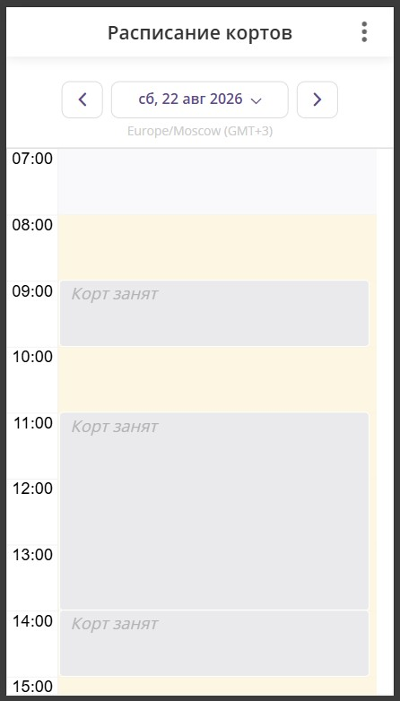

.. _dashboard-widget-label:

Виджет расписания
=================

.. toctree::
   :maxdepth: 1

   dashboard-setUp

О виджете
~~~~~~~~~

**Виджет расписания** — публичная страница занятости одной или нескольких :ref:`услуг<service-label>` или :ref:`ресурсов<resources-label>`. При нескольких объектах в ``ids`` на экране — отдельные столбцы на один день. Подходит для киоска, экрана в зале, телевизора или встраивания на сайт. Расписание обновляется автоматически по заданному интервалу.

Это **не** форма онлайн-записи: по слотам и заказам нельзя нажать, нет вида «неделя» или «месяц», нет фильтра статусов заказов в ссылке.

Как выглядит
~~~~~~~~~~~~

   Занятость на выбранный день: жёлтый — свободно, серый — занято без названий

**Жёлтый** фон — свободное или рабочее время. **Светло-серый** — нерабочее время, если график объекта доступен. **Серые блоки** — занятые интервалы с подписью **Занято** (параметр ``busyLabel``), без имён и деталей заказа (режим по умолчанию для экрана в зале).

Если в ссылке указать ``;visibility=View``, на сетке будут видны названия заказов — такой режим не рекомендуется для публичного экрана с клиентами.

У гостя без входа в приложение график ресурса часто недоступен — тогда весь видимый период отображается жёлтым, а занятость — серыми блоками сверху. Отменённые и отклонённые заказы на сетке не показываются.

На примере выше: в шапке имя объекта или ``title``, переключение даты стрелками (в ссылке задан параметр ``date``).

Доступ
~~~~~~

Страница открывается **без входа** в приложение. Данные отдаются только если у услуги или ресурса тип доступности **По ссылке** или **Открытый** (см. :doc:`/faq/access_type`). Иначе заголовок и сетка могут быть пустыми — отдельного сообщения «нет доступа» нет.

Что указать в ссылке
~~~~~~~~~~~~~~~~~~~~

Обычно в ссылке указывают идентификатор **ресурса** (зал, корт, кресло, кабинет) в параметре ``ids``. Можно указать идентификатор **услуги**; у гостя фон рабочих часов услуги часто не отображается. Несколько объектов — через запятую в ``ids``: каждый — отдельный столбец. На экран — **не больше 8** столбцов. У каждого объекта в ссылке тип доступности должен быть **По ссылке** или **Открытый**.

Идентификатор берётся из ссылки на карточку объекта — см. :ref:`Как скопировать ссылку?<share-label>`, сегмент ``;id=...`` в адресе карточки. Его подставляют в ``ids`` виджета. Ссылка «Поделиться» с карточки — это адрес объекта, **не** готовая ссылка на виджет расписания.

Ссылку, скопированную через меню на уже открытой странице расписания, **не используйте** для встраивания на сайт: в неё не попадают параметры ``sideMenuHidden``, ``lang``, ``timezone``, а сдвиг даты стрелками в URL не сохраняется. Соберите ссылку по шаблону ниже.

Канонический шаблон (экран на сегодня, обновление каждые 5 минут, без меню приложения):

.. code-block:: text

   https://torrow.net/app/tabs/tab-search/dashboard;ids={resourceId};date=now;refreshMin=5?sideMenuHidden=true&tabBarHidden=true

Настройки расписания задаются **в адресе после ``;``** (на сегменте страницы расписания). Параметры **после ``?``** скрывают боковое меню и нижнюю панель вкладок — для встраивания на сайт или TV оба параметра обязательны.

Параметры ссылки
~~~~~~~~~~~~~~~~

В адресе после ``;``
''''''''''''''''''''

.. list-table::
   :header-rows: 1
   :widths: 18 22 60

   * - Параметр
     - По умолчанию
     - Смысл
   * - ``ids``
     - —
     - Обязательный. Id ресурса или услуги через запятую; каждый — столбец
   * - ``title``
     - имя объекта
     - Текст шапки; при нескольких — иначе имя первого доступного объекта. Кириллица и пробелы — URL-encode
   * - ``busyLabel``
     - Занято
     - Подпись серого блока (режим без деталей)
   * - ``date``
     - нет в ссылке
     - Без параметра — скользящее окно вокруг «сейчас», без панели дат. ``now`` или ``YYYY-MM-DD`` — фиксированный день и стрелки переключения даты. С ``date`` параметры ``fromMin`` и ``toMin`` не работают
   * - ``fromMin``
     - 120
     - Минуты назад от «сейчас», только без ``date``; часовой пояс **устройства**, не ``timezone``
   * - ``toMin``
     - 480
     - Минуты вперёд от «сейчас», только без ``date``
   * - ``refreshMin``
     - 3
     - Интервал обновления в минутах; ``0`` обновление не выключает. Устаревшее имя ``resfreshMin`` учитывается, если ``refreshMin`` не задан
   * - ``visibility``
     - занятость без деталей
     - Для зала не указывайте. ``View`` — показывать названия заказов

После ``?``
'''''''''''

.. list-table::
   :header-rows: 1
   :widths: 18 22 60

   * - Параметр
     - По умолчанию
     - Смысл
   * - ``sideMenuHidden``
     - —
     - Для сайта и TV всегда ``true``
   * - ``tabBarHidden``
     - —
     - Всегда ``true`` вместе с ``sideMenuHidden``
   * - ``lang``
     - язык устройства
     - ``ru``, ``en``, ``es``, ``zh``; подписи календаря могут остаться языком устройства
   * - ``timezone``
     - настройки или устройство
     - IANA, например ``Europe/Moscow`` — границы суток и ось времени. Без ``date`` окно ``fromMin``/``toMin`` всё равно считается по поясу устройства

Примеры ссылок
~~~~~~~~~~~~~~

Подставьте свой id ресурса или услуги вместо ``{resourceId}`` / ``{serviceId}``.

**День (киоск на сегодня):**

.. code-block:: text

   https://torrow.net/app/tabs/tab-search/dashboard;ids={resourceId};date=now;refreshMin=5?sideMenuHidden=true&tabBarHidden=true

**Несколько ресурсов + свой заголовок:**

.. code-block:: text

   https://torrow.net/app/tabs/tab-search/dashboard;ids={resourceId1},{resourceId2};title=Зал%201;date=now;refreshMin=5?sideMenuHidden=true&tabBarHidden=true

**Своя подпись занятости (= Резерв):**

Кириллицу в ``title`` / ``busyLabel`` нужно URL-кодировать.

.. code-block:: text

   https://torrow.net/app/tabs/tab-search/dashboard;ids={resourceId};date=now;busyLabel=Корт%20занят;refreshMin=5?sideMenuHidden=true&tabBarHidden=true

**Сейчас (скользящее окно, без панели дат):**

.. code-block:: text

   https://torrow.net/app/tabs/tab-search/dashboard;ids={resourceId}?sideMenuHidden=true&tabBarHidden=true

**Узкое окно (час назад — два вперёд, только без ``date``):**

.. code-block:: text

   https://torrow.net/app/tabs/tab-search/dashboard;ids={resourceId};fromMin=60;toMin=120;refreshMin=5?sideMenuHidden=true&tabBarHidden=true

**Услуга:**

.. code-block:: text

   https://torrow.net/app/tabs/tab-search/dashboard;ids={serviceId};date=now;refreshMin=5?sideMenuHidden=true&tabBarHidden=true

**С названиями заказов (не для зала с клиентами):**

.. code-block:: text

   https://torrow.net/app/tabs/tab-search/dashboard;ids={resourceId};date=now;visibility=View;refreshMin=5?sideMenuHidden=true&tabBarHidden=true

Ограничения
~~~~~~~~~~~

Виджет расписания **не** поддерживает:

* вид «неделя» или «месяц»;
* запись или переход в карточку по клику на слот;
* сохранение выбранной даты в адресе после переключения стрелками;
* гарантированный график ресурса для гостя без входа;
* отдельное сообщение об ошибке доступа — при отказе API страница может быть пустой или частично заполненной.

:ref:`Установка на сайт<dashboard-widget-setup>`

.. raw:: html
   
   <torrow-widget
      id="torrow-widget"
      url="https://web.torrow.net/app/tabs/tab-search/service;id=103edf7f8c4affcce3a659502c23a?closeButtonHidden=true&tabBarHidden=true"
      modal="right"
      modal-active="false"
      show-widget-button="true"
      button-text="Заявка эксперту"
      modal-width="550px"
      button-style = "rectangle"
      button-size = "60"
      button-y = "top"
   ></torrow-widget>
   

.. raw:: html

   <!--  -->
