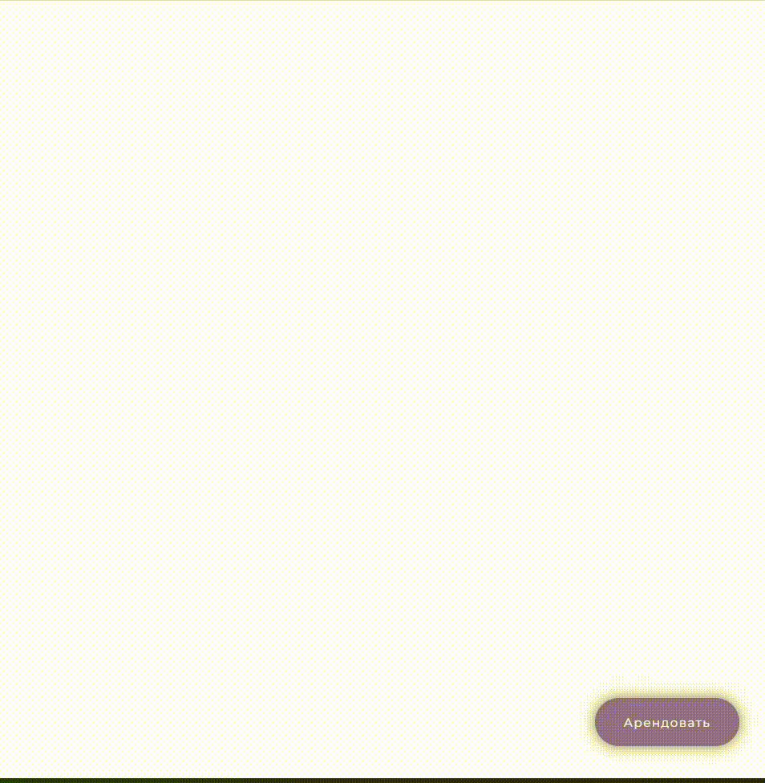

.. _onlinebookingpage:

Виджет онлайн-бронирования
~~~~~~~~~~~~~~~~~~~~~~~~~~

.. note:: **Виджет** — это универсальная форма онлайн-записи клиентов, которая размещается на вашем сайте. Формат виджета Torrow целиком и полностью зависит от предпочтений клиента и имеет гибкую структуру.

.. toctree:: 
      :maxdepth: 1

      online-booking-inst
      online-booking-setUp

Основные возможности
`````````````````````````

#. Почасовая аренда
#. Посуточная аренда
#. Выбор пакетов бронирования
#. Выбор дополнительных услуг
#. Оплата и многое другое!

Для правильной работы виджета ознакомьтесь со страничками руководства по :ref:`Услуге<service-label>` и :ref:`Ресурсам<resources-label>`.


Примеры установок
`````````````````

.. _widget-ob-exmpl-1:

Виджет открывается по ссылке на отдельной странице
''''''''''''''''''''''''''''''''''''''''''''''''''

Пользователь получает ссылку на виджет и переходит по ней. 
:ref:`Настроить данный пример.<ob-setUp-1>`

.. figure:: media/gif/linkOB.gif
       :scale: 70 %
       :align: center
       :alt: Альтернативный текст

_________________________________________________________________________

.. _widget-ob-exmpl-2:

Виджет встроен на страницу сайта
''''''''''''''''''''''''''''''''

Пользователь прямо на сайте пользуется виджетом! 
:ref:`Настроить данный пример.<ob-setUp-2>`

.. raw:: html

    <h1 align="center">
    <iframe src="https://web.torrow.net/app/tabs/tab-announcement/service;id=aae6103ed8c3b5086f915af000159521a" height="690px" width="50%" align="center"></iframe> 
    </h1>

_________________________________________________________________________

.. _widget-ob-exmpl-3:

Виджет открывается по анимированной кнопке 
''''''''''''''''''''''''''''''''''''''''''
   
Пользователь прямо на сайте может вызвать окно с виджетом! 
:ref:`Настроить данный пример.<ob-setUp-3>`


      Круглый вариант отображения кнопки



      Прямоугольный вариант отображения кнопки

--------------------------------------

Виджет открывается по существующей кнопке на сайте
''''''''''''''''''''''''''''''''''''''''''''''''''

Пользователь прямо на сайте может вызвать окно с виджетом!
:ref:`Настроить данный пример.<ob-setUp-4>`


.. raw:: html
   
   <torrow-widget
      id="torrow-widget"
      url="https://web.torrow.net/app/tabs/tab-search/service;id=103edf7f8c4affcce3a659502c23a?closeButtonHidden=true&tabBarHidden=true"
      modal="right"
      modal-active="false"
      show-widget-button="true"
      button-text="Заявка эксперту"
      modal-width="550px"
   ></torrow-widget>
   <script src="https://cdn.jsdelivr.net/gh/torrowtechnologies/torrow-widget@1/dist/torrow-widget.min.js" defer></script>