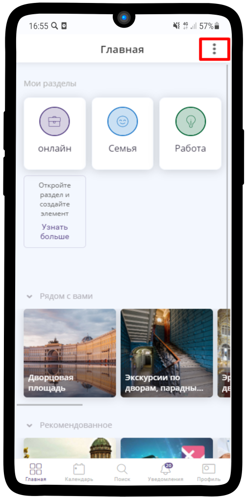
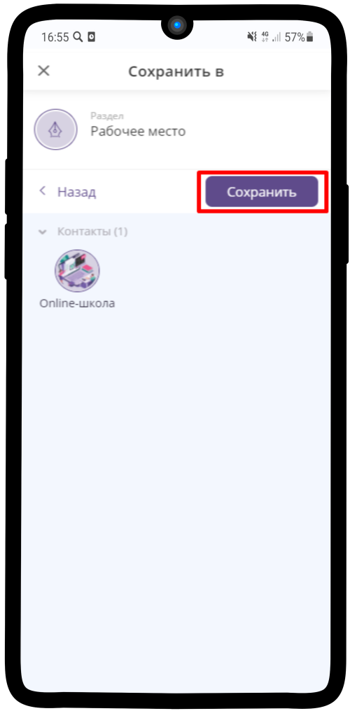

=========================================
Добавление нового сотрудника и передача прав
=========================================

.. note::
    
    * `Для сотрудника`_
    * `Для администратора`_

Для сотрудника
===========

**Создание рабочего раздела сотрудника**

Для начала работы в приложении, новому сотруднику нужно зарегистрироваться (:ref:`registration-label`) и создать свою **Визитку**. Также для удобства пользования рекомендуем создать **Рабочий раздел**.

1. Перейдите на вкладку **Главная**

.. figure:: media/rights/work_man1.png
    :scale: 42 %
    :alt: alternate text
    :align: center

-------------

2. Нажмите на |точка| в верхнем правом углу

    .. |точка| image:: media/tochka.png
        :scale: 42 %

-------------

3. Выберите **Добавить раздел**

.. figure:: media/rights/work_man3.png
    :scale: 42 %
    :alt: alternate text
    :align: center

-------------

4. Укажите ранее созданную **Визитку** в поле **Представиться как**, впишите **название** раздела и нажмите на |галка|

    .. |галка| image:: media/galka.png
        :scale: 42 %

.. figure:: media/rights/work_man4.png
    :scale: 42 %
    :alt: alternate text
    :align: center

-------------

5. Так выглядит созданный пустой раздел, куда мы сохраним необходимые для работы элементы

.. figure:: media/rights/work_man5.png
    :scale: 42 %
    :alt: alternate text
    :align: center

-------------

6. Перейдите по ссылке, которую получили от Администратора. Перед вами откроется страница с элементами, которые нужно сохранить. В правом верхнем углу нажмите на |точка|.

.. figure:: media/rights/mpz11.png
    :scale: 42 %
    :alt: alternate text
    :align: center

-------------

7. Нажмите на **Сохранить в**

.. figure:: media/rights/work_man7.png
    :scale: 42 %
    :alt: alternate text
    :align: center

-------------

8. Выберите Ваше **Рабочее место**

-------------

9. Нажмите **Сохранить**

.. figure:: media/rights/work_man9.png
    :scale: 42 %
    :alt: alternate text
    :align: center

-------------

10. Выберите заметку **Сотрудники**

.. figure:: media/rights/mpz3.png
    :scale: 42 %
    :alt: alternate text
    :align: center

-------------

11. Найдите Ваш ресурс. И аналогично пунктам 6-9 сохраните Ваш рабочий ресурс в **Рабочее место** 

.. figure:: media/rights/work_man10.png
    :scale: 42 %
    :alt: alternate text
    :align: center

-------------

.. figure:: media/rights/work_man11.png
    :scale: 42 %
    :alt: alternate text
    :align: center

-------------

-------------

12. Перейдите в **Услугу Запись на консультацию**. Если открылась запись, то нажмите на крестик в левом верхнем углу. Также аналогично пунктам 6-9 сохраните Услугу в **Рабочее место**

.. figure:: media/rights/work_man13.png
    :scale: 42 %
    :alt: alternate text
    :align: center

-------------

.. figure:: media/rights/work_man13.png
    :scale: 42 %
    :alt: alternate text
    :align: center

-------------

-------------

.. figure:: media/rights/work_man15.png
    :scale: 42 %
    :alt: alternate text
    :align: center

-------------

13. Ваше Рабочее место готово!

-------------

**Права доступа**

Чтобы Вы могли редактировать своё расписание и видеть заказы, нужно получить права доступа, а также передать права доступа Администратору.

1. После того, как Вы сохраните необходимые для работы элементы, Администратор также сохранит Вашу визитку на страницу Бизнеса. Перейдите во вкладку **Уведомления**. Нажмите на имя пользователя, который сохранил Ваш элемент

.. figure:: media/rights/res1.png
    :scale: 42 %
    :alt: alternate text
    :align: center

-------------

2. Нажмите на |точка| рядом с именем Администратора

.. figure:: media/rights/res2.png
    :scale: 42 %
    :alt: alternate text
    :align: center

-------------

3. Выберите **Сделать менеджером**

.. figure:: media/rights/res3.png
    :scale: 42 %
    :alt: alternate text
    :align: center

-------------

Для администратора
=========================

**Назначение прав сотруднику**

.. hint:: Сотрудникам нужно передать определенные права, чтобы они могли редактировать элементы, принимать заказы. Также Сотрудники должны передать права доступа Администратору, чтобы он мог назначать их Исполнителями и редактировать их элементы.

1. После того, как Менеджер сохранит необходимые для работы элементы, Вам необходимо сохранить его визитку на страницу Онлайн-школы. Перейдите во вкладку **Уведомления**. Нажмите на имя пользователя, который сохранил элемент

-------------

2. Нажмите на |точка| в правом верхнем углу

    .. |точка| image:: media/tochka.png
        :scale: 42 %

.. figure:: media/rights/admin2.png
    :scale: 42 %
    :alt: alternate text
    :align: center

-------------

3. Выберите **Сохранить в**

.. figure:: media/rights/admin3.png
    :scale: 42 %
    :alt: alternate text
    :align: center

-------------

4. Выберите заметку с подходящей группой менеджеров

.. figure:: media/rights/consult15.png
    :scale: 42 %
    :alt: alternate text
    :align: center

-------------

5. Нажмите **Сохранить**

.. figure:: media/rights/consult16.png
    :scale: 42 %
    :alt: alternate text
    :align: center

-------------

6. Нажмите на |галка|

    .. |галка| image:: media/galka.png
        :scale: 42 %

.. figure:: media/rights/admin6.png
    :scale: 42 %
    :alt: alternate text
    :align: center

-------------

7. Перейдите в ресурс Менеджера, откройте **Подписчиков**

-------------

8. Нажмите на |точка| рядом с именем Менеджера

-------------

9. Выберите **Сделать менеджером**

-------------

**Ссылка на элемент**

.. note:: При необходимости Вы можете поделиться любым элементомс другими пользователями

1. Чтобы поделиться ссылкой на страницу Онлайн-школы, нажмите на |точка| в правом верхнем углу

.. figure:: media/rights/mpz11.png
    :scale: 42 %
    :alt: alternate text
    :align: center

-------------

2. Выберите пункт **Поделиться**

-------------

3. Нажмите на **Поделиться** в правом нижнем углу

.. figure:: media/rights/link3.png
    :scale: 42 %
    :alt: alternate text
    :align: center

-------------

4. Выберите подходящий формат - **Ссылка**

-------------

5. Ссылка скопирована в буфер обмена, можете вставлять ее любым удобным Вам способом

-------------