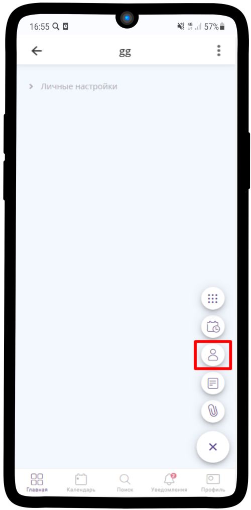

.. _contact_base-label:

===================
База клиентов
===================

.. note::
    
    * `Создание Базы клиентов`_
    * `Настройка поиска по Базе клиентов`_
    * `Поиск по Базе клиентов`_

----------------------
Создание Базы клиентов
----------------------

   .. |плюс| image:: media/plus.png
      :width: 21
      :alt: alternative text
   .. |точка| image:: media/tochka.png
      :width: 21
      :alt: alternative text
   .. |галка| image:: media/galka.png
      :width: 21
      :alt: alternative text
   .. |контакт| image:: media/contact.png
      :width: 21
      :alt: alternative text

1) Нажмите |плюс| и выберите иконку |контакт| (:ref:`contact-label`).
      

-----------------

2) Заполните **Контакт** и нажмите на |галка|

-----------------

3) База клиентов готова!

-----------------

----------------------
Настройка поиска по Базе клиентов
----------------------

Для того, чтобы искать Контакты в базе, нужно включить поиск.

1. Для этого перейдем в **Общие настройки**

.. figure:: media/contact_base/base17.png
    :scale: 53 %
    :alt: alternative text
    :align: center   

-----------------

2. Далее пункт **Управление доступом**

.. figure:: media/contact_base/base18.png
    :scale: 53 %
    :alt: alternative text
    :align: center   

-----------------

3. В поле **Могут искать прикрепленные элементы** отмечаем **владельцы и менеджеры**

.. figure:: media/contact_base/base19.png
    :scale: 53 %
    :alt: alternative text
    :align: center   

-----------------

4. Поиск включен

.. figure:: media/contact_base/base.png
    :scale: 53 %
    :alt: alternative text
    :align: center   

-----------------

.. _search_contact_base:

----------------------
Поиск по Базе клиентов
----------------------

.. note:: При создании заказа и возникновении вопроса с ним можно проверить его наличие с помощью Базы клиентов.

1. Откройте Базу клиентов. Внутри можете увидеть строку поиска, где необходимо ввести телефон или имя клиента
   

-----------------

2. Введите Имя

.. hint:: Также поиск возможен по **Телефону** или **e-mail**

-----------------

3. Выберите контакт из результатов поиска
      

-----------------

4. Нажмите на кнопку **Расписание**

-----------------

5. Перед Вами откроются все заказы данного контакта. Проверяем наличие спорной заявки
      

-----------------

6. Проверяем Детали заказа
   

-----------------

.. raw:: html
   
   <torrow-widget
      id="torrow-widget"
      url="https://web.torrow.net/app/tabs/tab-search/service;id=103edf7f8c4affcce3a659502c23a?closeButtonHidden=true&tabBarHidden=true"
      modal="right"
      modal-active="false"
      show-widget-button="true"
      button-text="Заявка эксперту"
      modal-width="550px"
      button-style = "rectangle"
      button-size = "60"
      button-y = "top"
   ></torrow-widget>
   

.. raw:: html

   